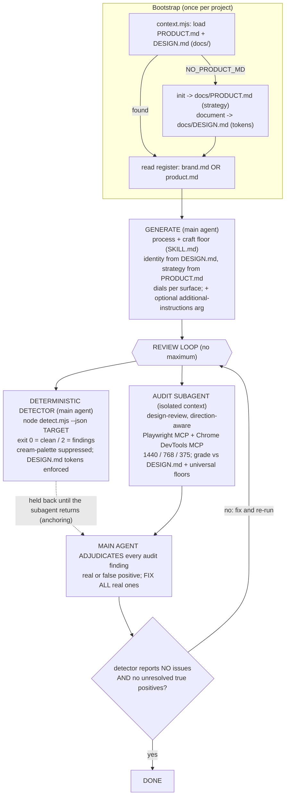

# Frontend-design skill: the flow

> Human reference. Not loaded into agent context (dot-prefixed, unreferenced by SKILL.md).
> The loop, the invariants (anchoring, the no-cap stop gate), and the two standing notes are
> described in SKILL.md; this file is just the picture.

