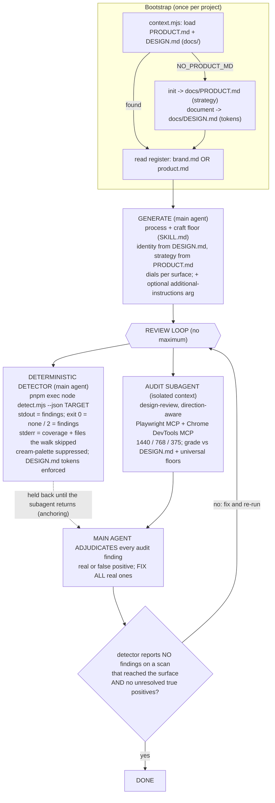

# Frontend-design skill: the flow

> Human reference. Not loaded into agent context (dot-prefixed, unreferenced by SKILL.md).
> The loop, the invariants (anchoring, the no-cap stop gate), and the two standing notes are
> described in SKILL.md; this file is just the picture, drawn for the direct invocation. Inside a
> subagent-driven run the same sections are assembled into `sdd-ui-implementer` (generate +
> detector) and `sdd-ui-auditor` (audit + adjudicate, under the workflow's cycle cap).

```mermaid
flowchart TD
  subgraph Bootstrap["Bootstrap (once per project)"]
    CTX["context.mjs: load PRODUCT.md + DESIGN.md (docs/)"]
    CTX -->|NO_PRODUCT_MD| INIT["init -> docs/PRODUCT.md (strategy)<br/>document -> docs/DESIGN.md (tokens)"]
    CTX -->|found| REG["read register: brand.md OR product.md"]
    INIT --> REG
  end

  REG --> GEN["GENERATE (main agent)<br/>process + craft floor (SKILL.md)<br/>identity from DESIGN.md, strategy from PRODUCT.md<br/>dials per surface; + optional additional-instructions arg"]

  GEN --> LOOP{{"REVIEW LOOP (no maximum)"}}

  LOOP --> DET["DETERMINISTIC DETECTOR (main agent)<br/>pnpm exec node detect.mjs --json TARGET<br/>stdout = findings; exit 0 = none / 2 = findings<br/>stderr = coverage + files the walk skipped<br/>cream-palette suppressed; DESIGN.md tokens enforced"]
  LOOP --> REV["AUDIT SUBAGENT (isolated context)<br/>design-review, direction-aware<br/>Playwright MCP + Chrome DevTools MCP<br/>1440 / 768 / 375; grade vs DESIGN.md + universal floors"]

  DET -. "held back until the subagent returns (anchoring)" .-> ADJ
  REV --> ADJ["MAIN AGENT ADJUDICATES every audit finding<br/>real or false positive; FIX ALL real ones"]

  ADJ --> GATE{"detector reports NO findings on a scan<br/>that reached the surface<br/>AND no unresolved true positives?"}
  GATE -->|no: fix and re-run| LOOP
  GATE -->|yes| DONE["DONE"]
```
