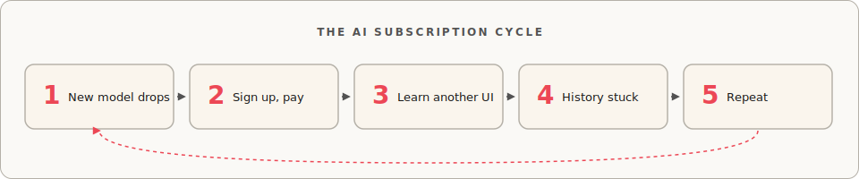
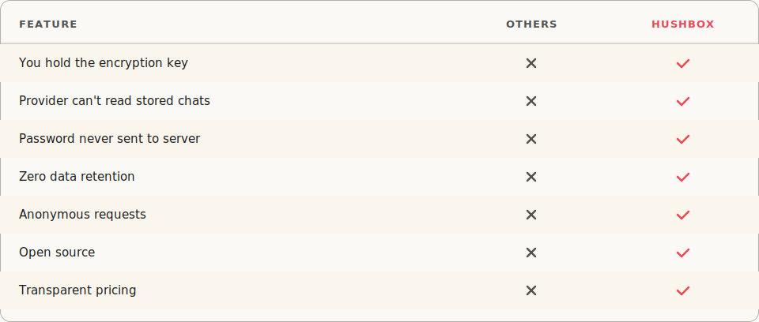
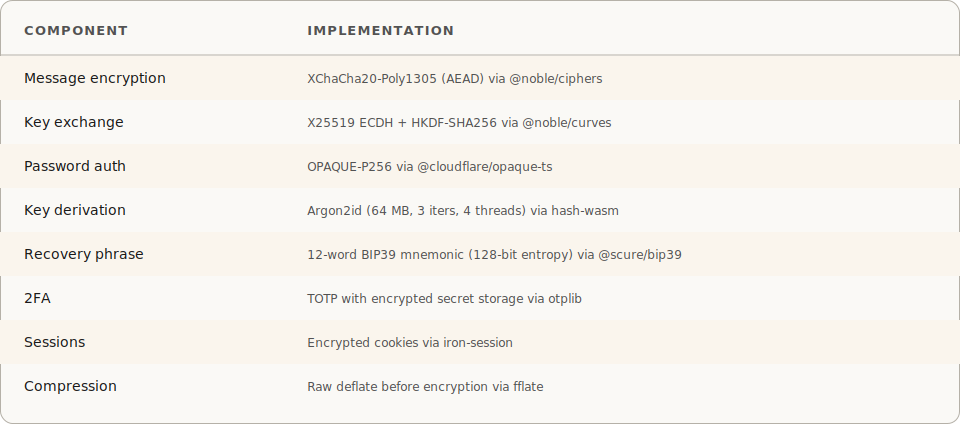
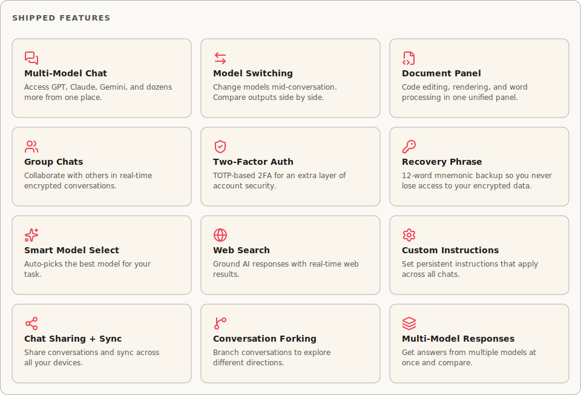
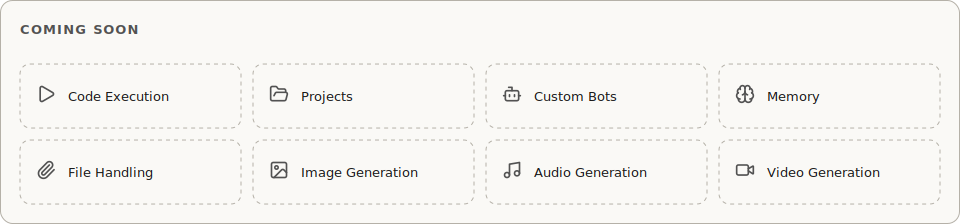
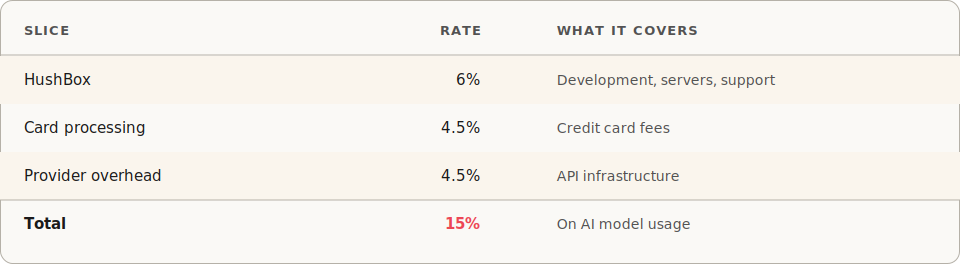
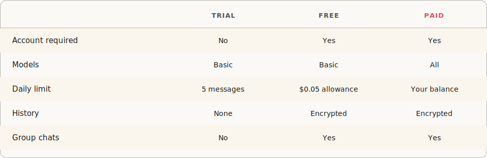
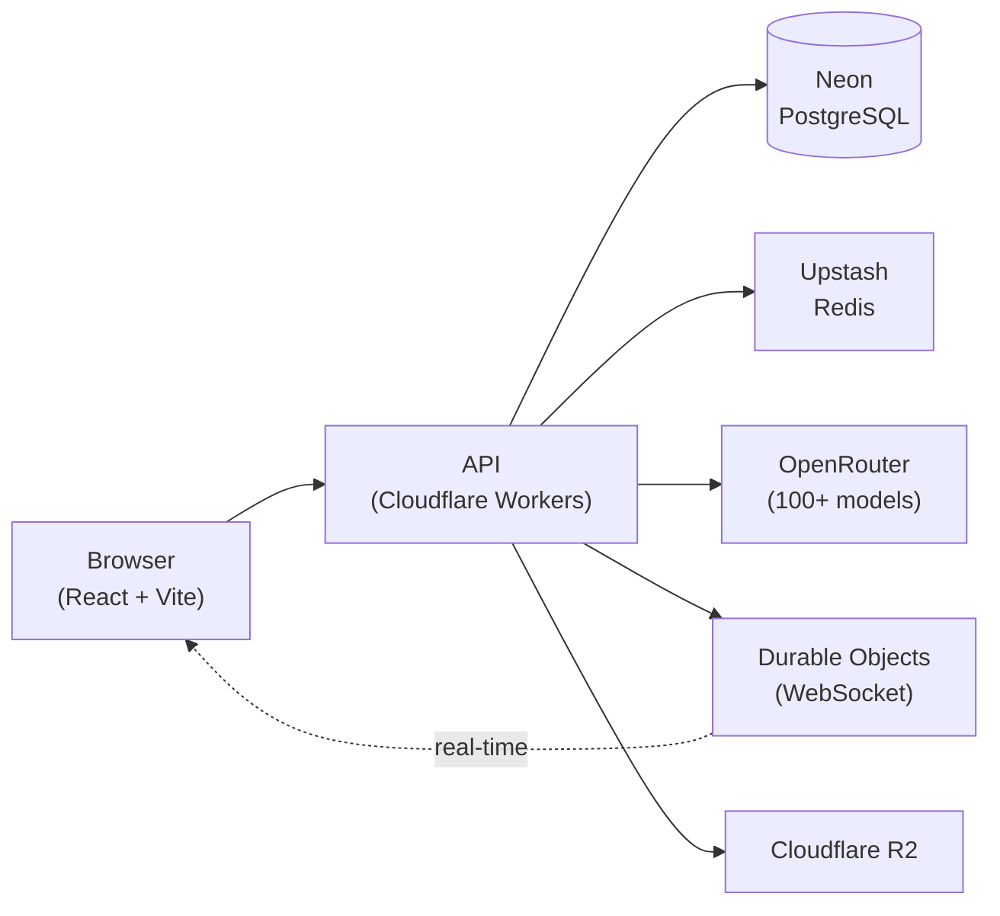

<picture>
  <source media="(prefers-color-scheme: dark)" srcset=".github/readme/banner-dark.gif">
  
</picture>

 

&nbsp;

&nbsp;

&nbsp;

&nbsp;

&nbsp;

---

## The Problem

Every few months, a new AI model takes the crown. You know the cycle.

<picture>
  <source media="(prefers-color-scheme: dark)" srcset=".github/readme/problem-flow-dark.svg">
  
</picture>

Your history is scattered across ChatGPT, Claude, Gemini, and whatever launched last Tuesday. Each has its own interface, its own billing, its own lock on your data.

HushBox puts GPT-4o, Claude, Gemini, Llama, DeepSeek, and over a hundred other models behind a single interface. Switch models mid-conversation. Fork a thread to try a different model's take. When the next model launches, you don't migrate. You pick it from the dropdown.

> **[Try HushBox](https://hushbox.ai).** No account needed for your first conversation.

---

## Encrypted By Default

<picture>
  <source media="(prefers-color-scheme: dark)" srcset=".github/readme/comparison-dark.svg">
  
</picture>

Your messages are encrypted in your browser before they're stored. The encryption key comes from your password, which never leaves your device. We use OPAQUE, a protocol where the server participates in authentication without ever seeing the password (not even a hash). Our servers hold encrypted blobs. Without your password or your 12-word recovery phrase, that data is noise.

Our servers can't read your stored conversations because they never hold the decryption key.

> AI models need to read your message to answer it. We partner exclusively with zero-data-retention providers who pledge not to log your data. Providers see HushBox's API credentials, not yours. They can't link a message to your identity. We publish our source code to prove our own promises. Our AI partners make theirs contractually. There's no absolute proof that any third party honors its word, so if you're extremely cautious, avoid personal information in prompts.

<strong>Technical details</strong>

 

<picture>
  <source media="(prefers-color-scheme: dark)" srcset=".github/readme/technical-details-dark.svg">
  
</picture>

**How it works:** Each conversation has cryptographic epochs with public/private keypairs. Messages are encrypted with the epoch's public key. Only members holding the epoch's private key can decrypt. When group membership changes, a new epoch starts with a fresh keypair distributed to current members.

**Stored encrypted:** message content, conversation titles, TOTP secrets, custom instructions, private keys (wrapped with your password and recovery phrase).

**Stored in plaintext:** email, username, message metadata (sender type, model name, cost, timestamps), billing records.

---

## Features

<picture>
  <source media="(prefers-color-scheme: dark)" srcset=".github/readme/features-dark.svg">
  
</picture>

<picture>
  <source media="(prefers-color-scheme: dark)" srcset=".github/readme/coming-soon-dark.svg">
  
</picture>

---

## Pricing

We charge **{{TOTAL_FEE_PERCENT}}** on AI model usage and **{{STORAGE_COST_PER_1K}}** per 1,000 characters for storage.

<picture>
  <source media="(prefers-color-scheme: dark)" srcset=".github/readme/pricing-dark.svg">
  
</picture>

Storage is cheap. $1 covers over {{MESSAGES_PER_DOLLAR}} average messages. Most users spend less than $1/year on storage.

No subscriptions. No premium tier that locks features behind a paywall. No "free" plan subsidized by selling your data. You pay for the AI you use. We take a cut. The math is public.

<strong>Tiers</strong>

 

<picture>
  <source media="(prefers-color-scheme: dark)" srcset=".github/readme/tiers-dark.svg">
  
</picture>

**Trial:** Chat without signing up. Lower-cost models only, {{TRIAL_LIMIT}} messages/day, no persistence.

**Free:** Create an account, get {{WELCOME_CREDIT}} welcome credit and a {{FREE_ALLOWANCE}}/day allowance for basic models. Conversations are encrypted and stored.

**Paid:** Load credits via card ($5 minimum). Access every model.

## Principles

<strong>Privacy First</strong>

 

We believe privacy is a right, not a privilege handed out by a terms-of-service. The ability to think out loud, ask the wrong question, or doubt yourself in private is the precondition for honest thought. Every era's governments have found reasons to demand access to private conversations. Every era's corporations have found reasons to harvest them. We will resist both, and we'll keep building tools that let you resist with us.

<strong>Radical Transparency</strong>

 

We believe you're owed the ability to verify, not reassurance. A company that hides its workings and issues promises instead has chosen to manage your trust rather than earn it. We'd rather earn it. The fee is published down to the basis point. Source code is visible. Cryptography is named and documented. If a claim doesn't hold up to scrutiny, the bug is ours.

<strong>No Data Monetization</strong>

 

We believe your data belongs to you. Not the euphemistic ownership companies claim while selling you to ad networks. Actual ownership. What you write in HushBox is yours to keep, delete, or export. We won't sell it, train a model on it, or hand it to a government without a fight. If we ever found ourselves choosing between our revenue and your ownership, we'd rather shut the company down.

<h2>Architecture</h2>

 

TypeScript everywhere. React 19 + Vite on the frontend, Hono on Cloudflare Workers for the API. Drizzle ORM and Zod schemas shared between frontend and backend for end-to-end type safety. Durable Objects handle WebSocket fan-out for group chats. Neon provides serverless PostgreSQL. Upstash Redis handles rate limiting and caching. Astro generates the marketing site. Capacitor wraps the web app for iOS and Android.

**Testing:** Vitest with 95% coverage threshold. Playwright E2E across Chromium, Firefox, WebKit, iPhone 15, Pixel 7, and iPad Pro. Mutation testing via Stryker.

**Local dev:** One command (`pnpm dev`) starts Vite, Wrangler, PostgreSQL, Neon proxy, Redis, and the Serverless Redis HTTP emulator via Docker Compose. All external APIs mocked. No production credentials needed.

---

## Contributing

See [docs/CONTRIBUTING.md](docs/CONTRIBUTING.md) for setup and guidelines. All contributors must agree to the [Contributor Assignment Agreement](https://gist.github.com/ctf05/24b91cac419a904919d1ad30eb14b9cd).

## License

Proprietary. Source code is visible for transparency, but usage requires explicit permission from LOME-AI LLC. See [LICENSE](LICENSE).

---

Built by LOME-AI LLC

