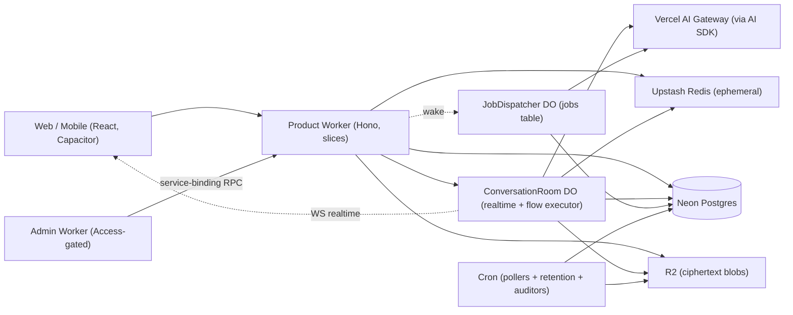

# Architecture

The backend's system map: what exists, how it composes, and the boundaries deliberately
drawn around it. Rules agents must follow live in `CODE-RULES.md`; technology choices in
`TECH-STACK.md`; the full design rationale in `docs/history/BACKEND-REDESIGN.md`.

---

## System map

A modular monolith of **vertical slices** on one product Cloudflare Worker, with pragmatic
hexagonal edges (ports only where implementations genuinely vary). Durable Objects carry
per-conversation realtime, in-process flow execution, and job dispatch. One Postgres is the
sole durable truth; Redis is ephemeral coordination; R2 holds only ciphertext.

**Slices** (a slice's `index.ts` barrel is its only public surface): `identity` (OPAQUE
auth, sessions, TOTP/step-up, recovery, link-guest principal, account deletion) ·
`conversations` (conversations, epochs, members, forks, shares) · `chat` (the turn:
messages, content, orchestration, trial, Smart Model) · `billing` (wallets, double-entry
ledger, usage, payments, budgets, Helcim) · `models` (catalog, capability registry,
inference via `ModelProvider`) · `media` (R2 GC, epoch-gated presign, transforms) ·
`notifications` (email, push, device tokens) · `account` (search, instructions,
preferences, export) · `workflows` (the engine, node registry, definitions, builder).
Cross-slice writes go only through published barrel APIs; the orchestrating slice owns the
transaction. Ownership is **single-writer-per-table**.

**Ports** (infra edges only): `ModelProvider`, `Storage`, `PaymentProvider`, `EmailSender`,
`RealtimeBroadcast`, `Telemetry`, `TransformCompute` (impl #1 = in-process server adapter).
`Db`/`Cache`/`Crypto` are deliberately unwrapped — anemic ports would discard Drizzle/Zod
inference.

## The four operation patterns

Every write is exactly one of these; there is no fifth.

- **A — single DB transaction.** The default. No external calls inside.
- **B — one external call + one DB update**, replayed via `Idempotency-Key`.
- **C — transactional job.** A `jobs` row inserted in the caller's transaction, executed by
  the alarm-clocked dispatcher (below).
- **D — pre-claim then reconcile.** Card charges only: durable `payments` pre-claim before
  the charge, finalized by webhook, verified by a delayed `payment.verify.v1` job.

## The jobs system

The only delivery mechanism for must-happen async work. The job row is the record, the
dead-letter store, and the audit trail; there is no queue, no DLQ, no sweep.

- **Enqueue** = `INSERT` inside the domain transaction (atomic with its trigger); a lossy
  post-commit `wake()` nudges the dispatcher.
- **Dispatcher** = one Durable Object per shard (`default`, `bulk`), stateless except its
  alarm. Each pass: re-arm first (`now+30s`), dead-letter exhausted rows at claim time,
  claim a batch (`FOR UPDATE SKIP LOCKED`, priority order, lease-expired `running` rows
  reclaimable), execute, then re-arm to `min(next nextAttemptAt, idle decay)`. Idle decay
  60s→30m applies only when no work is pending or scheduled; any `wake()` resets it.
- **Handlers** are registered with payload schema, lease, failure caps, and a mandatory
  idempotency class (`txn` — effect + terminal transition in one transaction; `natural`;
  `providerKey`; `byEventId`). Outcomes: `ok / fail / yield / dead`. `yield` checkpoints
  without consuming retries. Heartbeat-touch and checkpoint writes pass the same
  `claims`/`claimedBy` fence as completion — zombies cannot keep leases alive or corrupt
  live claims.
- **Timing:** enqueue→first attempt ~10–50 ms; retries at exact backoff (`failures⁴s ±10%`,
  cap 1 h); crash recovery = lease + ≤30 s. `succeeded` rows prune at 7 days; `dead` rows
  live forever, redriven by explicit admin action.
- **Liveness:** a 15-minute read-only auditor pages on stuck jobs and `wake()`s both shards
  (the one concession to a documented platform alarm-wedge bug).

Launch job types: `trueup.fetch.v1`, `payment.verify.v1`, `media.reclaimUser.v1`,
`export.build.v1` (bulk, yielding), `admin.executeAction.v1` (delayed, cancellable),
`admin.notify.v1`.

## Money & settlement

- **Single-settlement rule:** nothing commits mid-run. One fenced transaction — the
  pl/pgsql `settle()` function — writes content + every charge + double-entry ledger legs +
  the idempotency-key flip, atomically. A run killed at any earlier moment leaves an
  expiring Redis hold and nothing else: saved ⟺ billed, by construction. Lock order:
  content → wallet → period budget rows → conversations row → key row. No external or
  Redis calls inside, ever.
- **The run referee is the idempotency-key row** (there is no run table). First arrival
  claims by unique insert; the conversation DO performs the run-claim and heartbeat-touches
  the lease (~90 s), so a deploy-killed run is retryable in seconds. Retries are serialized
  and client-driven: `succeeded` replays, fresh `claimed` attaches to the live stream,
  expired lease or `failed` permits exactly one re-execution at a time. Reused key with a
  different body ⇒ 409 (canonical-JSON hash).
- **Ledger:** double-entry — signed legs per `transactionId` summing to zero across user
  wallets and house accounts (`revenue`, `payments-in`, `promo`); conservation is a
  write-time constraint. Running balances exist only on user-wallet legs. The settlement
  transaction also re-reads the `conversations` row `FOR SHARE` and asserts `currentEpoch`
  equals the wrap target — serializing persist against key rotation.
- **Admission** (the only balance gate — settlement charges unguarded; negative balances
  stand): one atomic Redis Lua script checks balance snapshot − Σholds ≥ estimate,
  period-keyed budgets, and the per-wallet concurrent-run cap, then places a TTL hold.
  Estimates price the declared ceiling (max fan-out width × max steps × max iterations).
  Snapshot write-through CASes on ledger sequence. Redis down ⇒ paid admission fails
  closed; there is no degraded mode. Mid-run, the cost circuit kills any run whose
  observed-usage accrual exceeds `hold × K` (K = 5), evaluated at step/branch/node
  boundaries; exposure bound = `hold × K + one max step cost`.
- **Estimate + true-up, all modalities:** settlement charges the observed-usage estimate
  (`isEstimated`); the authoritative gateway cost lands as an adjustment leg — inline
  first, then `trueup.fetch.v1` with backoff, give-up = accept estimate + audit row. The
  client displays cost only once final (`cost: pending` → `cost-final`; timeout shows the
  `~`-marked estimate). A monthly auditor reconciles the gateway invoice against
  Σ `usage_records` per modality.
- **Disputes:** a Helcim chargeback/reversal posts a `byEventId` clawback pair and
  auto-locks the account (`users.lockedAt`) with session revocation — defensive, immediate,
  reversible. Inquiries/retrievals only notify.

## The workflow engine

Everything AI is a **workflow**: a Zod-validated JSON DAG over a closed, versioned node
registry (`modelCall`, `transform`, `fanOut`, `fanIn`, `branch`, `loop`, `subWorkflow`),
interpreted **in memory inside the conversation DO**. A chat turn is a one-node definition;
the multi-model turn is a data-driven `fanOut` with optional branches (the reducer settles
the successful subset); Smart Model is a three-node definition.

- **Typed edges** run on the TypeTag algebra — four rules: exact equality with
  `json<schemaName>` (never bare `json`), media subset (modality equal, mimes ⊆),
  `optional<T>`, `list<T>`. `zodFor(tag)` derives every node's runtime schema from its
  declared ports; reducers are tuple-typed `(in: TypeTag[], out: TypeTag)`. Checked at
  build, save, and runtime.
- **The engine owns sequencing** (deadline, key-row claim, settlement ordering); each
  definition declares two typed policy hooks — admission (chat = balance hold; trial =
  quota) and settlement (chat = `saveChatTurn` + `chargeWithinTx(SettlementTx, …)`).
- **Fast-fail, never resumed — all run lengths:** deadline-bounded (text ~5 min, media
  ~15 min); the deadline alarm is run *control* (stop the stream, settle any billable
  partial). A killed run needs no cleanup; the client's own deadline shows "failed — not
  billed" and auto-resubmits. Values move through the in-memory `ValueStore` (byte-metered
  ≤20 MB assuming a 3× real-memory multiplier; over-budget rejects at validation for large
  video). Mid-flow content never rests anywhere; finals wrap to the epoch key at persist.
- **One run per conversation, hard-blocked** at both layers (typed error server-side,
  disabled composer client-side). Multi-stream within a run (`streamId` + per-stream
  cursors) is the protocol; fan-out width respects the platform's 6-connection cap.

## Streaming & realtime

The conversation DO's hibernatable WebSocket is the sole transport: turn tokens, flow
progress, presence, media events. A transport disconnect never cancels — the turn
completes, persists, bills server-side (founder-verified: a DO sustains minutes-long
fetches after the client is gone); reconnects replay per-stream from `Last-Event-ID` out of
a capped memory-only buffer, then resume live. Explicit stop has an HTTP path (a WS-blocked
user can always abort a paid run) and settles the partial. WS upgrade failures are measured
day one (client beacon + server WAE; no fallback transport is built — re-entry below).
Membership is revalidated at broadcast: a short-TTL Redis cache of authoritative membership
with DB recheck on miss; eviction fires on membership change, rotation, session and link
revocation; Redis down ⇒ delivery pauses beyond a bounded last-known-good window.

## Data model essentials

Nano-USD `bigint` money (`NanoUSD` strings at JSON boundaries); pgEnums for every closed
set; `relations()` everywhere; uuidv7 keys; every FK indexed. Tables: `users` (+`lockedAt`,
`deletionRequestedAt`) · `wallets` (unique per user+type) · `ledger_entries` (double-entry)
· `usage_records` (nullable content FK — `SET NULL` on deletion; insert-time invariant:
billed ⟹ the run persisted content; `runId` groups a run's charges) · `llm_completions` /
`media_generations` · `payments` · `member_budgets` / `conversation_spending`
(period-keyed, UTC; no reset jobs) · `messages` (unique conversation+sequence) ·
`content_items` · `conversations` / `conversation_members` / `conversation_forks` ·
`epochs` / `epoch_members` · `shared_links` (+`revokedAt`/`expiresAt`, enforced lazily at
read) / `shared_messages` (+`createdBy`) · `modelCatalog` (surrogate PK,
unique id+version) / `modelPricing` / `modelOverrides` · `idempotency_keys` (`kind`,
body-hash, lease, claims fence) · `jobs` · `admin_audit` (append-only) · device tokens,
instructions, preferences, verification tokens. Deletion is hard (privacy promise);
financial rows are pseudonymized via `SET NULL` (Art. 17(3)(b) retention); R2 ciphertext is
reclaimed by `media.reclaimUser.v1` with orphan GC (min-age ≥ max deadline + margin) as the
crash-debris backstop.

## Models & capabilities

The catalog is auto-discovered from gateway metadata (hourly, jittered, skip-unchanged;
two-tier fetch), persisted as versioned descriptors. New language models are zero-touch;
image/video require `modelOverrides` data (ParamSpecs, pricing matrices) and ZDR
verification before exposure — zero *code*, not zero *touch*. A genuinely new modality is
one enum migration + one dispatch adapter (dispatch keys on SDK call-shape:
language/image/video/embedding). Unknown gateway types are excluded with an alert, never a
crash. ZDR is enforced per-request and fail-closed: unverified models stay hidden;
verifications are dated, aged data (90-day alert). Realtime-bidirectional and computer-use
models break the port itself and are architecturally out until designed.

## Admin plane

A separate Worker + SPA behind Cloudflare Access (passkey MFA), with in-Worker JWT
validation and WebAuthn step-up for irreversible tiers and defensive actions. The admin
Worker holds zero product code and zero database credentials: every action travels a typed
service-binding RPC into the product Worker, which enforces tier delays (tiers keyed by
target type, product-side), executes through the same settlement/billing invariants, and
writes the append-only audit (actions and reads) itself. Mutations are delayed cancellable
jobs; defensive actions (lock, revoke, model-disable) execute immediately and
retry-notification afterward. Notification = email to all admins via Resend. Break-glass is
a pre-staged deploy enabling an offline-key auth mode (useless in a control-plane outage —
offline Neon/R2 credentials are the true last resort).

## Observability

Workers Logs (structured, allowlisted fields) · Analytics Engine for metrics (SQL API only;
every metric has a named watcher — a 15-minute auditor polls it) · Sentry for unexpected
errors only (backend only; `errorCode` in fingerprints; scrubbed at the Telemetry port,
cause-chains included; console patched at the entry point) · native OTel tracing
(verify-at-implementation; redaction processor mandatory). Error taxonomy: expected domain
failures are `Result` values → `{code}` responses + metrics; exceptions are defects →
Sentry; invariant breaks are auditor pages; routine drift goes to a daily digest, never a
page.

---

## Deliberate limits

Decisions **not** to do things. Reversing one is an architecture decision, not a cleanup.

- **Vendor lock-in is deepened and isolated** (DO programming model is the deepest
  coupling), traded for operational simplicity; each piece sits behind a port.
- **Zero-trust ends at the API boundary** — same-process internal calls are trusted; no
  internal mTLS.
- **Postgres is a mitigated SPOF** — Neon HA + encrypted cross-vendor backups; no DIY
  multi-region.
- **Auditability is structured logs** (product side) — no hash-chained audit table until
  compliance demands one; the admin plane has its own append-only table.
- **Best-effort vs critical is a hard split** — push/email/telemetry may degrade; money,
  auth, persistence fail fast and never degrade.
- **Fast-fail applies to every run length** including long media: a deploy can kill a
  15-minute generation; the user retries; provider spend on killed runs is accepted and
  observable (generation ids stream to WAE).
- **One run per conversation** — no queueing, no concurrent lanes.
- **No client-side Sentry** — browser capture sits too close to plaintext; frontend bugs
  are debugged from reports.
- **No backup mechanisms** — one mechanism per task, made recoverable (leases, TTLs, lazy
  checks); auditors detect, humans redrive. A second delivery path is a design smell.
- **No degraded admission mode** — Redis down means paid runs refuse, loudly.
- **The welcome-credit re-register loop is accepted** — hard deletion forbids grant dedup;
  the global trial/welcome budget bounds it.
- **In-isolate circuit breakers don't exist** — retry + timeout only; breaker state would
  be in-memory state.

## Excluded services & re-entry conditions

Consult before proposing any of these; the conditions are the decision.

- **Cloudflare Workflows** — returns for flows that must survive deploys, multi-day sleeps,
  human-in-the-loop waits, or runs exceeding DO memory. Plugs in behind the
  `ValueStore`/`WorkflowRunner` seam and **reintroduces a run table**.
- **Cloudflare Queues** — returns only if the dispatcher's ceiling is reached after
  shard-by-type and claim-then-fan-out scaling. Two standing asymmetries: a queue send is
  never atomic with a Postgres commit; an ack is never atomic with a `txn`-class effect.
- **Hyperdrive** — returns when it supports our Postgres major AND sustained p95 DB
  connect+query overhead per turn exceeds 150 ms for a week AND the DO+vitest path is
  proven. Query caching stays off (not read-your-writes safe). It does support interactive
  transactions; the blockers are concrete, not capability myths.
- **Non-WS transport fallback** — client polling of message-fetch until terminal (cheap:
  turns complete server-side) when >0.5% of session starts fail WS upgrade over 7 days
  (beacon + WAE).
- **Concurrent runs per conversation** — when product feedback demands chat-during-media;
  multi-stream already ships, so re-entry is admission ordering + a shared memory budget.
- **R2 mid-flow intermediates** — with the heavy-compute tier (container handoff);
  the K_inst staged design is recorded in the archived plan.
- **Manifest-based GC** — when bucket list-and-check gets slow.
- **DO Facets** (beta) — watch item for dispatcher sharding.

**Still deferred:** audio (gateway has none; will be two call-shapes — speech,
transcription), heavy server-side compute (prefer Cloudflare Containers/Sandbox), the
capability planner (workflow level 2), a product-side audit table, API versioning,
GDPR/CCPA legal specifics. **Verify at implementation:** the Zero-Trust 50-user free tier;
the DO-finalize vitest path; native OTel tracing maturity (Sentry tracing is the fallback).

## Verified platform facts

Dated, founder-verified evidence; entries age — re-verify and alert past 90 days.

- **2026-06-10** — the gateway's per-generation cost endpoint returns `total_cost` for
  image and video (undocumented; the estimate path stays first-class regardless).
- **2026-06-10** — per-request ZDR flag enforcement holds for image/video; the exposed
  image/video models are individually ZDR-verified in `modelOverrides`.
- **2026-06-10** — a Durable Object sustains a minutes-long outbound fetch to completion
  after the client disconnects (the disconnect-completion promise rests on this).
- Platform constants relied on: alarms survive eviction/deploys and `setAlarm` persists
  from a throwing handler; cron has no delivery guarantee (alarms do); ~128 MB isolate
  shared across co-located DOs; 6 simultaneous outbound connections per invocation; 15-min
  alarm wall cap; deploys kill in-flight DO work with no drain hook.
