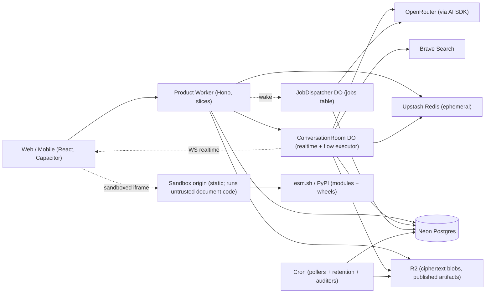

# Architecture

The backend's system map: what exists, how it composes, and the boundaries deliberately
drawn around it. Rules agents must follow live in `CODE-RULES.md`; technology choices in
`TECH-STACK.md`.

---

## System map

A modular monolith of **vertical slices** on one product Cloudflare Worker, with pragmatic
hexagonal edges (ports only where implementations genuinely vary). Durable Objects carry
per-conversation realtime, in-process flow execution, and job dispatch. One Postgres is the
sole durable truth; Redis is ephemeral coordination; user content in R2 is only ever
ciphertext.

```mermaid
flowchart LR
  Client["Web / Mobile (React, Capacitor)"]
  Worker["Product Worker (Hono, slices)"]
  DO["ConversationRoom DO (realtime + flow executor)"]
  Jobs["JobDispatcher DO (jobs table)"]
  PG[("Neon Postgres")]
  R2["R2 (ciphertext blobs, published artifacts)"]
  Redis["Upstash Redis (ephemeral)"]
  Prov["OpenRouter (via AI SDK)"]
  Search["Brave Search"]
  Cron["Cron (pollers + retention + auditors)"]
  Sandbox["Sandbox origin (static; runs untrusted document code)"]
  ModCDN["esm.sh / PyPI (modules + wheels)"]

  Client -. sandboxed iframe .-> Sandbox
  Sandbox --> ModCDN
  Client --> Worker
  Worker --> PG & Redis & R2 & DO
  Worker -. wake .-> Jobs
  DO --> Prov & Search & PG & R2 & Redis
  Jobs --> PG & Prov
  Cron --> PG & R2
  DO -. WS realtime .-> Client
```

**Slices** (a slice publishes via its `index.ts` barrel and `public/` modules; the roster
is the directory set under `apps/api/src/slices/`, each wired in the composition root —
the parentheticals below describe roles, they do not assert the set): `identity` (OPAQUE
auth, sessions, TOTP/step-up, recovery, link-guest principal, account deletion) ·
`conversations` (conversations, epochs, members, forks, shares) · `chat` (the turn:
messages, content, orchestration, trial, Smart Model) · `billing` (wallets, double-entry
ledger, usage, payments, budgets, Helcim) · `models` (catalog, capability registry,
inference via `ModelProvider`) · `media` (R2 GC, epoch-gated presign, transforms) ·
`notifications` (email, native FCM + in-house Web Push, device tokens/subscriptions,
notification preferences) · `newsletter` (mailing list: subscribers,
double opt-in consent, issues, batch dispatch, Resend webhooks) · `account` (search,
instructions, preferences) · `workflows` (the engine, node registry, definitions, builder) ·
`announcements` (the in-app banner: config + per-user dismissals) · `feedback` (in-app
feedback reports) · `roadmap` (public roadmap board) · `stats` (public anonymized usage
stats) · `updates` (mobile app updates: served version + per-platform OTA bundles) ·
`growth` (the marketing site's anonymous visit and funnel aggregates, the campaign tags,
and the views over them — never joinable to an account, arch-enforced;
`docs/GROWTH-MEASUREMENT.md`) · `admin` (the operations registry + Customer-360 reads;
owns only `admin_audit` — see §Admin plane).
Cross-slice writes go only through published APIs — the barrel or a `public/` door; the
orchestrating slice owns the transaction. Ownership is **single-writer-per-table**, and
the table→slice map of record is the arch rule `single-writer-per-table`
(`packages/config/arch/rules/single-writer-per-table.rule.ts`), asserted complete in both
directions against the schema barrel.

**Ports** (infra edges only): `ModelProvider`, `SearchProvider`, `Storage`, `PaymentProvider`, `EmailSender`, `PushSender`,
`RealtimeBroadcast`, `Telemetry`, `TransformCompute` (impl #1 = in-process server adapter).
`Db`/`Cache`/`Crypto` are deliberately unwrapped — anemic ports would discard Drizzle/Zod
inference.

## The four operation patterns

Every write is exactly one of these; there is no fifth.

- **A — single DB transaction.** The default. No external calls inside.
- **B — one external call + one DB update**, replayed via `Idempotency-Key`.
- **C — transactional job.** A `jobs` row inserted in the caller's transaction, executed by
  the alarm-clocked dispatcher (below).
- **D — pre-claim then reconcile.** Card charges only: durable `payments` pre-claim before
  the charge, finalized by webhook, verified by a delayed `payment.verify.v1` job. The
  pre-claim transaction also refuses a fresh deposit while the payer holds an unresolved one,
  releasing by terminal status or by row age; a provider server error is an unknown outcome
  that leaves the pre-claim `pending` for the verify job, never a decline; a read-only auditor
  pages on rows still unresolved past the verify window; and a row nothing can resolve is
  repaired only through a registered admin operation. Semantics: `docs/BILLING.md`
  §Payments (Helcim).

## The jobs system

The only delivery mechanism for must-happen async work. The job row is the record, the
dead-letter store, and the audit trail; there is no queue, no DLQ, no sweep. Enqueue is an
`INSERT` inside the domain transaction, so a job commits atomically with its cause; an
alarm-clocked dispatcher Durable Object claims and executes rows under a lease; the
handler registry is the authoritative list of job types, each with a mandatory
idempotency class. Recovery is the lease; liveness is a read-only auditor that pages.
Mechanics: `docs/JOBS.md`.

## Money & settlement

- **Single-settlement rule:** nothing commits mid-run. One fenced settlement transaction
  writes content + every charge + double-entry ledger legs + the idempotency-key flip,
  atomically, with no external or Redis calls inside. A run killed at any earlier moment
  leaves an expiring Redis hold and nothing else: saved ⟺ billed, by construction.
  The one carve-out is a settlement refusal: an answer already streamed that settlement's
  own locks refuse is billed with nothing saved.
- **Concurrency is row locks at READ COMMITTED, no retry:** correctness under contention
  rests on the wallet-row lock plus the deferred zero-sum ledger trigger, never on a
  higher isolation level or a serialization-failure retry loop.
- **The run referee is the idempotency-key row** (there is no run table): first arrival
  claims by unique insert, the conversation DO holds and heartbeats the lease, and
  retries are serialized and client-driven.
- **Ledger:** double-entry — signed legs per `transactionId` summing to zero across user
  wallets and house accounts; conservation is a write-time constraint.
- **Admission is the only balance gate.** One atomic Redis script checks spendable
  balance, budget scopes and the concurrent-run cap, then places a TTL hold sized to the
  run's declared ceiling; settlement charges unguarded and negative balances stand. Redis
  down ⇒ paid admission fails closed; there is no degraded mode. Mid-run, the cost
  circuit kills any run whose observed accrual exceeds a fixed multiple of its hold.
- **One estimator, shared client + server:** the canonical nano-USD estimator in
  `packages/shared` is the single implementation of billable-cost pricing for display,
  affordability, admission holds and settlement's estimated charges.
- **Cost-circuit trip is no-bill, asymmetric with the deadline stop.** A trip settles
  nothing and the incurred provider spend is absorbed as platform loss, surfaced by one
  Sentry event; the deadline stop settles its billable partial.
- **Authoritative inline cost:** the provider's inline charged cost is billing truth for
  text and video; image is charged at its deterministic catalog estimate. When an inline
  figure cannot stand as the whole run's cost, settlement bills the catalog estimate,
  flagged `isEstimated`, and raises one Sentry alert.
- **Disputes:** a chargeback posts a `byEventId` clawback pair and auto-locks the account
  with session revocation — defensive, immediate, reversible.

Settlement mechanics — lock order, the concurrency proof, the referee's lease and retry
states, the exposure bound, the inline-cost fields: `docs/BILLING.md` §Settlement.

## The workflow engine

Everything AI is a **workflow**: a Zod-validated JSON DAG over a closed, versioned node
registry (the roster is the `NODE_TYPES` union in `packages/shared/src/workflow/workflow.ts`),
interpreted **in memory inside the conversation DO**. A chat turn is a one-node definition;
the multi-model turn is N sibling `modelCall` nodes — no reducer joins them; settlement
persists each sibling's output and bills the successful subset (`docs/BILLING.md`
§Multi-Model Turns).

- **Typed edges** run on the TypeTag algebra — four rules: exact equality with
  `json<schemaName>` (never bare `json`), media subset (modality equal, mimes ⊆),
  `optional<T>`, `list<T>`. `zodFor(tag)` derives every node's runtime schema from its
  declared ports; reducers are tuple-typed `(in: TypeTag[], out: TypeTag)`. Checked at
  build, save, and runtime.
- **The engine owns sequencing** (deadline, key-row claim, settlement ordering); each
  definition declares two typed policy hooks — admission (chat = balance hold; trial =
  quota) and settlement (chat = persist the turn and charge inside the settlement
  transaction).
- **Fast-fail, never resumed — all run lengths:** deadline-bounded (text ~5 min, media
  ~15 min); the deadline alarm is run _control_ (stop the stream, settle any billable
  partial). A killed run needs no cleanup; the client's own deadline shows "failed — not
  billed" and auto-resubmits. Values move through the in-memory `ValueStore`, byte-metered
  against a fixed budget; over-budget rejects at validation. Mid-flow content never rests
  anywhere; finals wrap to the epoch key at persist.
- **One run per conversation, hard-blocked** at both layers (typed error server-side,
  disabled composer client-side). Multi-stream within a run is the protocol
  (`docs/REALTIME.md`).

## Runnable documents

AI-generated code executes in the user's browser, never on our infrastructure. A fenced
block past a length threshold becomes a **document**; `html`/`js`/`react`/`python`
documents run live in the document panel.

- **The trust boundary is an origin.** Untrusted code runs only inside a sandboxed
  cross-origin iframe served by a credential-free static Worker — no cookies, no session,
  no API, nothing to steal. The app origin, holding plaintext and the device key, is
  unreachable by construction rather than by diligence.
- **Containment is the network lockdown, not `script-src`.** The sandbox CSP denies every
  network channel but the module and wheel hosts; executing the document's own scripts is
  the feature, so inline script is permitted.
- **No service workers, by construction.** WKWebView has none, so one codepath serves
  web, iOS, and Android.

Full design — the CSP, the parent↔frame channel, the Python runtime, the rejected
designs: `docs/DOCUMENTS.md`.

## Streaming & realtime

The conversation DO's hibernatable WebSocket is the sole transport: turn tokens, flow
progress, presence, media events. `POST /chat` initiates the run and returns a handle;
everything after rides the WS. A transport disconnect never cancels — the turn completes,
persists, bills server-side. Replay is negotiated at connection setup, never after it:
the reconnecting client declares its per-stream cursors on the upgrade, and the room
replays exactly that gap before admitting the socket to live fan-out. A room bounds the
sockets one principal holds and evicts the oldest at the cap; that eviction is also what
reaps a dead socket, because a second cleanup path would be a backup mechanism. Explicit
stop has an HTTP path and settles the partial; a stop that produced nothing commits
nothing. The product
interface offers no stop control; the route and its authorization stand for one that
does. Membership is
revalidated at broadcast, and session, link and membership revocation evict live sockets;
Redis down pauses delivery beyond a bounded last-known-good window. No fallback
transport exists — re-entry below. Protocol detail: `docs/REALTIME.md`.

## Edge cacheability

Every route on the product Worker declares whether a shared cache may store its
response, in one policy map keyed off `AppType` exactly like the rate-limit posture map.
A pipeline stage writes the declared directives and default-denies — an undeclared route,
an unmatched request, disagreeing registrations, and any non-200 get `private, no-store`
— so a new route can fail to cache, never leak. A storable declaration needs a
caller-invariance proof, arch-enforced; route class is not evidence. A cache hit is
served before the Worker runs, the cache partitions by Worker version, and no purge
mechanism exists; the platform's caching behaviour is permanently untestable locally and
in CI. Full design and the untestability ruling: `docs/CACHING.md`.

## Data model essentials

Nano-USD `bigint` money (`NanoUSD` strings at JSON boundaries); pgEnums for every closed
set; `relations()` everywhere; uuidv7 keys; every FK indexed. Which slice may write which
table is the `single-writer-per-table` arch rule's map (§System map). Deletion is hard —
the privacy promise — and the exceptions are pseudonymized, never kept whole. The epoch
floor governs which rows a member reads, never which identifiers a row or an event
carries; it is enforced where content is read and where publication is authorized, not
by keeping identifiers secret. Table roles, column semantics, the deletion cascade and
its exceptions: `docs/DATA-MODEL.md`.

## Models & capabilities

The catalog is auto-discovered from OpenRouter's live metadata (hourly, jittered,
skip-unchanged, across the model, image, video and ZDR-endpoint listings), persisted as
a slim one-row-per-model snapshot. All models — including image/video — are
zero-touch: ParamSpecs, pricing (stored billable, fees baked at ingestion), max output tokens, and
ZDR-reachability come from the live APIs; per-model
reasoning metadata (supported effort levels, mandatory, defaults) rides the same snapshot,
and effort control derives from it positionally. Genuinely
unrepresentable data (an unknown pricing unit or model type) is excluded with a warning, never
a crash. A genuinely new modality is one enum
migration + one dispatch adapter (dispatch keys on SDK call-shape:
language/image/video/embedding). ZDR is enforced per-request and fail-closed: `zdrReachable`
is membership in the live `/endpoints/zdr` set (endpoint-granular) and `provider.zdr:true` is
sent on every call; unverified models stay hidden. Realtime-bidirectional and computer-use
models break the port itself and are architecturally out until designed.

## Admin plane

An `admin` slice on the product Worker plus a separate static SPA on `admin.hushbox.ai`,
both behind one Cloudflare Access app; the Worker re-verifies the Access JWT on every
`admin`-classed route, fail-closed. There is no separate admin Worker and no
service-binding RPC. **The Single Auth Path Law:** hardware-key MFA through Cloudflare
Access is the only production authentication path, and the GUI is the only production
admin surface. Every capability is a **registered operation** — defined once with a
typed input schema, it becomes a UI form and an API endpoint hitting the same engine,
which composes published slice barrels inside one settlement transaction and writes the
append-only `admin_audit` row in that same transaction. **The Reversibility Iron Law:**
every admin mutation that lands durable operator-originated state has a registered
inverse, and no admin operation destroys state the operator cannot restore. Safety is
preview → execute → undo: preview is the same execution rolled back, undo is the inverse
op through the same engine. Break-glass is a physical ladder, never a code path or
deploy flag — nothing in the repo can mint admin access. The charter, the Law's formal
statement, the edge configuration, op anatomy and the test battery:
`apps/api/src/slices/admin/CLAUDE.md`.

## Observability

Sentry is the sole retained channel — what an operator must act on, backend only, both
Durable Object isolates included (`errorCode` in fingerprints; scrubbed at the Telemetry
port, cause-chains included; console patched at the entry point). Structured log lines are
written but not retained: Workers observability is off by decision. Native OTel tracing:
verify-at-implementation; redaction processor mandatory. Error taxonomy: two independent
questions route a failure — what the caller gets, and whether an operator must act.
Expected failures are `Result` values → `{code}` responses; exceptions are defects →
`INTERNAL`. Independently, whatever the caller saw, a failure a human must act on is
captured under a registered fingerprint code, and one nobody must act on is not retained.
A dependency outage is the case that needs both: the caller's `UNAVAILABLE` is expected,
but it names no dependency, and the capture is the only retained channel that name
survives on. Invariant breaks are auditor pages; routine drift goes to a daily digest,
never a page.
