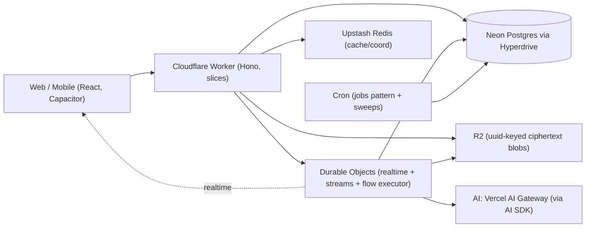

# HushBox Backend Redesign — Design & Plan of Record

> **Status:** Design locked — revised 2026-06-09 across three review rounds (codebase
> re-audit, live platform/API research, adversarial re-review, and founder decision
> sessions); implementation not started. Clean-slate **big-bang** rewrite of the backend in
> a single branch (decided over an incremental strangler-fig cutover — see §19/§20 for how
> the safety net is preserved). Round 3 deliberately **removed Cloudflare Workflows and
> Queues from the stack** (§21 records the re-entry triggers) and moved all interactive flow
> execution in-process into the conversation Durable Object.
> **The product has no users**, so migration, coexistence, and rollback are *not*
> constraints — we design the end state directly.
>
> **What this is:** the complete design and execution plan. It is the working
> plan-of-record / handoff. The permanent reference docs (`TECH-STACK.md`,
> `CODE-RULES.md`, `AGENT-RULES.md`) will be updated with the *distilled, deduplicated*
> rules once this plan is finalized; until then, this document is the single source for
> the redesign's intent and reasoning.
>
> **Disposition of decisions:** every decision here is evidence-based (codebase
> diagnosis + external research), but revisable. If a rule stops serving the work,
> change the rule *and this doc* — don't silently break it.

---

## 0. How to read this document

Sections 1–3 give the goals, the diagnosis of today's backend, and the shape of the
target. Sections 4–5 are the *domains* and *principles* (what we optimize for and how).
Sections 6–17 are the design proper, slice by slice and concern by concern. **Section 11
(AI Workflows) is the centerpiece** — the composable model+media engine that is the
product's headline capability, with an explicit per-principle table. Section 18 is the
full stack rationale (choice / why / denied). Section 20 is the phased build plan.
Section 22 is a glossary for newcomers.

---

## 1. Context & goals

**HushBox** is an end-to-end-encrypted AI chat aggregator: one interface to 100+ AI
models, with messages encrypted client-side (OPAQUE auth; per-conversation cryptographic
epochs). It runs serverless on Cloudflare. Today's backend is ~32k LOC of API plus shared
packages; all tests, lints, typecheck, and e2e currently pass.

**Why rewrite.** The current backend works but cannot absorb the two capabilities the
product is built around, and carries several correctness/security defects (Section 2). We
are rewriting the entire backend to be: *extraordinarily extensible, durable,
error-resistant, naturally self-healing, a joy to develop, maintainable, and free of
duplication.*

**The two headline requirements that shape everything:**

1. **Support brand-new model *types* with little or no code.** New input/output
   modalities (text, image, audio, video, embeddings, speech, reasoning, tool-use, and
   future ones) and new behaviors must be addable as *data + a tiny adapter*, never by
   editing a dozen switch statements.
2. **Compose AI work into arbitrary workflows.** Chain model calls (output → input), fan
   many outputs into one input, run media-transform algorithms mid-flow, branch and loop
   — a typed state machine over model calls and transforms (deadline-bounded and fail-fast
   by policy, §11.6). Initially these workflows are generated **by our own code, dynamically
   and pluggably** (data-defined DAGs over a curated node registry); a user-facing builder
   can layer on later with no engine change.

**Success metrics:** a new *model* onboards with **zero code** (auto-discovered); a
brand-new *modality* is a rare, deliberate, small change (one enum migration + one dispatch
adapter); new workflows ship as versioned definition data (a deploy is needed only for new
node types or the code that generates definitions); no double-charges, lost turns, or stuck
states; the system heals itself; the code is modular, testable, and self-documenting.

---

## 2. Current-state diagnosis (why we rewrite)

A full read of the existing backend (12 subsystem analyses) found a consistent root
cause and a set of concrete defects. Condensed:

**Root cause.** A "model type" is implicitly defined by an *output-only* `Modality` enum
threaded through ~12 hand-edited `switch` statements and 4 hardcoded ID allowlists. There
is no workflow engine — there are **two disjoint, ad-hoc orchestrators** (a text path and
a media path) that cannot compose. Most other smells compound from this.

**Correctness / security defects (now design requirements, not patches):**

| # | Defect | Evidence |
|---|---|---|
| 1 | Step-up auth routes (`/api/auth/*`) skip session-revocation checks — a logged-out / post-password-change cookie can change password or disable 2FA | `app.ts:63-72` mounts only `ironSessionMiddleware`, not `sessionMiddleware` |
| 2 | AI stream succeeds but persist/charge fails → the turn **and** the charge vanish silently | `stream-pipeline.ts:342` `waitUntil(billingPromise.catch(() => null))` |
| 3 | On a transport disconnect the turn's result is not reliably persisted — we *want* it completed, saved, and billed (the user authorized payment on send) | requirement stands; the originally cited evidence (`stream-pipeline.ts:1651`) did **not** verify on the 2026-06-09 re-audit |
| 4 | No charge-idempotency key → a retried turn double-charges | `usage_records` has a *non-unique* index on `(sourceType, sourceId)` |
| 5 | Money is float (`parseFloat` on `numeric(20,8)`) — drift is real (a `FREE_TIER_FLOAT_TOLERANCE_CENTS` hack already exists) | `balance.ts`, `resolve-billing.ts:39` |
| 6 | Data-driven capability path is **dead**: `supported_parameters` hardcoded `[]`; the `/config` merge a comment claims was never implemented | `fetch.ts:187` |
| 7 | Account deletion orphans some group-conversation media in R2 — **acceptable by design**: the GC job reclaims it (not a fix target) | `delete-user.ts:67-93` |
| 8 | Crypto has no decompression bound → a crafted member blob is a zip-bomb on the decrypting client | `compression.ts:8` |

**Structural smells** (re-verified 2026-06-09; 12/16 original claims confirmed at their
cited lines): `opaque-auth.ts` is 1,704 lines (the earlier "431 inline Drizzle calls"
figure was wrong — it delegates to services); the auth middleware bundle is copy-pasted
16× in `app.ts`; `saveChatTurn` is a god transaction; the parent-chain is reassembled in
multiple places (exact rule-divergence unverified); zero `relations()`;
bare-`text()` enums everywhere; no persisted model catalog; modality enum fragmented 5×;
bare `Uint8Array` key material inviting argument transposition.

---

## 3. Architecture at a glance

- **Style:** Modular monolith, **vertical slices** with **pragmatic hexagonal edges**
  (ports only where an implementation genuinely varies — ~6, at infra boundaries).
- **Runtime stack (no Effect):** services return **`Result<T, DomainError>`**
  (neverthrow); per-slice tagged `DomainError` unions map to `{code, details}` via
  **exhaustive ts-pattern**; external calls wrapped in **cockatiel** policies;
  cancellation via **AbortController**; DI via factory functions + Hono `c.var`; Zod at
  boundaries; **Drizzle inference preserved**.
- **Compute topology:** one product Cloudflare Worker (+ one separate admin Worker — §14);
  **Durable Objects** for per-conversation realtime, stream survival/resume, and the
  **in-process flow executor** (the DO owns the turn: it calls the gateway and runs
  finalize); **Cron** for scheduled jobs, sweeps, and the Postgres jobs pattern. **No
  Cloudflare Workflows, no Queues** (decided round 3 — re-entry triggers in §21): every
  async need is covered by status tables + atomic claim + cron sweep, `waitUntil` for
  declared-best-effort effects, and the DO for stateful execution.
- **Data:** Neon Postgres via **Hyperdrive + `pg` + Drizzle** as the single source of
  truth; **R2** for blobs (uuid-keyed, always ciphertext); **Upstash Redis** for ephemeral
  cache/coordination only.
- **Extensibility spine:** capability-driven **registries** (models, transforms, workflow
  nodes) — new types are *data + a tiny adapter*.
- **Enforcement:** `eslint-plugin-boundaries` (one tool for **both** cross-slice/package
  boundaries and intra-slice layers — `@softarc/sheriff` was dropped: redundant with
  boundaries, pre-1.0, less maintained) + `ts-morph` architecture tests (structural rules
  lint can't express). A rule without an enforcement mechanism is only a suggestion.



---

## 4. Domains — how each is addressed

| Domain | Approach |
|---|---|
| **Data storage & management** | Neon Postgres (via Hyperdrive) is the single source of truth for durable state — Drizzle with `relations()`, pgEnums, FKs, **integer minor-unit** money. R2 for blobs: uuid keys, always ciphertext (content-addressing was dropped — §11.4). Redis is ephemeral only (idempotency fast-path, rate limits, OPAQUE challenge, reservation cache) and is *never* the sole store of money or state. Immutability where it pays: append-only ledger, versioned crypto blobs, versioned model descriptors and workflow definitions. Ciphertext at rest. |
| **Data movement & processing** | Three modes: in-request synchronous; **in-DO flow execution** (the conversation DO runs whole definitions in one in-memory, deadline-bounded execution — §11); the **Postgres jobs pattern** (status table + atomic claim + cron sweep) for durable async ops. Inside a flow, values move **in memory**; R2 only at the edges (inputs in, epoch-wrapped finals out). Streaming reaches clients over the DO's hibernatable WebSocket with **abort propagation** and **resumability** (memory-only buffer + `Last-Event-ID`). The turn **completes server-side on disconnect** (best-effort — an eviction/deploy mid-stream saves nothing and bills nothing, so saved ⟺ billed holds either way; a janitor alarm makes kills visible); only an explicit user-stop aborts. Card charges use a **pre-claim** (Pattern D). |
| **Communication & API design** | Hono + typed `hc<AppType>()`. Errors: per-slice tagged `DomainError` → `{code, details}` via exhaustive ts-pattern → `friendlyErrorMessage`. Cross-slice communication is **only through published barrel APIs** (boundaries-enforced). Realtime via Durable Objects. `Idempotency-Key` required on all mutations (with five declared exemption classes — §8). |
| **Compute & deployment topology** | One product Cloudflare Worker (modular monolith) + one admin Worker (§14). DOs for realtime + stream coordination + flow execution; Cron for scheduled jobs and sweeps. Stateless Worker; all state in PG/Redis/R2 (DO holds only in-flight execution + a metadata-only marker). Deploys kill in-flight DO work — **accepted** (credit + idempotent client retry + janitor; §15). GitHub Actions CI/CD. Heavy server-side compute (video transcode, code execution) is **deferred** — see §12. |
| **Reliability & resilience** | Pre-claim + reconcile sweeps (no lost/stuck turns); DB-backed idempotency (exactly-once money); cockatiel retry/timeout on every external call (no in-isolate breakers — §18); **fast-fail flows**: deadline-bounded, never resumed, every charge credited on terminal failure (§11.6); the jobs pattern for roll-forward ops; GC/reconcile crons as self-healing backstops; best-effort vs critical separation; an explicit user-stop aborts, but a transport disconnect completes + bills best-effort (the user authorized it on send). |
| **Security & identity** | OPAQUE; E2E epoch crypto; **default-deny auth pipeline** (uniform revocation, including step-up); least-privilege per-slice authz; step-up (OPAQUE + TOTP) for sensitive ops; branded key types + versioned blobs + bounded decompression; typed/redacted secrets; zero-trust at the boundary; **ZDR enforced per-request via the gateway's fail-closed flag** (§10). Product audit via structured logs; **admin actions get a dedicated append-only audit table** (§14, Admin plane). |
| **Observability & operations** | Native Cloudflare (Workers Logs + Analytics Engine + OTel tracing, MCP-queryable) + Sentry for errors (§17; PostHog deferred, no session replay ever); request-ID correlation; health endpoints; flow/job state lives in `flowRuns` + job tables — queryable by SQL and the admin panel (§14); one-command local dev with near-prod parity (Hyperdrive local mode bypasses pooling/caching — §18). |
| **Architectural styles & boundaries** | Modular monolith, vertical slices + pragmatic hexagonal. Boundaries enforced by eslint-plugin-boundaries + ts-morph. Coupling is the explicit, lint-enforced import graph; cross-slice writes go through published APIs; the orchestrating slice owns each transaction. Capability-driven registries make new types data + a tiny adapter. |

We do not maintain a separate "domains" chapter in the permanent docs; these treatments
are folded into `TECH-STACK.md` / `CODE-RULES.md` where related content already lives.

---

## 5. Principles — what we value and how

Legend: ✅ core value · ◐ valued with a deliberate nuance · ⚠️ deliberately limited.

| Principle | | How it lives in the system |
|---|---|---|
| Enforced idempotency | ✅ | Branded `Mutation → Idempotent`, five `idempotent.*` patterns, mandatory `Idempotency-Key`, ts-morph enforcement (§8) |
| No partial / stuck states | ✅ | Pre-claim rows, atomic conditional transitions, deadline-bounded flows (terminal within minutes by construction), reconcile sweeps |
| Self-healing | ✅ | Reconcile/GC crons, fast-fail + automatic credit, retried job sweeps, janitor alarms, auto-expiring Redis holds |
| Deterministic behavior | ✅ | No `Date.now`/random in flow control; pinned definition versions |
| Consistency guarantees | ✅ | One Postgres; **cross-slice ACID is allowed**; strong for money/state, eventual only for best-effort side-effects |
| Correctness by construction | ✅ | Branded types, exhaustive matching, capability-typed dispatch, Zod boundaries, compile-enforced contracts |
| Exactly-once effects | ✅ | Pre-claim + DB idempotency keys (external provider calls: at-least-once + dedup); per-node charges exactly-once via DB keys |
| Graceful degradation | ◐ | Best-effort ports (push/email/realtime) degrade; **money/auth/persistence never degrade — fail fast** |
| No single point of failure | ◐ | Lean on Neon HA + Cloudflare edge + encrypted backups; we **don't** DIY multi-region — Postgres is a logical SPOF, mitigated not eliminated |
| Fault isolation | ✅ | Slice boundaries, per-call timeouts/retries, per-branch/per-model fan-out isolation |
| Recoverability | ✅ | Durable pre-claim/job state, reconcile sweeps, frequent encrypted backups (Kopia→B2), idempotent retries |
| Backpressure | ◐ | DO single-thread gates, rate limits, bounded fan-out widths, cron batch caps |
| Modularity / separation of concerns | ✅ | Vertical slices, published barrels, lint-enforced boundaries |
| Loose coupling, high cohesion | ✅ | Import-graph boundary; cohesion via **transaction-boundary slicing** |
| Evolvability | ✅ | Data-driven registries; versioned descriptors/definitions; clean-slate removes cruft |
| Backward / forward compatibility | ◐ | No users → no live back-compat burden now; but we **version** crypto blobs, descriptors, and workflow definitions (in-flight instances pinned). API versioning deferred |
| DRY without over-abstraction | ✅ | Single-source types (Drizzle/Zod); shared node primitives reused by chat + engine; **reject** anemic over-porting |
| Testability | ✅ | 95% coverage, TDD mandatory, factory DI + mock adapters, fresh test layers, behavioral tests preserved as spec |
| Observability | ✅ | Native CF logs + Analytics Engine + tracing (MCP-queryable) + Sentry; redaction-by-default; product analytics deferred |
| Diagnosability | ✅ | Typed errors with context, request-ID correlation, no swallowed errors |
| Reproducibility | ✅ | Deterministic builds, local=prod parity, cassette-replayed AI tests, time mocking |
| Automated, reversible deployment | ✅ | GitHub Actions; revert (never reset); preview branches |
| Configurability over rebuild | ✅ | **Headline** — descriptors, workflow definitions, transform registry are *data*; new models appear with zero code; new flows are new definitions |
| Operational simplicity | ✅ | One product Worker + one admin Worker, managed services, one-command dev, **fewest moving parts** (round 3 removed Workflows + Queues — every remaining service has multiple irreplaceable consumers) |
| Secure by default | ✅ | Default-deny pipeline, E2E default, redacted secrets, ZDR |
| Least privilege | ✅ | Per-slice authz, scoped secrets, step-up for sensitive ops |
| Zero-trust | ◐ | Enforced at the API/client boundary (never trust client IDs); internal same-process calls are trusted — no internal mTLS |
| Auditability | ◐ | Via structured logs, **not** a hash-chained Postgres audit table (deferred until compliance demands it) |
| Data integrity | ✅ | FKs, constraints, transactions, AEAD, idempotency |
| Simplicity | ✅ | "No Effect, ~6 ports, 4 patterns" is simplicity-driven; simplicity is the tiebreaker |
| Single source of truth | ✅ | Drizzle (DB types), Zod (contracts), model catalog (model facts), workflow definitions (flow), one modality enum |
| Principle of least surprise | ✅ | Lint-enforced conventions, no magic, consistent patterns |
| Explicitness | ✅ | Result error channels, factory DI, explicit boundaries, fail-fast over silent fallback |
| Composability | ✅ | Workflow engine, node primitives, capability registries, Result/policy combinators |
| Immutability where possible | ✅ | Append-only ledger, versioned blobs, pinned workflow versions |
| Self-documenting / intent-revealing | ✅ | Types as docs, named patterns, intent-revealing names, comments only for durable non-obvious facts |

**Also valued (already in our docs / added in this redesign):** 95% test coverage ·
fail-fast / never-hide-problems · type-safety, no `any` · serverless mindset / no
in-memory state · accessibility (WCAG) · no security through obscurity · local-dev parity
· frequent forever backups · DX-first · cost efficiency · **transaction-boundary slicing**
· **capability-driven extensibility** · **AI SDK as the portability seam (single Vercel AI Gateway)** ·
**behavioral-tests-as-spec**.

**Honest tension — vendor lock-in.** "Minimal vendor lock-in" is a stated value, yet we
deliberately deepen our Cloudflare commitment (Hyperdrive, Durable Objects, R2). We treat
this as **◐ deliberate**: we trade lock-in-minimization for operational simplicity and
platform power, and we **isolate** the lock-in behind ports/adapters so each piece is
swappable in principle. (Round 3 reduced the surface: Workflows and Queues were removed,
so the deepest remaining lock-in is the DO programming model.) If lock-in-avoidance is
reweighted higher, the next decision to move is the Hyperdrive/`pg` driver choice.

---

## 6. Slices & boundaries

### Slice map

Slices are organized by feature and by **transaction boundary** — what commits together,
slices together.

| Slice | Owns (tables / responsibility) |
|---|---|
| `identity` | OPAQUE auth, sessions (including the distinct **billing-only session** type), TOTP, step-up, token-login, email verification + resend, recovery (incl. the enumeration-safe wrapped-key retrieval with timing-safe dummy response), TOTP/deletion lockouts, session revocation (`sessionActive` + `passwordChangedAt`), **link-guest as a first-class principal type** (consumed by realtime + media authz); **account deletion** (Pattern A + GC — §7); the default-deny pipeline |
| `conversations` | `conversations`, `epochs`, `epoch_members`, `conversation_members`, `conversation_forks`, `shared_links`, `shared_messages`; key rotation; mute/pin; shared-message creation **and the unauthenticated public share read endpoint** (IP rate-limited); link privileges; member limit; full-history-vs-rotation add semantics (`visibleFromEpoch`); key chains |
| `chat` | the turn: `messages`, `content_items`, `llm_completions`, `media_generations`; orchestration + persistence; **trial mode as an explicit no-persist/no-charge variant of the same pipeline** (5/day quotas); regenerate; **Smart Model** (the classifier-routing flow, consumed as a workflow definition — §11.7) |
| `billing` | `wallets`, `ledger_entries`, `usage_records`, `payments`, `member_budgets`, `conversation_spending`; Helcim; webhooks (with retry + service-evidence logging — CI's `verify:evidence` depends on it); payment expiration; free-tier daily allowance; **wallet provisioning** (published `provisionWalletsWithinTx`, composed by identity at registration); usage-analytics read endpoints; exposes `chargeWithinTx` (holds are short-lived Redis keys, not a table) |
| `models` | model catalog + capability registry + inference orchestration over the `ModelProvider` port; premium-tier gating; ZDR-reachability |
| `media` | R2 GC, presign (**epoch-gated**: membership AND an `epoch_members` row for the message's epoch), media-transform node implementations |
| `notifications` | email, push (suppressed by mute + DO presence), device-tokens |
| `account` | user search, encrypted custom instructions, accessibility preferences (LWW merge); **data export** (the lone jobs-pattern op — §7) |
| `workflows` | the generic DAG engine (the in-DO executor), the node registry, the **definitions library** (incl. Smart Model — §11.7), the typed builder |

Beyond the slices, two app-level areas: **`platform`** (health, roadmap proxy, app-update/
download routes, the dev-only routes the e2e suite depends on, version-check middleware +
its exemption list, the rate-limit registry) lives in `apps/api` as cross-cutting routes;
the **admin plane** is a *separate* `apps/admin-api` Worker + `apps/admin` SPA — full design
in §14 (Admin plane).

Model **descriptor schemas** live in `packages/shared` (consumed by chat, billing,
workflows); the **catalog service** is the `models` slice; persistence is `packages/db`.
Ports that earn their keep (infra edges only): `ModelProvider`, `Storage`,
`PaymentProvider`, `EmailSender`, `RealtimeBroadcast`, `Telemetry` (best-effort) — six —
plus `TransformCompute` (abstract; heavy backend deferred) and a reserved-but-deferred
`FeatureFlags`. (`QueuePublisher` and `WorkflowRunner` were cut with their services in
round 3.) We do **not** wrap `Db`/`Cache`/`Crypto` behind anemic ports (it would discard
Drizzle/Zod inference).

### Boundary rules (each with enforcement)

- A slice's `index.ts` barrel is its only public surface. *(boundaries)*
- Slices may not import each other's internals; they communicate via barrel types or
  published methods. *(boundaries)*
- Domain code imports only from its slice's `ports/`; only adapters import infra
  libraries. *(eslint-plugin-boundaries)*
- Routes contain no business logic. *(ts-morph + review)*
- `apps/*` import `packages/*`, never the reverse; `packages/shared` imports nothing
  internal beyond other shared subpaths. *(boundaries + pnpm)*

### Cross-slice communication & transactions (corrected from the source doc)

We **do** support cross-slice communication, and because we run one Postgres in one
Worker, that communication **can be transactional** — this is the main benefit of choosing
a modular monolith over microservices, and we keep it. The rule:

> A slice may touch another slice's tables **only through that slice's published barrel
> API** (including transactional write helpers such as `billing.chargeWithinTx(tx, …)`).
> The **orchestrating slice owns the transaction** and composes other slices' published
> writes inside it. Direct schema reach-in is banned. *(boundaries + ts-morph)*

So `chat`'s `saveChatTurn` calling `billing.chargeWithinTx(tx, …)` is the **normal**
pattern, not an exception. This retires the source doc's "transactions never cross
slices" rule and its contrived "row-kind ownership in a shared table" workaround. Coupling
stays explicit and lint-enforced; atomicity stays intact.

---

## 7. The four operation patterns

Every write operation is exactly one of these (the source doc's three plus the one its own
code proved necessary):

- **A — Single DB transaction.** Atomic, no external calls inside. The default. *Failure:*
  Postgres rolls back; HTTP error; client retries.
- **B — Single external call in-request.** One external call + one DB update. *Failure:*
  HTTP error; client retries with `Idempotency-Key`; the cached response replays the
  original outcome.
- **C — Jobs pattern: status table + atomic claim + cron sweep.** Durable async work that
  must roll forward to completion. A status row is written in-request; the cron claims it
  atomically (`idempotent.byTransition`), invokes a **queue-shaped handler** (handler
  registry keyed by job type, payload in/`ok|retry|dead` out — so a future move to a real
  queue swaps only the trigger), with attempt counts + backoff columns; terminally failed
  jobs are `status='dead'` rows — queryable forever, redriven by `UPDATE`, visible in the
  admin panel. *(Redefined in round 3 from "Cloudflare Workflow + domain table"; current
  sole consumer: data export. Account deletion turned out to be Pattern A + GC — the
  one-transaction delete severs every reference and key, and the existing orphan GC reclaims
  the ciphertext within a cycle.)* *Failure:* per-attempt retries, dead rows, admin redrive.
- **D — External-effect-then-reconcile (pre-claim).** A **card charge** moves money at the
  processor and we must capture it **exactly once**: write a durable **pre-claim** (the
  `payments` row in `pending`/`awaiting_webhook`) *before* the charge, then finalize via the
  webhook; a reconcile sweep resolves any pre-claim left pending by a crash. **Model calls and
  media generation are *not* Pattern D** — they are *saved ⟺ billed* (persist + charge in one
  atomic txn), so a crash saves nothing and bills nothing. Inside a flow, a paid node is
  exactly-once via its DB idempotency key.

There is no fifth pattern. If an operation doesn't fit A–D, the slice boundary is probably
wrong — redraw it (and show the redraw concretely, don't hand-wave).

---

## 8. Enforced idempotency

**Goal:** every mutation is exactly-once *in effect*, and the safety is enforced by the
compiler, lint, and tests — not by developer discipline.

**Type spine.** A persistent-state mutation, at the port/repository layer, returns a
branded `Mutation<T>`:

```ts
declare const MUTATION: unique symbol
export type Mutation<T> = T & { readonly [MUTATION]: 'Mutation' }

declare const IDEMPOTENT: unique symbol
export type Idempotent<T> = T & { readonly [IDEMPOTENT]: 'Idempotent' }
```

`Mutation<T>` is deliberately un-shippable: the route helper `runMutation` accepts only
`Idempotent<T>`. The single way to convert one to the other is an `idempotent.*` wrapper.
A mutation that isn't wrapped in an idempotency strategy is therefore a **compile error**.
There is no escape hatch. (Plain TypeScript branding — no Effect, no runtime cost beyond
the wrapper's own logic.)

**The five strategies.**

| Wrapper | Mechanism | Used for |
|---|---|---|
| `idempotent.byKey` | client `Idempotency-Key`; first call acquires it via a **Postgres unique insert**, stores the response; retries replay it (Redis caches the hot path) | general mutating endpoints |
| `idempotent.byUpsert` | `INSERT … ON CONFLICT`; DB unique constraint is the guard | natural-key creation (device tokens, member add) |
| `idempotent.byTransition` | `UPDATE … WHERE status = <expected>` in a txn; assert rows-affected = 1 | state-machine steps (payment, turn) |
| `idempotent.byEventId` | atomic claim on a unique event id (Postgres for money, Redis `SET NX` + TTL otherwise) | webhook consumers, job handlers |
| `idempotent.byExternalPreClaim` | write a `pending` row before an external effect we must capture exactly once; finalize/reconcile after | card charges (Pattern D); rarely needed elsewhere |

**Money is DB-backed, never Redis-only.** Unique idempotency-key constraints on the charge
rows — `usage_records`, `ledger_entries`, `payments`; Redis eviction can never cause a
double-charge because the DB constraint is authoritative. **Reservations are *not* money** —
they are short-lived Redis holds (TTL); losing one risks at most a small bounded overspend in a
rare race, never lost money, because the ledger is authoritative. Money is integer minor-units
(`bigint`), so there's no float drift in comparisons.

**Retry composition.** `cockatiel` retry policies may only wrap an already-`Idempotent<T>`
value (type + lint enforced). Inside the flow engine, per-node DB idempotency keys give the
same guarantee.

**Enforcement.** *Type:* `runMutation` requires `Idempotent<T>`. *Structural (ts-morph
tests):* every mutating port method returns `Mutation<T>`; every `Mutation<T>` is consumed
only by an `idempotent.*` wrapper; no raw Drizzle mutations in domain code; the
Idempotency-Key middleware is mounted on every mutating route. *Runtime:* middleware
rejects mutations missing the key. *Tests:* each pattern has duplicate-delivery + retry +
crash-recovery tests; the pre-claim path has a "crash after external effect" integration
test asserting no double-charge and no loss.

**Idempotency-Key exemptions.** The header is required on every mutating route *except*
those declaring one of five exemption classes in the route definition. A ts-morph test
asserts every exempted route's handler uses the matching `idempotent.*` wrapper internally —
no unclassified mutation can ship:

| Class | Routes | Why safe without the header |
|---|---|---|
| `opaque-protocol` | login/register/2FA/recovery init+finish | Redis challenge state is the dedup; a retry restarts the handshake harmlessly; rate-limited |
| `token-is-key` | token-login | the one-time token itself is the idempotency key (deterministic session id) |
| `webhook-event-id` | `/webhooks/*` | `idempotent.byEventId` on the provider's event id |
| `internal-consumer` | job handlers, cron | `byEventId` / `byTransition`; no client involved |
| `naturally-idempotent` | logout, decline-invite | same end-state on repeat (`byUpsert`/`byTransition` underneath) |

---

## 9. Data model

Neon Postgres via Hyperdrive. Highlights of the redesigned schema:

- **Money is integer nano-USD (`bigint`)** everywhere (**decided**). No `numeric`/float for
  money; conversions only at boundaries. Nano (1e-9) over micro: storage pricing
  ($0.0003/1k chars ≈ 0.3 µUSD/char) is sub-micro, and nano guarantees no rounding anywhere
  while fitting comfortably in `bigint` (cap ≈ $9.2B).
- **pgEnums** for every status/type/privilege field **and for modality** (no bare `text()`
  enums). **Decided:** a brand-new modality is a rare, deliberate event — one enum migration
  + one dispatch adapter — and we accept that small deploy in exchange for closed-set type
  safety everywhere. (This retires the earlier "open modality string tags" idea, which
  conflicted with pgEnums and bought flexibility we don't need at that frequency.)
- **`relations()`** declared for every table (so Drizzle's relational queries are usable
  and joins aren't all hand-written).
- **FKs added:** `messages.parentMessageId`, `messages.epochNumber → epochs`, all model
  references → `modelCatalog`, `epochs.previous_epoch_id` (referential epoch chain).
- **New tables:** `modelCatalog` + `modelPricing` (persisted capability/pricing catalog),
  `modelOverrides` (manual supplements for capability gaps the gateway can't express);
  **`flowRuns`** (one slim row per flow execution, written by the DO executor: domain refs,
  start/terminal status, `failure_reason`, `progress` JSONB — for billing correlation, the
  failed-credit admin queue, and diagnostics; **no per-step table** — per-node cost falls
  out of `usage_records`); `exports` (the lone jobs-pattern table — §7);
  `admin_audit` + `admin_pending_actions` (the admin plane's append-only audit log and
  delay-queue — §14, Admin plane).
- **Idempotency:** unique idempotency-key constraints on the **charge** rows — `usage_records`, `ledger_entries`,
  `payments` idempotency-key columns.
- **Lifecycle/status columns** live only on genuinely multi-step, crash-spanning entities —
  `flowRuns`, the jobs-pattern tables, the existing `payments` (reserve→capture→webhook),
  and a `deletionRequestedAt` column on users (the chunked-deletion fallback — §7). The **chat turn gets none**: persist+charge is one atomic
  transaction (saved ⟺ billed), in-flight state lives in the conversation Durable Object, and the
  Redis hold auto-expires — a crash saves nothing and bills nothing, leaving no half-state to
  reconcile.
- **Storage keys are uuid everywhere**: uploads keep `media/{conv}/{msg}/{uuid}` (the key
  schema embeds ownership, which is what makes list-and-check orphan GC possible). A
  short-TTL `inputs/{flowRunId}/{uuid}` class exists **only** as the large-input fallback
  (§11.4) — flows hold intermediates in memory, never in R2. Content-addressing was
  **dropped** — full rationale in §11.4.
- **Single modality enum** sourced from `packages/shared` (one const array feeding the
  pgEnum, the Zod schema, and the dispatch types), consumed by DB + API + AI.
- **Hard deletion, no soft-delete of user data** (the privacy promise is *full* deletion):
  account deletion physically removes rows + R2 objects (GC sweeps orphans). Financial/ledger
  rows are *retained but anonymized* — the user link is severed via `ON DELETE SET NULL` — which
  is record-retention, not a soft-deleted copy of user data.

Append-only `ledger_entries` with running `balanceAfter`; financial rows survive user
deletion (deliberate audit retention via `ON DELETE SET NULL`).

---

## 10. Capability-driven model system

The mechanism that makes "new model types with ~no code" real.

**Descriptors are data; modalities are a closed enum.** A model self-describes. Modalities
come from the single shared enum (§9) — **a new model is pure data; a new *modality* is a
rare, deliberate enum migration + one dispatch adapter** (decided — see §9):

```ts
export const MODALITIES = ['text', 'image', 'audio', 'video', 'embedding'] as const
export const Modality = z.enum(MODALITIES)   // one source: feeds pgEnum, Zod, dispatch types

export const ModelDescriptor = z.object({
  id: z.string(),
  provider: z.string(),
  version: z.string(),
  inputs: z.array(Modality),
  outputs: z.array(Modality),
  parameters: z.array(z.string()),     // supported_parameters (revived; language models only — see below)
  behaviors: z.array(z.string()),      // 'streaming' | 'tools' | 'reasoning' | 'web-search' | …
  limits: z.record(z.string(), z.number()),
  pricing: PricingSchema,              // integer nano-USD (§9) — estimates/display ONLY, never billing (§13)
  zdrReachable: z.boolean(),           // derived: some provider for this model is on the gateway's ZDR list
  fetchedAt: z.number(),
})
```

**One modality-agnostic port** replaces the per-modality switch fan-out. Dispatch is a
`Map<signature, Adapter>` keyed by `inputs+outputs` (the Vercel AI SDK's own internal
pattern, lifted one level):

```ts
export interface ModelProvider {
  infer(req: InferenceRequest, d: ModelDescriptor): InferenceStream   // ONE generic method
  listDescriptors(): Promise<ModelDescriptor[]>
}
```

**Vercel AI Gateway as the single gateway; the AI SDK as the portability seam.** We route
**all** inference through the **Vercel AI SDK** (v6 — already installed), pointed at the
**Vercel AI Gateway** (one gateway, exactly as today). The reason to go through the SDK is
*portability*: the SDK is the vendor-neutral seam, so a future move to another gateway/provider
touches one adapter, not the domain. We reach for **Vercel-proprietary APIs only when the SDK
can't express something** — never per-model direct-to-provider routing.

**ZDR is enforced per-request, mechanically (decided).** Every inference call sets
`providerOptions.gateway.zeroDataRetention: true`, which the gateway enforces **fail-closed**:
it routes only to providers under a ZDR agreement and errors with `no_providers_available`
otherwise. (Per-request flagging is free on our Pro tier; we deliberately do **not** enable the
account-wide toggle, which is billed per-request.) ZDR status is *not* machine-readable in the
gateway's model metadata, so the descriptor's `zdrReachable` flag is **derived** from the
gateway's documented ZDR-provider list — a small manual sync of ~14 provider names (not
per-model data) — and exists only so the catalog/UI can hide models that would fail the flag,
never as the enforcement mechanism itself.

**Honest scope limits (verified against the live gateway, 2026-06-09):**
- **Audio does not exist on the gateway** — no TTS/STT model type, open feature request
  upstream. The current `/api/chat/audio` endpoint is dead code behind a feature flag (it
  throws). Audio stays **deferred** until the gateway supports it; if a feature ever forces it
  sooner, a direct-provider exception must be *designed* (it breaks the single-gateway ZDR
  story), not slipped in.
- The "one generic `infer()`" maps cleanly onto **language models** (true streaming). Image
  (three different API shapes), video (non-streaming, minutes-long), and embeddings are
  separate promise-returning SDK calls — the adapter layer wraps each as a single-event
  stream behind the same port. Plan for **one adapter per modality family**, not "a tiny
  adapter" in the singular.

**Multimodal I/O contract** replaces today's text-or-one-blob event model:

```ts
export const InputPart = z.discriminatedUnion('modality', [
  z.object({ modality: z.literal('text'), text: z.string() }),
  z.object({ modality: z.literal('image'), ref: MediaRef }),
  z.object({ modality: z.literal('audio'), ref: MediaRef }),
  // extending = add a variant here alongside the enum migration (rare, deliberate — §9)
])
export const InferenceRequest = z.object({
  model: z.string(),
  inputs: z.array(InputPart),
  parameters: z.record(z.string(), z.unknown()),  // validated against descriptor.parameters
  outputs: z.array(Modality),
})
export const InferenceEvent = z.discriminatedUnion('kind', [
  z.object({ kind: z.literal('text-delta'), index: z.number(), content: z.string() }),
  z.object({ kind: z.literal('reasoning-delta'), index: z.number(), content: z.string() }),
  z.object({ kind: z.literal('tool-call'), id: z.string(), name: z.string(), args: z.unknown() }),
  z.object({ kind: z.literal('media-start'), index: z.number(), modality: Modality, mimeType: z.string() }),
  z.object({ kind: z.literal('media-done'), index: z.number(), value: MediaValue }),
  z.object({ kind: z.literal('finish'), metadata: ProviderMetadata }),
])
```

**Catalog persistence & refresh.** A cold-start normalization reads gateway model metadata,
normalizes to `ModelDescriptor`, and upserts into `modelCatalog` (idempotent by
`(id, version)`). A Cron Trigger re-runs periodically so added/retired models propagate
without a deploy. The metadata is **two-tiered** (verified live): the list endpoint
(`/v1/models`) gives id/type/tags/limits/pricing; **modalities and `supported_parameters`
live only on per-model `/endpoints` calls** — the refresh makes N+1 requests (fine for a
cron). Known metadata weaknesses the normalizer must handle: `supported_parameters` is
boilerplate for non-language models (it cannot drive image/video parameter UIs — overrides
fill that), several models ship **empty pricing objects** (excluded from exposure unless an
override supplies pricing), and image/video models report zeroed context/token limits.
Billing and content rows FK into `modelCatalog`, so pricing and capability are joinable and
versioned. Sync is **one-directional** (gateway → catalog, with `modelOverrides` layered on
top) and **append-mostly**: a metadata change creates a new `(id, version)` row so historical
records keep referencing the metadata in effect at the time; retired models are marked
inactive, never deleted (FK integrity). Persisting (vs querying live) buys FK integrity,
historical pricing, availability independent of the gateway, and rich local queryability.
Where the metadata omits a capability, the `modelOverrides` table supplies *only* the missing
field — the sole manual input, used only where automatic discovery is impossible.

**No model is ever added by hand.** The model list, capabilities, and pricing are discovered
**automatically** from the gateway metadata and refreshed by cron — a model the gateway
advertises appears on its own. The *only* manual inputs are (a) a `modelOverrides` supplement,
used **solely** to fill a field the metadata genuinely can't express (known cases: non-language
parameter surfaces, empty-pricing models, capability gaps like missing audio-input flags), and
(b) the ~14-name ZDR-provider list sync (above). The *only* code ever required is a new
**dispatch adapter**, and that is for a genuinely new *modality* the AI SDK handles differently
(paired with the §9 enum migration) — never for adding a model. End to end, models and
capabilities are metadata-driven; manual touch is the rare exception, not the path.

---

## 11. ★ AI Workflows — the system we want

This is the product's headline capability and the heart of the design. Everything the
product does with AI is expressed as a **workflow**: a typed, directed graph of **nodes**
over **typed channels**, executed durably. A single chat turn is the degenerate case (one
model-call node); a complex flow is many nodes chained, branched, looped, fanned in/out,
with media transforms interleaved.

### 11.1 Design tenets

- **Definitions are DATA; behavior is CODE.** A workflow is a serializable, Zod-validated
  JSON DAG. Node *implementations* live in a versioned code registry keyed
  `(type, version) → NodeImpl`. A new flow is new definition data; a new capability is one
  node implementation (tiny code). This is "configurability over rebuild." (Stated honestly:
  definitions authored at runtime ship without a deploy; the *generation code* and node
  implementations deploy like any code.)
- **Authoring: typed builder functions now; a capability planner later (decided).**
  **Level 1 (built in this plan):** product flows are written as **plain typed builder
  functions** over the node registry (no fluent DSL — same validation, less machinery);
  `build()` runs the same graph-compile validation as save-time (edge type-compatibility,
  cycle checks, bounded fan-out) and emits the JSON definition. Flows ship as a small
  library of versioned definitions, reviewable in PRs.
  **Level 2 (deferred until a feature needs it):** a planner that auto-assembles a
  definition from `(available inputs, desired outputs, model prefs)` by querying the catalog
  and inserting adapter nodes. It emits the same definition contract, so deferring it costs
  no engine change. *(User-facing authoring likewise layers on later — a builder UI emits
  the same contract.)*
- **No client participation after send (decided — load-bearing constraint).** A flow may
  require the client **only at the moment the request is sent**; it must never block on the
  client again. The execution/privacy model this forces is §11.4.
- **Fast-fail, never resumed (decided).** Interactive flows exist to answer a waiting user.
  Every definition carries an **instance deadline** (default ~5 min; media-heavy ~15 min).
  Past deadline or a terminal node failure: the run terminal-fails, **every charge is
  internally credited**, the client is told, and the user's retry is the recovery path. We
  do not resurrect old runs — by the time a resume would land, the user has already retried.
- **In-process execution on the conversation DO (decided round 3).** The engine is an
  in-memory interpreter running inside the per-conversation Durable Object — one continuous
  execution, values passed in memory, the terminal node streaming to the client. There is no
  durable-execution substrate behind interactive flows (Cloudflare Workflows was removed —
  §21 records re-entry triggers). Crash/deploy mid-run = terminal-fail + credit, which is
  exactly the fast-fail policy.

### 11.2 Node taxonomy

All nodes implement one interface, so the engine never special-cases them:

```ts
export interface NodeImpl<In, Out> {
  readonly type: string
  readonly version: number
  readonly inputSchema: z.ZodType<In>
  readonly outputSchema: z.ZodType<Out>
  run(input: In, ctx: WorkflowCtx): Promise<Result<Out, NodeError>>   // pure wrt durable state
}
```

**The `ValueStore` seam.** Nodes touch content values (`ContentValue` — inline bytes/text or
a ref) only through `ctx.values.resolve(v)` / `ctx.values.store(v)`. In round 3 this
collapsed to **one shipped implementation** — in-memory, since all interactive flows run
in-process in the DO — but the *interface* is deliberately preserved: it is the seam through
which a future durable executor (R2-ref-based, for flows that must survive deploys or exceed
isolate memory) plugs in without touching a single node. *Enforcement:* a ts-morph rule
forbids node implementations from importing storage/R2 modules directly.

| Node | Purpose |
|---|---|
| `modelCall` | invoke any model via the `ModelProvider` port + a descriptor (any modality) |
| `transform` | run a media/data transform via the `TransformCompute` port (server locus — §12) |
| `fanOut` | spawn N parallel branches — static, or data-driven (LangGraph `Send`-style) |
| `fanIn` | combine many upstream outputs into one input via a typed **reducer** |
| `branch` | conditional routing on a typed predicate over state |
| `loop` | bounded iteration until a typed condition |
| `subWorkflow` | nest a workflow as a node (composability) |

The set is **extensible**: a new node type is one registered implementation; the engine and
all existing definitions are untouched.

### 11.3 Typed channels, state, and fan-in

```ts
export const Node = z.discriminatedUnion('type', [
  z.object({ type: z.literal('modelCall'), id: NodeId, model: z.string(), params: z.record(z.unknown()), in: PortRef, out: PortId }),
  z.object({ type: z.literal('transform'), id: NodeId, transform: z.string(), in: PortRef }),
  z.object({ type: z.literal('fanOut'),    id: NodeId, over: PortRef, body: NodeId }),
  z.object({ type: z.literal('fanIn'),     id: NodeId, reducer: z.string(), ins: z.array(PortRef) }),
  z.object({ type: z.literal('branch'),    id: NodeId, predicate: z.string(), then: NodeId, else: NodeId }),
  z.object({ type: z.literal('loop'),      id: NodeId, body: NodeId, until: z.string() }),
  z.object({ type: z.literal('subWorkflow'), id: NodeId, ref: z.string() }),
])
export const WorkflowDefinition = z.object({
  version: z.number(),
  nodes: z.array(Node),
  edges: z.array(Edge),
})
```

- **Typed edges.** Each node declares `inputSchema`/`outputSchema`. An edge is legal only if
  the producer's output type is assignable to the consumer's input type. This is checked
  **at definition-save time** (graph-compile) and **re-validated at runtime** before each
  node. Format mismatches between media producers/consumers insert an explicit adapter node
  (e.g., `jpeg→avif`); never a silent coercion.
- **Reducer state for fan-in.** Shared state is a typed object; each field may have a
  registered **reducer** (default last-write-wins). Fan-in is a node whose reducer merges N
  upstream outputs deterministically (concat, object-merge, vote, select-best, custom). This
  is LangGraph's key insight and makes parallel/fan-in writes safe and serializable.

### 11.4 Execution & privacy model: no client after send, nothing at rest mid-flow (decided)

**The constraint.** A flow may involve the client **only at the initial send**; it must run
to completion with no client online. With in-DO execution (round 3) this is satisfied
*trivially*, and the privacy story is strictly better than any staged design: **mid-flow, no
user content exists at rest anywhere** — only in the DO's memory, the same place a request's
plaintext already transiently lives (the server must see plaintext to call models — README's
published threat model; it encrypts to the epoch public key at persist and can never decrypt
again — verified: `beginMessageEnvelope(epochPublicKey)` is how AI outputs are persisted
today).

**The mechanism:**

1. **All inputs are supplied at send.** The request carries the prompt, parameters, and any
   media inputs. A flow referencing *historical* encrypted content ("transform the image
   from message 5") has the client decrypt and attach it at send — never a later round-trip.
   Small inputs ride the request body straight into the DO. **Large inputs:** direct request
   body first (simplest — no storage involved at all); if body limits ever bite, the
   fallback is a short-TTL `inputs/{flowRunId}/{uuid}` staging object, client-encrypted with
   a request-scoped key the DO uses once and deletes at flow start.
2. **Intermediates live in DO memory only.** Values pass between nodes in-process via the
   in-memory `ValueStore`. No R2, no durable state, nothing retained by any vendor system.
3. **Final outputs are wrapped to the epoch public key at persist.** **Epoch-at-persist rule
   (decided):** finals wrap to the epoch that is current *at persist time* (today's exact
   behavior); if the initiating user is no longer an epoch member by then
   (rotation/removal mid-run — rare in a minutes-bounded flow, but possible), the run
   terminal-fails, persists nothing, and credits all charges.
4. **What survives a run:** the persisted finals (E2E from that moment), the `flowRuns`
   metadata row (shape, status, cost — the same metadata class the product already stores
   in plaintext), and nothing else.

**Operating limits (honest):** the DO isolate gives ~128 MB — ample for text and image
flows. Video generation must hold the result plus its encryption buffer at once, so it gets
a size cap or chunked encryption (T0.7). Fan-out width is bounded by the validator. Flows
that would exceed memory belong to the deferred heavy-compute tier (§12), which is also what
reintroduces R2 intermediates (container handoff requires them).

**Content-addressing is dropped (decided).** The earlier design keyed transform outputs by
`HMAC(epochSecret, content)` — but that hash is computable only client-side, which violates
the no-client constraint for every server-produced artifact, and a server-computable
substitute (server-keyed HMAC) would store a durable fingerprint of plaintext, weakening the
at-rest story. What CAS bought is covered anyway: fan-out branches share the *same in-memory
value* (nothing to dedup), per-node charges are exactly-once via DB idempotency keys, and
cross-run dedup of generated content was always marginal (generated artifacts are rarely
byte-identical). **All storage keys are uuid** (§9). If upload dedup is ever wanted, it's a
client-side-at-send optimization that can return later without touching the engine.

**Recorded design — staged durable execution (not built).** If a future feature needs flows
that survive deploys, exceed isolate memory, or hand off to containers, a durable executor
returns behind the `ValueStore` seam with this recorded design: a per-run ephemeral key
(**K_inst**) generated client-side at send; *all* content — including user-authored node
params — passed as K_inst-encrypted R2 refs while control values ride inline; a terminal
cleanup step + status-checked GC deleting staging; backups excluding the staging prefix;
AEAD binding each ciphertext to `(runId, ref)`; K_inst as a branded Secret type that cannot
serialize into progress JSON, error context, or Sentry. §21 names the re-entry triggers.

```ts
export const MediaValue = z.object({
  ref: z.string(),           // R2 key: media/{conv}/{msg}/{uuid} (epoch-wrapped final) or
                             // inputs/{flowRunId}/{uuid} (short-TTL large-input fallback).
                             // Ciphertext only. Mid-flow values are in-memory, not refs.
  mimeType: z.string(),
  modality: Modality,
  byteLength: z.number(),
  metadata: z.record(z.unknown()),
})
```

**Consequence for transforms:** `computeLocus` collapses to **`server`** (+ the deferred
heavy-compute backend — §12). There are no client-locus nodes; the server transforms
transiently-held plaintext exactly as it already processes prompts.

### 11.5 Execution on the conversation DO

One generic interpreter inside the per-conversation Durable Object runs a stored definition
as a single in-process execution:

- **Topological walk, in memory.** Nodes execute in dependency order; parallel branches via
  `Promise.all`; values pass through the in-memory `ValueStore`; the terminal node streams
  through the `ModelProvider` port to connected clients (§11.7). No step persistence, no
  replay, no step naming, no step budgets — none of the durable-engine machinery exists.
- **Deadline enforcement.** The executor arms a deadline timer (definition-declared; default
  ~5 min, media-heavy ~15 min) and a **keep-alive alarm heartbeat** (~30 s, set while a run
  is in flight, cleared at terminal state) so survival doesn't depend on a connected client.
- **A metadata-only in-flight marker + janitor.** At run start the DO writes a tiny
  non-content marker to DO storage (`flowRunId`, `startedAt`, hold ref). If eviction or a
  deploy kills the run, the refired alarm on the fresh instance finds the orphaned marker
  and cleans up: release the Redis hold, credit any node charges, mark the `flowRuns` row
  terminal-failed, emit "run failed — not billed" to reconnecting clients, count it in
  telemetry. Kills are visible and tidy, never silent.
- **A run is pinned to its definition version**; a deployed definition is never mutated — a
  change forks a new version.
- **Postgres is the record.** The DO writes the `flowRuns` row at start and terminal state
  (+ `progress` JSONB on node transitions); live progress reaches clients as DO events.
  There is no second engine-of-record to reconcile against.
- **Deploys kill in-flight runs — accepted (decided).** No separate DO deploy script, no
  content checkpointing (plaintext tokens in DO storage would breach posture, and
  epoch-encrypted checkpoints can't be read back to continue). The janitor + automatic
  credit + idempotent client auto-resubmit (same `Idempotency-Key` → no double charge) make
  a deploy kill a transparent retry for a connected user.

### 11.6 Failure, billing, self-healing (fast-fail — decided)

**Two profiles, two disciplines:**

- **Interactive flows** (everything user-facing, the chat turn included): deadline-bounded,
  fail-fast, **never resumed** — by the time a resurrection would land, the user has already
  retried. Per-node retries are small and short (cockatiel; `NonRetryableError` stops
  spinning); a node failure past its retries, or the instance deadline, terminal-fails the
  run.
- **Infra ops** (data export — the lone current member): the **jobs pattern** (§7) — roll
  forward, retried until done, no deadline. A deletion must never give up because the user
  "probably retried."

**Failure billing — one rule.** Billable nodes charge at completion (estimate, flagged, with
true-up — §13), exactly-once via DB idempotency keys. **On terminal failure, every one of
the run's charges is internally credited** — extending saved ⟺ billed to flows as *final
persisted ⟺ billed*. We eat the provider cost of failed runs; the deadline and retry caps
bound it tightly. An *optional* branch that fails inside a run that still **succeeds** stays
billed (it was attempted in service of a delivered result); critical-path failure = nothing
delivered = nothing billed.

**Money mechanics under fast-fail:** one balance check + **one Redis hold at admission**
covers the entire run — TTL = deadline + margin, released at terminal state, auto-expiring
otherwise (minutes-bounded flows are what make a single TTL hold sufficient). The authorized
amount is the estimate shown at send; actual cost is billed (§13 — negative balance
supported by decision).

**Self-healing backstops:** the janitor alarm (§11.5) cleans evicted runs; the reconcile
cron terminal-fails + credits anything non-terminal past deadline and sweeps `isEstimated`
charges; GC reclaims orphaned R2 objects. **`failed_needs_attention`** shrinks to its true
core: credits that themselves failed to apply — surfaced on the admin panel, alerting via
Sentry. The system stays consistent *about* its own inconsistency; the only realistic
manual-fix case is a permanently failing external payment refund.

### 11.7 The chat turn is just a short definition (Smart Model included — decided)

There is **one executor** (§11.5), and the chat turn is simply the shortest definition it
runs: a single `modelCall` node, wrapped by the admission hold and the atomic persist+charge
(saved ⟺ billed). **Smart Model is the same mechanism, not a one-off** (decided): a 3-node
definition — `classify (modelCall) → branch (on classifier output) → answer (modelCall,
streaming)` — built with the same builder functions, validated by the same graph-compile,
billed like any nodes. Future routing/ensemble features (re-ranking, draft-then-refine,
multi-model voting) are likewise just definitions.

**The streaming seam is the `ModelProvider` port, stated honestly.** `NodeImpl.run()` is
promise-shaped and cannot express token deltas — so non-terminal nodes resolve to values,
and the *terminal* streaming node consumes the port's event stream directly, tokens flowing
through the DO's buffer to clients while the node's resolved value feeds the finalize
transaction. The unity claim is precise: one definition format, one executor, one
`ModelProvider` port — not "every node streams."

One honest caveat: disconnect-survival is carried by the DO and is **best-effort** — an
eviction or deploy mid-run kills pending work (verified platform behavior; janitor + credit
+ idempotent client auto-resubmit make it clean — §11.5). The consistency invariant is
unharmed: a killed run saves nothing and bills nothing.

### 11.8 Extensibility worked examples

- **New model type** (e.g., audio+image→video): add a descriptor (data) + one adapter if the
  provider API differs. Immediately usable as a `modelCall` node anywhere. No engine or
  switch edits.
- **New transform** (e.g., "extract key frames"): register one `transform` implementation.
- **New product flow** (e.g., "summarize a meeting recording into action items with a
  diagram"): a new definition composed from existing nodes via the builder — shipped as
  reviewable definition data, no engine change.
- **New routing behavior** (e.g., Smart Model, multi-model voting): also just a definition
  (§11.7) — classifier and judge calls are ordinary `modelCall` nodes.

### 11.9 Principles, applied to the workflow system

How each principle the project cares about is realized *specifically in the workflow engine*:

| Principle | How it's realized in the workflow system |
|---|---|
| Enforced idempotency | Billable nodes charge exactly-once via DB idempotency keys; the run's `Idempotency-Key` makes client resubmits safe |
| No partial / stuck states | Deadline-bounded runs are terminal within minutes by construction; janitor + reconcile cron terminal-fail anything orphaned; no half-applied DAG persists (finals commit atomically) |
| Self-healing | Fast-fail + automatic full credit; janitor alarm cleans evicted runs; reconcile cron sweeps deadline breaches + `isEstimated` charges |
| Deterministic behavior | No `Date.now`/random in flow control; topology fixed per definition version |
| Consistency guarantees | Finals persist + charge in one transaction; reducer merges deterministic; DB writes only via owning slice's transactional API |
| Correctness by construction | Zod-validated DAG; edge type-compatibility checked at `build()`, save, **and** runtime; node registry + reducers typed |
| Exactly-once effects | DB idempotency keys per node charge; external effects via pre-claim; terminal credit idempotent |
| Graceful degradation | Optional/best-effort nodes can fail without failing the run; critical nodes fail fast |
| No single point of failure | State in PG/R2; the DO is per-conversation (one conversation's eviction touches no other); ◐ in-flight runs die with their DO — accepted, credited |
| Fault isolation | Node failures isolated; fan-out branches independent; one branch's failure can't corrupt siblings (reducer merges only successful results) |
| Recoverability | Nothing to recover by design — runs are terminal in minutes, charges credited on failure, the user's retry is the recovery path; version-pinned definitions |
| Backpressure | Admission check + hold before any run starts; per-model rate limits; bounded fan-out width; DO single-threading serializes a conversation's runs |
| Modularity / SoC | Nodes are independent units; engine separate from node impls; registries per concern (model/media/control) |
| Loose coupling, high cohesion | Nodes talk only via typed named edges; engine never sees node internals; node impls call slice barrels |
| Evolvability | New node type = one registered impl + schema; new flow = new definition; engine untouched; a future durable executor plugs in behind `ValueStore` |
| Backward / forward compatibility | Definitions versioned; in-flight runs finish on their version (they're minutes long); node impls versioned `(type,version)→impl`; deployed definitions immutable (fork to change) |
| DRY without over-abstraction | The chat turn and Smart Model are just short definitions on the one executor; shared reducers; no per-flow bespoke code |
| Testability | Each node unit-tested with mock ports; the executor tested in-process with a fake registry (no platform emulation needed); DAG validation unit-tested |
| Observability | Each node emits structured start/done/error events with cost + duration; `flowRuns` + `progress` queryable by SQL and the admin panel |
| Diagnosability | Typed node errors with context; `flowRuns` records which node failed and why (`failure_reason`) |
| Reproducibility | Deterministic definitions; cassette-replayed model calls in tests; pinned versions |
| Automated, reversible deployment | Engine + node impls deploy via CI; definitions are data (roll forward/back as data); reversible |
| Configurability over rebuild | The headline: flows are definition data composed from a stable node set; our code generates them dynamically and pluggably |
| Operational simplicity | One executor, in-process, zero orchestration infrastructure; no bespoke orchestration per feature |
| Secure by default | Definitions Zod-validated before execution; node registry is closed (no arbitrary code); inputs validated; authz checked at run entry |
| Least privilege | Each node gets only the ports it needs; a run executes under the initiating user's authz scope |
| Zero-trust | Inputs validated at the boundary; cross-slice node calls go through published APIs, never raw DB |
| Auditability | `flowRuns` (+ `progress` JSONB) records what ran and why it failed; `usage_records` carries per-node cost; structured logs |
| Data integrity | Node outputs typed + validated; reducer merges typed; FK to model catalog for cost |
| Simplicity | A closed node set + one in-process interpreter beats N bespoke orchestrators *and* beats a durable-execution platform serving a fast-fail policy |
| Single source of truth | The definition is the single source for the flow; the node registry for behavior; the model catalog for model facts |
| Principle of least surprise | Uniform node interface; consistent edge typing; predictable deadline/credit semantics |
| Explicitness | The DAG is explicit data; edges are explicit typed channels; reducers explicit; no hidden control flow |
| Composability | The core property: nodes compose into arbitrary graphs; outputs feed inputs; fan-in combines; sub-workflows nest; the chat turn is a 1-node composition |
| Immutability where possible | Definitions versioned + immutable once deployed; runs pinned; ledger append-only |
| Self-documenting / intent-revealing | A definition reads as the flow it represents; node types/names reveal intent; typed edges document data shape |

---

## 12. Media & storage

- **`MediaValue`** (§11.4) is the uniform media value; mid-flow it is an in-memory value,
  at rest it is a reference. **All storage keys are uuid** (content-addressing dropped —
  §11.4); R2 holds ciphertext only (epoch-wrapped finals; short-TTL large-input fallback
  objects).
- **Where transforms run (`computeLocus`): `server` only (decided — §11.4).** Under the
  no-client-after-send constraint there are no client-locus nodes: the server transforms the
  plaintext it transiently holds, exactly as it already processes prompts. Light image ops
  run in-Worker (Cloudflare Images binding / WASM).
- **Heavy server-side compute is deferred.** The `TransformCompute` port's implementation is
  pluggable and **not built now** (no video transcode or code-execution feature is in scope).
  When a feature forces it, prefer **Cloudflare Containers / the Cloudflare Sandbox SDK**
  (one vendor, integrated) over re-introducing Fly.io; evaluate E2B/Modal then. The
  *capability* exists in the model; the *backend* is a later, swappable decision.
- **Delivery of generated media.** *(Corrected against the verified current state: there are
  no polling endpoints today — media already arrives via SSE events carrying a download URL.
  The v2 delta is therefore DO fan-out, resumability, and the gating below — not
  "polling → streaming".)* The client holds the conversation stream (the DO's hibernatable
  WS); the DO emits `media-start` (+ provider progress where available); on completion the
  server uploads ciphertext to R2, persists the content item + charge in the one atomic
  transaction, then broadcasts `media-done` with the content-item id; the client mints the
  presigned download URL, fetches ciphertext, decrypts locally, renders. A disconnected user
  finds the completed message on reconnect via normal fetch + stream replay; a completion
  push for long generations is a product option via the notifications slice.
- **Presign authorization has two paths (decided — crypto end-state of shares is
  invariant).** *Member path:* conversation membership AND an `epoch_members` row for the
  message's epoch. *Share path:* a valid `shareId` (unauthenticated, IP rate-limited, scoped
  to exactly that shared message's content items) — preserving today's share model exactly;
  **no re-encrypt-at-share**. Without this carve-out, universal epoch-gating would break
  shared messages containing media.

---

## 13. Billing & money

- **Billing invariant — saved ⟺ billed, unconditionally (decided).** If a turn does not
  error and a message or media artifact is persisted, it **is** billed — always, even if the
  user has already left, **and even if the charge takes the balance negative**: completed
  work is never free. A turn that errors before anything is saved is **never** billed.
  Enforced *by construction*: `chargeWithinTx` runs **inside** the same `saveChatTurn`
  transaction that persists the content, so "saved" and "charged" commit together and cannot
  diverge (a partial save bills for the partial).
- **Negative balances are supported (decided).** The finalize charge has **no balance
  guard** — the old `UPDATE … WHERE balance >= cost` conflict (bill-always vs guard) is
  resolved in favor of billing. Balance checking moves entirely to **admission**: hold +
  entry check before any model call, bounding exposure to the per-run worst case. A negative
  balance lives on the purchased wallet, is never offset by the free-tier allowance, blocks
  new paid turns until top-up, and is surfaced in the UI.
- **Integer nano-USD (`bigint`)** everywhere; conversions only at boundaries (§9).
- **Charge the estimate immediately; true-up from gateway stats (decided).** The finalize
  transaction commits content + charge **at stream end using the estimate**, flagged
  `isEstimated` — no stats wait inside or before the txn, so the
  answer-visible-but-unsaved window shrinks to milliseconds. The **true-up** then fetches
  the gateway's authoritative per-generation `total_cost` (`getGenerationInfo`) and posts a
  ledger **adjustment entry** (debit or credit delta), clearing the flag — attempted inline
  by the DO right after finalize (it's alive and holds the `generationId`), guaranteed by
  the cron sweeping `isEstimated` rows. Negative-balance support makes adjustments always
  applicable. Rationale for stats-over-metadata-math (verified): several gateway models ship
  empty pricing objects, and metadata math silently diverges on reasoning tokens, cache
  pricing, tiered rates, and per-size image matrices (a documented 4.4× discrepancy incident
  exists). Text already fetches stats today; image/video currently bill from price tables —
  the redesign unifies all modalities on estimate + true-up (embeddings don't exist today;
  if added they follow the same path). **Verification gap (T1.0 spike):** per-generation
  stats are documented for chat completions; image/video/embeddings coverage must be proven
  against the real gateway before T1.2 — the estimate path is **first-class**, not a fallback,
  precisely so missing stats can never block billing.
- **Append-only ledger** with running balance; one purchased + one free-tier wallet per user.
- **Admission → charge.** One balance check + one short-lived **Redis** hold (TTL = the
  run's deadline + margin — sufficient because flows are minutes-bounded, §11.6) reserves
  estimated cost *before* any model call, guarding against concurrent overspend; the charge
  is applied **atomically with persistence** (`chargeWithinTx`) on completion, with no
  balance guard at that point (negative supported). The hold is not money — it auto-expires;
  the ledger is the durable truth. A crash before completion saves nothing and bills nothing
  (saved ⟺ billed), so there is no half-charge to reconcile.
- **Billing survives client disconnect.** Payment is authorized at send; a transport disconnect
  does not void it. The turn completes server-side, the answer is persisted, and the wallet is
  charged regardless of whether the client is still connected. Only an explicit user *stop*
  cancels (billing any partial per policy).
- **DB-backed idempotency** on every money row (unique key); Redis only caches.
- **Helcim** with idempotency-key forwarding; webhooks idempotent via atomic status claim.
- **No silent zero/negative cost:** missing generation stats are flagged estimated, not
  charged as 0; negative provider costs are rejected, not credited.
- `chargeWithinTx(tx, …)` is billing's published transactional write, composed inside
  `chat`'s `saveChatTurn` transaction (§6).
- **Fee structure (decided):** HushBox charges a **15% markup over base provider cost** —
  the marketed figure, accurate as the customer-facing markup; after card/processing costs
  the net profit margin is ≈6%. All pricing math uses the 15%-over-provider-cost definition.

---

## 14. Security & identity

- **OPAQUE** zero-knowledge auth; the server never sees the password.
- **E2E epoch crypto:** per-conversation keypairs; messages encrypted to the epoch public
  key; membership change → new epoch; **`epochs.previous_epoch_id`** gives the chain a
  referential backbone.
- **Default-deny auth pipeline:** one pipeline mounts `ironSession → session` for all `/api/*`
  except an explicit public allowlist, so revocation (`sessionActive` + `passwordChangedAt` +
  `billingOnly`) is enforced **uniformly, including on step-up routes** — closing the bypass
  (Defect 1). The copy-pasted 16× middleware bundle is gone.
- **Step-up** (OPAQUE re-auth + TOTP) for sensitive ops; least-privilege per-slice authz.
- **Crypto hardening:** branded key types (no argument transposition), a versioned header on
  **every** blob (including symmetric), **bounded decompression** (Defect 8), keyed (HKDF)
  epoch confirmation, one `wrapSecretTo`/`unwrapSecret` primitive.
- **ZDR enforced per-request** via the gateway's fail-closed flag; the catalog's derived
  `zdrReachable` gates model exposure (§10).
- Secrets typed + redacted-by-default; zero-trust at the API boundary (validate everything,
  never trust client IDs).

### Admin plane (decided in full)

A complete admin control panel, usable from anywhere, security-first. Researched against
current practice and Cloudflare Access capabilities (2026-06); all choices below are locked.

**Architecture: a fully separate plane.** `apps/admin` (React SPA on Pages at
`admin.hushbox.ai` — subdomain, not a separate registrable domain) + a **separate
`apps/admin-api` Worker** — never admin routes in the product Worker. Worker secrets are
scoped per-Worker, so only this separation lets the admin plane hold a **privileged Neon
role** while the product Worker keeps a restricted one, and keeps admin power unreachable
from a supply-chain compromise of product code. Hand-rolled UI reusing `packages/ui`/
`shared`/`db`; internal-tool platforms rejected (cloud ones proxy our data; self-hosted ones
need an always-on server and have a real CVE history — Appsmith unauthenticated RCE).

**Four defense layers (what stops anyone who isn't an admin):**

1. **Cloudflare Access in front** (Zero Trust free tier; Cloudflare-as-IdP / one-time-PIN —
   no external IdP). One Access app covers SPA + API. Policy: the 1–3 allowlisted admin
   emails + **Independent MFA requiring a passkey** (platform authenticators — Touch ID /
   Face ID / Windows Hello; **no hardware keys, decided** — passkeys sync via iCloud/Google,
   which makes hardening those accounts part of the threat model). A random visitor fails
   here: they can't receive the OTP for an allowlisted inbox, and even with the inbox they
   can't produce the origin-bound WebAuthn assertion without an enrolled device.
2. **In-Worker JWT validation on every request** — the admin Worker verifies
   `Cf-Access-Jwt-Assertion` (`jose` + remote JWKS, issuer + audience + email allowlist) and
   fails closed (no header → 401). Access enablement alone validates nothing; this layer
   holds even if someone reaches the Worker around Access. Side doors closed in config:
   `workers_dev: false` *in wrangler config* (dashboard-only toggles re-enable on deploy),
   preview URLs gated, the Pages `*.pages.dev`/preview Access toggle on,
   `Cache-Control: no-store, private` on all admin responses.
3. **In-app WebAuthn step-up** for any mutation — a fresh assertion against the admin Worker
   itself (separate registration from Access's), elevation cached ~10 minutes. A stolen live
   Access session still can't mutate.
4. **Delay-and-notify on every mutation (decided; no four-eyes — it deadlocks at 1–3
   people).** Mutations queue in `admin_pending_actions`, notify all admins out-of-band
   immediately, and execute after a tiered delay unless cancelled (cancellation also
   notifies): ops actions (failed-credit retry, catalog refresh, job redrive) **2 min** ·
   account-state changes **10 min** · money (credits, refunds) **30 min** · **any deletion
   24 h**. **Exception (decided): purely defensive, fully reversible actions — lock account,
   revoke sessions, disable a model — execute immediately** (delaying defense helps the
   attacker) but notify just as loudly.

**CLI/scripts:** Access service tokens (1-year, Service-Auth policy, expiry alerts),
verified through the same JWT path.

**Audit.** Structural middleware (not per-handler opt-in) writes every admin mutation to
**append-only `admin_audit`**: actor, action, target type+id, result, request id, IP, reason,
non-sensitive before/after summary. The admin Worker's DB role has INSERT/SELECT only on it —
no UPDATE/DELETE grants; corrections are appended events. Daily export to an **R2 bucket
with bucket locks** (WORM) + per-batch SHA-256 — tamper-evidence without hash-chain
machinery. Access's own auth logs are pulled daily by cron (free tier retains 24 h). Admin
logs are **not** mentioned in public privacy commitments (decided).

**Scope (v1 panel).** Dashboard (reconcile/cron status, job backlog + dead-row counts,
failed-credit count, WAE metrics) · Users (search, metadata view, revoke sessions, lock,
credit adjust, delete) · Billing (payments, refunds/credits, ledger incl. `isEstimated`
stragglers, webhook replay) · Models (catalog view, **`modelOverrides` CRUD**,
ZDR-reachability, premium flags, force refresh) · Flows & jobs (failed-credit queue,
`flowRuns` inspection, job redrive) · Audit viewer (read-only). The
admin plane **can never read content** — everything sensitive is ciphertext by construction;
its risk surface is *actions*, which is where the layers above concentrate. Any
"test endpoint" feature is SSRF — destination allowlists only.

**Break-glass.** Access has real outage history (Nov 2025, Oct 2023). Shared fate mostly
covers us (edge down = panel down anyway); for "Access broken, Workers fine": an
offline-stored CF API token scoped to Access-edit (drop/bypass the app), plus direct Neon/R2
credentials for out-of-band scripts. Layers 2–3 mean temporarily removing Access never
leaves the API naked.

**Verify at implementation:** Independent MFA availability on the free tier (shipped
2026-04 without an Enterprise flag — unconfirmed), and the 50-user free-tier figure.

---

## 15. Streaming & realtime

- **The DO owns the turn end-to-end (decided).** It calls the gateway, holds the stream, and
  runs finalize (`saveChatTurn` + `chargeWithinTx`) — gateway credentials and Hyperdrive
  access are DO-runtime dependencies (same Worker, same bindings; the DO+Hyperdrive vitest
  path is a **blocking** item in the T0.4 spike). A transport disconnect detaches the client;
  the turn **runs to completion, persists, and is billed**.
- **Survival is engineered, not assumed (corrected).** An in-flight outbound fetch blocks
  hibernation but does **not** prevent eviction, and deploys restart DOs with no grace
  window or shutdown hook (verified platform behavior — there is no "stays alive while
  fetching" guarantee). So: a **keep-alive alarm heartbeat** (~30 s while a turn is in
  flight) carries survival; a **metadata-only in-flight marker + janitor alarm** (§11.5)
  makes any kill visible — hold released, charges credited, "turn failed — not billed"
  emitted to reconnecting clients, telemetry incremented. **Deploy kills are accepted
  (decided — no separate DO deploy script):** nothing saved, nothing billed, idempotent
  client auto-resubmit makes it a transparent retry. An `AbortController` is threaded into
  the model call **only for an explicit user *stop*** (which bills any partial per policy).
- **Resumable streams:** tokens are buffered in the per-conversation Durable Object —
  **memory-only, current-turn-only, declared** (plaintext in DO storage would breach the
  at-rest posture; the buffer dies with the turn). Events carry monotonic ids; a reconnect
  sends `Last-Event-ID` and replays from there, then resumes live. After finalize the buffer
  is dropped and replay = normal message fetch. Routing guarantees the reconnect lands on
  the same DO.
- **Hibernatable WebSocket is the sole DO transport (decided).** Turn tokens, flow progress,
  and realtime events all ride the conversation WS; `POST /chat` initiates and returns a
  handle. SSE-from-the-DO is out — an open HTTP stream pins the DO and blocks hibernation,
  gutting "idle conversations cost ~nothing."
- **Durable Object** = per-conversation realtime hub (hibernatable WebSockets, presence —
  fixed to emit the real `conversationId`) + the resumable-stream buffer; injected via DI, not
  reached through raw `env`. **Every conversation gets a DO, including solo chats (decided)**:
  the DO's primary job in the redesign is stream coordination, and a solo user closing a
  laptop mid-answer gets the same resume + completion guarantees a group member does. DOs are
  lazy and hibernate — a quiet solo conversation costs effectively nothing.
- Generated media is delivered through the same stream (`media-start`/`media-done` + presigned
  fetch — §12); the old polling endpoints are gone.
- One streaming path (no divergent trial copy); broadcast is unified, not two batch loops.

---

## 16. Reliability & self-healing

- Saved ⟺ billed + auto-expiring Redis holds → no lost or stuck chat turns; Pattern D pre-claim + reconcile for card charges.
- DB-backed idempotency → exactly-once money.
- cockatiel retry/timeout on every external call (no in-isolate circuit breakers — §18).
- **Fast-fail flows**: deadline-bounded, never resumed; terminal failure credits every
  charge; the janitor alarm + reconcile cron guarantee terminal state (§11.5–11.6).
- Reservations are short-lived **Redis** holds (TTL = run deadline + margin); losing one
  risks at most a small, bounded overspend in a rare race — never a double-charge or lost
  money. The hold + admission check is the overspend guard (the finalize charge is
  deliberately unguarded — negative balances are supported, §13); the ledger is the source
  of truth.
- GC / reconcile / catalog-refresh / true-up crons as self-healing backstops, each
  idempotent and isolated (one failing job doesn't abort the others; the run is still marked
  failed).
- **Jobs cannot be silently lost.** The jobs pattern (§7) keeps every async op as a Postgres
  row: terminally failed jobs are `status='dead'` rows — queryable forever, visible in the
  admin panel, redriven by `UPDATE`. (This transparency is half the reason Queues were cut:
  a misconfigured DLQ silently deletes; a row cannot vanish.)
- Best-effort vs critical separation (push/email degrade; money/auth/persistence fail fast).

---

## 17. Observability & operations

**Stack (native-first, minimal vendor sprawl, MCP-queryable):**
- **Logs — Cloudflare Workers Logs** (native, structured, arbitrary-field search; 7-day
  retention, Logpush to R2 for longer). Queryable from the coding assistant via the
  **Cloudflare Observability MCP**.
- **App/business metrics — Workers Analytics Engine** (native; model usage, token counts, cost,
  latency, tier — high-cardinality, 3-month retention, SQL/GraphQL). Replaces behavioral product
  analytics for counts.
- **Errors — Sentry** (the one third-party gap: native has no grouping/dedup/alerting/release
  regression). Source maps + native Tail-Worker integration; queryable via the **Sentry MCP**.
  Locked down for privacy (below).
- **Tracing — Cloudflare native OTel tracing** (vendor-neutral OTLP, exportable to Sentry).
- **Product analytics (PostHog) — deferred.** No client analytics SDK, no autocapture, **no
  session replay, ever** (incompatible with the privacy mission). If ever needed: self-hosted,
  replay/autocapture off, server-side allowlist events only.
- **Feature flags — deferred** as a system; a `FeatureFlags` port is reserved (a small DB/KV
  flag store when needed, not PostHog). **Marketing analytics — none.**
- Flow/job state is first-class domain data: `flowRuns` + jobs tables, queryable by SQL and
  the admin panel (§14); health endpoints.

**Telemetry discipline (privacy mission — enforced, not hoped):**
- One **`Telemetry` port**, **best-effort** (error channel `never`; never blocks or fails a
  request).
- **Redaction-by-default = allowlist-only structured logging.** The logger accepts only a typed
  `SafeLogFields` shape (`requestId, userId` opaque-id, `route, method, statusCode, latencyMs,
  modelName, inputTokens, outputTokens, costUsd, errorCode`). There is no
  `message`/`prompt`/`content`/`body`/`text` field — they are unrepresentable.
- **Never logged:** message content, prompts, model outputs, decrypted data, ciphertext, keys,
  secrets, email/PII, request/response bodies. *Enforcement:* ESLint `no-restricted-syntax` bans
  `console.*` string interpolation and logging any variable matching
  `/message|prompt|content|body|text/i`; an optional OTel redaction processor
  (`allow_all_keys:false` + allowlist) as a fail-closed second layer.
- **Errors carry codes, not content.** Sentry: `sendDefaultPii:false`, `beforeSend` strips
  user/request-body/cookies/headers/breadcrumbs, drop console+xhr breadcrumbs, remove the
  RequestData integration, plus server-side Advanced Data Scrubbing. `DomainError` messages never
  embed user content.
- **Metrics are dimensional, never content.** WAE data points use safe blobs/doubles only.
- **MCP-queryable is a selection criterion** — observability is first-class from the coding
  assistant.

**Operations:** one-command local dev (`pnpm dev`) with near-prod parity: Postgres + Hyperdrive
`localConnectionString` (no Neon-proxy container — note Hyperdrive local mode bypasses
pooling/caching, §18), Redis + SRH emulator, MinIO for R2, Wrangler for Workers/DO. External
APIs mocked locally; real-API tests in CI with evidence assertions. Encrypted backups
(Kopia → B2) already wired.

---

## 18. Runtime stack & rationale

Format: **Choice** — why. *Denied:* alternative (reason). 🆕 = new/changed in this redesign.

### Compute & topology
- **Cloudflare Workers** — serverless scale-to-zero, edge latency, native streaming, one
  ecosystem with DO/Workflows/Queues/R2. *Denied:* Node/Bun on VM/container (idle cost, ops);
  AWS Lambda (cold starts, no edge-native streaming); Vercel Functions (less primitive
  control, no DO equivalent); Deno Deploy (smaller ecosystem).
- **Cloudflare Pages** — FE + marketing hosting co-located with Workers. *Denied:*
  Vercel/Netlify (split vendor); S3+CloudFront (ops).
- **Durable Objects** — per-conversation realtime + resumable-stream coordination +
  single-threaded consistency + hibernation. *Denied:* Pusher/Ably (vendor, cost, no
  co-located state); Redis pub/sub (no ordering/coordination, no hibernation); stateful server
  (not serverless).
- 🆕 **No durable-execution service; no message queue (decided round 3, after independent
  steelman re-evaluation).** Interactive flows run in-process in the conversation DO
  (fast-fail by policy makes resume-after-crash — the headline feature of any durable
  engine — explicitly unwanted); durable async ops use the **Postgres jobs pattern** (§7:
  status table + atomic claim + cron sweep, handlers written queue-shaped); fire-and-forget
  effects use `waitUntil` (declared best-effort). Money's source of truth is queryable DB
  state, so a sweep is mandatory in *every* design — a queue could only ever be a latency
  layer in front of it. Dead jobs are rows: queryable forever, admin-visible, redriven by
  `UPDATE` — vs a DLQ's 14-day evaporating retention and bespoke inspection tooling.
  *Denied:* **Cloudflare Workflows** (zero in-scope consumers after fast-fail + Pattern-A
  deletion; platform still young — V2 shipped mid-2026); **Cloudflare Queues** (no consumer
  a cron can't serve at current scale; silent-deletion-without-DLQ footgun); Temporal /
  Inngest / Trigger.dev / DBOS (external control planes, heavier than the need); pg-boss
  (a broker over Postgres when a table + cron suffices). **Re-entry triggers recorded in
  §21** — both services return behind existing seams when a named condition is met.
- **Heavy compute (deferred)** — see §12. *Denied for now:* Fly.io Machines (second compute
  vendor for a not-yet-existing feature). Future preference: Cloudflare Containers / Sandbox
  SDK.

### Database & data
- **Neon Postgres (PG18)** — serverless, branching previews, scale-to-zero, native uuidv7, full
  relational + concurrency. *Denied:* Cloudflare D1 (SQLite — too limited); PlanetScale (MySQL,
  lacks PG features); Supabase (more bundled than needed); CockroachDB (cost/over-kill); RDS
  (ops).
- 🆕 **Hyperdrive + node-postgres (`pg`)** — edge connection pooling (~10× faster connects per
  Neon's own benchmarks; Neon's current recommendation for Workers), transaction-duration
  connection pinning (interactive transactions + `FOR UPDATE` work — verified). **Mandatory
  caveats (verified):** create the config with **query caching disabled** (caching is on by
  default and is NOT read-your-writes safe — TTL-only, no write invalidation); per-request
  `pg` clients, pool `max ~5`, never global; 60s query cap; no advisory locks / LISTEN-NOTIFY;
  local mode bypasses pooling/caching entirely (a parity gap vs prod); **PG18 is not yet on
  Hyperdrive's supported list** — the T0.4 spike must verify it (fallback: neon-serverless).
  *Denied:* `@neondatabase/serverless` (slower cold connect, extra local proxy container + WS
  shim — kept as fallback); direct `pg` without Hyperdrive (no edge pool); Prisma Accelerate
  (different ORM).
- **Drizzle ORM** — type-safe, lightweight, identical Neon/local, schema-as-source-of-truth,
  inference preserved (no `Db` port wrapper). *Denied:* Prisma (heavy engine, Workers-awkward,
  codegen); Kysely (lower-level, less schema-as-truth); TypeORM (decorators, heavy); raw SQL
  (loses types).
- **R2** — S3-compatible, zero egress, Workers-native binding. *Denied:* S3 (egress cost,
  cross-vendor); B2 as primary (slower — used for backup); DO storage for blobs (size/cost).
- 🆕 **uuid keying everywhere** — content-addressing was considered and **rejected** (round
  2/3): the privacy-safe variant requires the client mid-flow, violating
  no-client-after-send; dedup/idempotency are covered by in-memory value sharing + DB
  idempotency keys (§11.4).
- **Backblaze B2 + Kopia** — cross-vendor disaster-recovery backup, encrypted dedup. *Denied:*
  R2→R2 (no vendor isolation); AWS Backup (vendor); Restic (Kopia dedup/UX better).

### Cache / coordination
- **Upstash Redis (REST)** — serverless Redis for rate limits, OPAQUE challenge, idempotency
  fast-path, reservation cache; never the sole store of money/state. *Denied:* self-hosted Redis
  (ops, not serverless); Cloudflare KV (eventually consistent — wrong for counters/locks); DO
  storage for global counters (wrong scope).

### Backend framework & contracts
- **Hono** — ultrafast, Workers-native, streaming, typed `hc<AppType>()`. *Denied:* Express (not
  Workers-native); tRPC (couples FE/BE more, less HTTP-idiomatic); `@effect/platform` HttpServer
  (would replace Hono, lose `hc` + `streamSSE`); itty-router (too minimal).
- **Zod** — runtime validation + inference, shared FE/BE, `.brand()`. *Denied:* Yup/io-ts
  (inference/ergonomics); Valibot (smaller ecosystem — revisit); `@effect/schema` (needs Effect).

### Backend domain stack 🆕
- **neverthrow** — typed `Result` error channel at service seams; explicit, never-swallowed
  errors. *Health note (verified):* releases have stalled (~16 months), bus factor 1 —
  acceptable on a small vendorable surface, **but a must-use lint is mandatory** or dropped
  Results fail silently: adopt a maintained community fork (e.g.
  `@ninoseki/eslint-plugin-neverthrow`) in T0.2. *Denied:* **Effect-TS** (50KB+, Workers
  impedance, agent-unfriendly idiom, worse stack traces, would discard Drizzle/Zod inference —
  full rationale in our evaluation); fp-ts (heavier); ts-results/oxide.ts (less maintained);
  throw+catch only (implicit, swallow-prone).
- **ts-pattern** — exhaustive matching (DomainError→code, node dispatch); compiler catches
  unhandled variants. *Denied:* `switch`+`assertNever` (verbose, drift-prone); Effect `Match`
  (needs Effect).
- **cockatiel** — composable retry / timeout / bulkhead (healthy, zero-dep, web-API based).
  **Circuit breakers: not in-isolate (decided)** — breaker state in ephemeral Worker isolate
  memory never accumulates meaningful failure counts and violates our own no-in-memory-state
  rule; use retry + timeout policies only, and if a breaker is ever genuinely needed, back its
  state with Redis/DO. *Denied:* p-retry + p-limit (two libs); Effect `Schedule` (needs
  Effect); opossum (heavier, Node-oriented).
- **Factory DI via Hono `c.var`** — request-scoped, typed, zero framework, correct serverless
  lifetime. *Denied:* InversifyJS/tsyringe/awilix (decorators + reflect-metadata,
  Workers-hostile); Effect `Layer` (needs Effect).

### Architecture enforcement 🆕
- **eslint-plugin-boundaries** — ONE tool for both cross-slice/package boundaries and
  intra-slice layer rules (element types with capture groups express both). Healthy, ESLint 9
  flat-config native. *Denied:* **@softarc/sheriff** (decided out: redundant with boundaries,
  pre-1.0, Angular-gravity, 13× fewer downloads); dependency-cruiser (kept in reserve for
  repo-wide graph rules if boundaries hits a wall); tsarch (semi-dormant); review-only
  (doesn't scale).
- **ts-morph** — structural architecture tests boundaries can't express (idempotency wrapping,
  mutation rules, no-raw-Drizzle-in-domain, exemption-class verification, ValueStore
  isolation). Keep tests syntactic (no `getType()`) — fast in CI at this codebase size.
  *Denied:* hand-rolled AST; lint-only (can't express structural rules).

### AI / LLM (Vercel AI Gateway via the AI SDK)
- **Vercel AI SDK (v6)** — provider-agnostic inference and the **portability seam**: all
  inference goes through it so a future gateway/provider swap touches one adapter, not the
  domain. One adapter per modality family (§10): language streams; image/video/embeddings are
  promise-shaped and get wrapped as single-event streams. *Denied:* LangChain.js (heavier,
  opinionated); per-provider raw fetch (reinvent, loses the seam).
- **Vercel AI Gateway** — the **single** gateway (one API for 100+ models, per-request
  fail-closed ZDR via `providerOptions.gateway.zeroDataRetention` — decided, Pro tier,
  account-wide toggle deliberately off; the model-metadata catalog; the per-generation
  `total_cost` API that is the **billing source of truth** — §13). Known limits: **no audio
  models** (audio deferred); metadata gaps covered by `modelOverrides` (§10). We use
  Vercel-proprietary APIs **only when the SDK can't express something**, never per-model
  direct routing. *Denied:* OpenRouter (switching = full inference-layer rewrite; the SDK seam
  makes it a future option, not now); multi-gateway / direct-to-provider (multiplies ZDR
  enforcement + discovery work for no gain today).

### Auth & crypto
- **@cloudflare/opaque-ts** — zero-knowledge PAKE; server never sees the password. *Denied:*
  server-side bcrypt/argon at login (server sees password — breaks threat model);
  Auth0/Clerk/Supabase Auth (3rd party holds credentials); WebAuthn-only (recovery/UX gaps —
  complementary).
- **iron-session** — stateless encrypted cookies. *Denied:* JWT (revocation pain); server
  session store (stateful); Lucia (more than needed).
- **otplib** — TOTP. *Denied:* hand-rolled TOTP; 3rd-party 2FA (vendor sees secrets).
- **@noble/ciphers|curves|hashes** — audited, zero-dep, identical browser+Workers. *Denied:*
  WebCrypto-only (uneven primitive coverage); libsodium.js (WASM weight); node:crypto (absent in
  Workers/browser).
- **hash-wasm (Argon2id)** — WASM password hashing in both runtimes. *Denied:* native argon2
  (not in Workers); PBKDF2 (weaker).
- **@scure/bip39** — recovery phrases. *Denied:* custom mnemonic.
- **fflate** — deflate before encrypt. *Denied:* pako (larger); gzip (per-message overhead).

### Email & payments
- **Resend** — HTTP transactional email, CI test addresses, good DX. *Denied:* SendGrid/Mailgun
  (heavier); SES (verification friction); SMTP (not Workers-friendly).
- **Helcim** — credit loading, lower fees, idempotency keys, sandbox. *Denied:* Stripe (higher
  fees); Paddle/LemonSqueezy (merchant-of-record changes tax/flow); PayPal (UX).

### Observability & telemetry 🆕
- **Cloudflare Workers Logs** — native structured logs, arbitrary-field search, MCP-queryable,
  Logpush to R2 for retention. *Denied:* Axiom (native covers it; a vendor for marginal
  retention/query gain — revisit only if long-retention ad-hoc querying hurts).
- **Workers Analytics Engine** — native high-cardinality app/business metrics, 3-month retention,
  SQL/GraphQL. *Denied:* Datadog (enterprise cost); Grafana (local-MCP friction).
- **Sentry** — error grouping/dedup/alerting/release-regression (a real native gap), source maps,
  Tail-Worker integration, best-in-class MCP. *Denied:* native-only error visibility (no
  grouping/alerting); Highlight/Rollbar/Bugsnag (Sentry's DevEx + MCP lead).
- **Cloudflare native OTel tracing** — vendor-neutral OTLP, exportable. *Denied now:*
  Honeycomb/Dash0 (add only if request flows get complex).
- **PostHog — deferred**; if adopted, self-hosted, no replay/autocapture. *Denied as default:*
  client-side analytics + session replay (incompatible with the privacy mission).
- **Marketing analytics — none.** *Denied:* Plausible/Fathom/CF Web Analytics (out of scope).

### Frontend (unchanged — listed for completeness)
- **React 19** · **Vite** · **TanStack Router/Query** · **Zustand** · **shadcn/ui + Tailwind** ·
  **Streamdown/Shiki/KaTeX/Mermaid** · **Framer Motion** (reduced-motion aware; GSAP/anime/
  motion-one banned by a11y rules) · **Lucide / React Virtuoso / input-otp / react-qrcode-logo**.
- **Astro** (marketing SSG/SEO) · **Capacitor** (one React codebase → native; RN/Expo/Flutter =
  separate codebase/rewrite; PWA-only limited native APIs).

### Dev, test, CI
- **Turborepo** (graph caching) · **pnpm** (strict workspaces) · **Vitest ^4.1** (required by
  the pool) + 🆕 **@cloudflare/vitest-pool-workers** (real Workers runtime in tests; knowns:
  `pg` needs a `deps.optimizer` workaround for ESM/CJS resolution — in the T0.4 spike; DO +
  WebSocket tests need `--no-isolate` single-worker mode) ·
  **Playwright** (cross-browser E2E; CDP virtual WebAuthn authenticator for admin step-up
  tests) · **fishery + @faker-js/faker** · **MinIO** (local R2 emulator) · **execa + tsx** ·
  **GitHub Actions**. Admin plane adds **jose** (Access JWT verification).

---

## 19. Testing strategy

**Context: the rewrite is big-bang (decided).** The e2e suite is dark until Phase 4 — so the
behavioral spec it encodes is **ported downward** during the rewrite and e2e becomes
confirmation at the end, not discovery.

- **TDD is mandatory** (red → green → refactor); no production code without a failing test
  first. **95% line/branch/function coverage per package from the first task** — no deferred
  catch-up; big-bang removes the net that would have caught it.
- **Behavioral spec is ported into per-slice integration tests.** The existing e2e suite
  encodes hard-won correctness (key-rotation gates, deletion cascades, payment idempotency,
  LWW merge, quota depletion, epoch-gated media authz…). Every task brief carries a
  "behavioral spec" section listing the e2e-encoded behaviors it must preserve, re-encoded as
  integration tests. The e2e specs themselves are preserved and re-pointed at Phase 4.
- **Integration-first; mocks only at true external seams.** Tests run against real local
  infra — Postgres, Redis, MinIO, workerd (vitest-pool-workers). **Internal slices are never
  mocked** — tests call the real barrel. Mocks/cassettes exist only for: gateway, Helcim,
  Resend, push.
- **Standard batteries per pattern (enforced).** Every `idempotent.*` call site ships three
  tests by convention: duplicate delivery, retry-after-crash, concurrent race (money paths
  additionally the atomic `UPDATE … WHERE` race). Every workflow gets a resume-mid-flight
  test. A ts-morph check flags wrapper call sites with no matching test file.
- **Test layers** per slice via factory DI + mock adapters; a helper builds a fresh layer per
  test (no state leak) — plain factory composition.
- **AI tests** use HTTP-level cassettes (record once, replay by canonical hash), extended to
  all modality families + the generation-stats endpoint. **Failure-shape fixtures (new):**
  live 4xx/5xx are correctly never cached, which means error paths never replay — so
  hand-curated synthetic failure cassettes (`no_providers_available` for ZDR fail-closed,
  429s, truncated streams) are injected at the same fetch seam, making error handling
  deterministic in CI. Real-API tests run in CI with `verify:evidence`. (**Decided against:**
  a scheduled cassette-wipe/real-call canary, and mutation-testing gates — both declined.)
- **The flow executor** is tested in-process with a fake node registry (no platform
  emulation needed — it's plain code in the DO); DO behavior (keep-alive, janitor, buffer)
  via `runInDurableObject`.
- **Architecture tests** (ts-morph) assert the structural rules (idempotency wrapping +
  exemption classes, no raw Drizzle in domain, ValueStore isolation, boundary integrity).
- **New e2e suites (Phase 4/5), beyond re-pointing the existing spec:**
  1. *Disconnect/billing invariants* — kill the connection mid-stream → answer persisted,
     billed exactly once; reload mid-stream resumes via `Last-Event-ID`; explicit stop bills
     the partial; double-submit with one `Idempotency-Key` charges once.
  2. *Flow engine* — a multi-step flow (mocked gateway) completes with progress in the UI;
     a deadline breach / permanently failing node terminal-fails, **credits every charge**,
     and tells the client; Smart Model routes via its definition. (The cross-app
     admin-redrive spec lives in suite 5 / T5.4 — it needs the admin plane.)
  3. *ZDR gating* — a ZDR-unreachable model is unselectable and the API refuses it with the
     right code.
  4. *Media delivery* — progress events → `media-done` → presigned fetch → client-side
     decrypt renders; share-path presign works for shared messages with media (the §12
     carve-out); member-path presign denies non-epoch members.
  5. *Admin panel* (own Playwright project) — Access faked at the real seam (test JWKS; the
     suite mints JWTs so our actual validation code runs); step-up via Playwright's virtual
     WebAuthn authenticator; unauthenticated/wrong-audience/expired-JWT blocked; per-area
     CRUD; delay-queue lifecycle (queue → notify → cancel / execute) on test-tier delays via
     `envUtils`; audit rows asserted after every mutation. Accessibility checks: whatever the
     existing suite applies, no more (decided).

---

## 20. Execution plan

Clean-slate, single branch, **big-bang** (decided): the old backend stays untouched and green
until Phase 4 assembly replaces it; e2e is dark until then, so every task brief carries a
**behavioral-spec section** (the e2e-encoded behaviors it must preserve, re-encoded as
integration tests — §19; extracted up front by T0.0). Tasks are sized for one focused
implementer pass (the former oversized identity/billing/chat tasks are split below); ⚠️ marks
sensitive tasks (auth, authz, payments, crypto, user data, deletion, uploads, admin) that
receive a multi-lens audit. Each task: **objective · acceptance (testable) · owns (paths)**.

### Coexistence mechanics (how the old backend stays green mid-rewrite)

The repo carries both systems until T4.7 deletes the old one. The rules that make that work:

- **v2 code lives in new paths.** Slices under `apps/api/src/slices/**` (new tree); the v2
  assembly is `app-v2.ts`, mounted nowhere until T4.3. The live `app.ts` (and the `AppType`
  the web app + e2e import) is untouched until cutover.
- **Dual schema trees.** `packages/db/src/schema/**` is frozen; v2 lives in
  `packages/db/src/schema-v2/**` with its own migrations dir and drizzle config; v2 tables
  coexist in the same dev/CI database (no production data exists). Drift checks are scoped
  per tree.
- **`shared`/`crypto` are additive-only.** Old surfaces frozen (no edits); v2 modules in new
  subpaths. The 7 consumer packages keep compiling throughout.
- **Both DB drivers coexist.** The old neon-serverless client (+ neon-proxy container) stays
  until cutover; the v2 Hyperdrive/`pg` client is `client-v2`. Dropping neon-proxy happens
  in T4.7, not T0.4.
- **Tooling scoped to v2.** boundaries/ts-morph arch rules, jscpd, knip, and the 95%
  coverage gate apply to v2 paths; legacy is exempted (it already passed its own bar).
- **T4.7 collapses the tree** to the end-state layout: delete legacy routes/services/old
  schema/neon-proxy, unfreeze + prune shared/crypto, repoint `AppType`, retighten
  knip/coverage to the whole repo.

### End-state directory tree (the T4.7 target; indicative, not exact)

```
apps/
├── web/                          # React SPA
├── marketing/                    # Astro
├── api/                          # the product Worker
│   ├── wrangler.toml             # DO + Hyperdrive bindings (no Workflows/Queues)
│   └── src/
│       ├── index.ts              # Worker entry: fetch/scheduled; re-exports the DO class
│       ├── app.ts                # assembly: default-deny pipeline, mounts slice routes
│       ├── middleware/           # rate-limit, CSRF, CORS, version-check, security headers
│       ├── platform/             # health, roadmap, app-updates, dev-only routes
│       ├── jobs/                 # cron: gc, catalog-refresh, reconciles, true-up, jobs sweep
│       ├── lib/                  # idempotency/ jobs/ result/ errors/ resilience/ telemetry/
│       └── slices/               # identity · conversations · chat · billing · models ·
│           │                     #   media · notifications · account — each:
│           │                     #   routes.ts / domain/ / ports/ / adapters/ / index.ts (barrel)
│           └── workflows/
│               ├── engine/       # in-DO interpreter, ValueStore, deadline, graph-compile
│               ├── nodes/        # modelCall, transform, branch, fanOut, fanIn, loop, subWorkflow
│               ├── definitions/  # versioned flow library: smart-chat, media flows, …
│               └── builder/      # plain typed builder functions
├── admin-api/                    # admin Worker — own secrets, privileged Neon role (§14)
└── admin/                        # admin SPA (Pages)
packages/
├── shared/                       # Zod contracts, modality enum, error codes, descriptors,
│                                 #   WorkflowDefinition, ContentValue/MediaValue, brands
├── db/                           # Drizzle schema + relations(), migrations, Hyperdrive/pg client
├── crypto/                       # branded keys, versioned blobs, bounded decompression, envelopes
├── realtime/                     # ConversationRoom DO: hibernatable-WS hub, stream coordinator,
│                                 #   in-DO flow execution context, keep-alive + janitor alarms
├── ui/                           # shared component library
└── config/                       # eslint (boundaries), tsconfig, ts-morph arch harness
e2e/                              # Playwright: web project (+ suites 1–4), admin project (suite 5)
```

### Phase 0 — Foundations
- **T0.0 Behavioral-spec extraction** — mine the existing e2e + integration suites into
  per-slice behavioral-spec lists (the 13 catalogued families + per-area details), which
  every later task brief cites; capture exact current constants (lockout counts, quotas,
  confirmation phrases, rate-limit registry, Smart Model behavior + billing fold-in). *Acc:*
  every Phase-2/3 task has its spec section sourced from this artifact. *Owns:*
  `docs/plans/behavioral-spec/**` (working artifact, deleted at T4.7).
- **T0.1 Slice scaffolding + boundary enforcement** — slice template, eslint-plugin-boundaries
  (cross-slice AND intra-slice rules), ts-morph harness — **scoped to v2 paths** (coexistence
  rules above). *Acc:* cross-slice internal import fails lint; intra-slice layer violation
  fails lint; arch tests run in CI; legacy paths exempt. *Owns:* `slices/_template`,
  `packages/config`, arch config.
- **T0.2 Lighter runtime primitives** — neverthrow/ts-pattern/cockatiel; `Result` convention
  + **must-use-Result lint** (community fork — §18), base `DomainError` taxonomy, cockatiel
  policy factory (retry/timeout only — no in-isolate breakers, §18), AbortController helpers.
  *Acc:* unit-tested incl. retry/timeout; dropped `Result` fails lint; error→code map
  exhaustive. *Owns:* `lib/{result,errors,resilience}`.
- **T0.3 Default-deny DI pipeline** ⚠️ — per-request `c.var` DI; one default-deny chain; envUtils;
  fail-fast on missing binding. *Acc:* unmarked route is denied (test); env only via envUtils.
  *Owns:* `middleware/**`, **`app-v2.ts` skeleton** (the live `app.ts` is untouched),
  `lib/context`.
- **T0.4 Hyperdrive + pg + Drizzle (v2 client + spike)** ⚠️ — new `client-v2` via Hyperdrive;
  local via `localConnectionString`; **neon-proxy and the old client stay until T4.7**.
  *Expanded spike acceptance (all verified findings from §18 + §15):* config created with
  **caching disabled**; **PG18 against Hyperdrive verified**; multi-statement txn +
  `FOR UPDATE` through local Hyperdrive; `pg` runs inside vitest-pool-workers
  (`deps.optimizer` workaround); **DO + Hyperdrive under vitest validated (blocking — the DO
  runs finalize, §15)**; per-request client pattern enforced; go/no-go recorded (fallback:
  neon-serverless). *Owns:* `packages/db/src/client-v2*`, `docker-compose`, `wrangler.toml`,
  `scripts/ensure-stack`.
- **T0.5 DB schema redesign (v2 tree)** ⚠️ — §9 in full, in `schema-v2/**` (coexistence
  rules). *Acc:* shape-tests assert **nano-USD bigint** money, pgEnums **including
  modality**, FKs, idempotency uniques, `modelCatalog` FKs, `epochs.previous_epoch_id`,
  `relations()`, one modality enum, `flowRuns` (+ `progress` JSONB; no per-step table),
  `exports`, `admin_audit` + `admin_pending_actions`, `users.deletionRequestedAt`. *Owns:*
  `packages/db/src/schema-v2/**`.
- **T0.6 Shared contracts rewrite** — single **closed** modality enum (one const → pgEnum +
  Zod + dispatch types); API Zod schemas; exhaustive error-code system; `ModelDescriptor`
  (with `zdrReachable`), multimodal I/O, `WorkflowDefinition`, `ContentValue`/`MediaValue`
  schemas; `.brand()` types. *Acc:* one modality source; error map compile-exhaustive; schemas
  unit-tested; no type duplicated vs Drizzle. *Owns:* `packages/shared/**`.
- **T0.7 Crypto hardening (v2 modules, additive)** ⚠️ — branded key types; versioned blob
  headers; bounded decompression; keyed epoch confirmation; `wrapSecretTo`/`unwrapSecret`;
  previous-epoch support; **large-media strategy** (size cap or chunked encryption — video
  must fit result + encryption buffer in the DO's ~128 MB, §11.4). *Acc:* transposition
  blocked (type test); zip-bomb rejected; every blob versioned; round-trip behavioral tests
  pass; old crypto surfaces untouched. *Owns:* `packages/crypto/src/v2/**`.
- **T0.8 Idempotency framework + jobs pattern** ⚠️ — 5 wrappers + `Mutation→Idempotent` brand +
  `runMutation` + ts-morph rule + Idempotency-Key middleware **+ the five exemption classes
  (§8)** + the **jobs-pattern helper** (queue-shaped handler registry, `byTransition` claim,
  attempt/backoff columns, dead rows — §7). *Acc:* each wrapper tested incl. dup/retry; brand
  compile-enforced; ts-morph fails on unwrapped mutation AND on an exempted route whose
  handler lacks the matching wrapper; pre-claim crash-after-external test; a job that
  exhausts retries lands `dead` and is redrivable. *Owns:* `lib/idempotency/**`, `lib/jobs/**`.
- **T0.9 Telemetry port + redaction logger** ⚠️ — `Telemetry` port (best-effort, `never` error
  channel); typed `SafeLogFields` allowlist logger; ESLint redaction rules; a native
  console/Workers-Logs adapter so logging works from day one. *Acc:* logger rejects disallowed
  fields at compile time; ESLint fails on `console.*` interpolation + logging a
  `/message|prompt|content|body|text/i` variable; unit tests. *Owns:* `lib/telemetry/**`,
  `packages/config/eslint*`.

### Phase 1 — Infra ports & adapters
- **T1.0 Gateway billing spike** — against the **real** gateway: prove (or disprove)
  per-generation `total_cost`/`generationId` for image (incl. multi-image), video, and
  embeddings; record go/no-go per modality. The estimate path is first-class regardless
  (§13), so a "no" narrows true-up coverage without blocking anything. *Acc:* findings
  recorded in this doc; T1.2's stats client scoped accordingly.
- **T1.1 Storage port + R2/MinIO adapter** ⚠️ — uuid keys throughout (no CAS, §11.4); presign
  with the **two authorization paths** (member epoch-gate + share carve-out, §12); idempotent
  put; short-TTL large-input fallback class. *Owns:* `slices/media/{ports,adapters}/storage*`.
- **T1.2 ModelProvider port + gateway adapters** — modality-agnostic `infer` port; **one
  adapter per modality family** (language streaming; image; video; embeddings — §10) via the
  AI SDK; **ZDR flag on every call**; the per-generation **stats client (the billing source —
  §13)**; cassette harness incl. **failure-shape fixtures** (§19); abort wired. *Owns:*
  `slices/models/{ports,adapters}`.
- **T1.3 Model catalog + capability registry** — two-tier fetch + normalize (list endpoint +
  N+1 per-model `/endpoints` for modalities/`supported_parameters`), persist to `modelCatalog`,
  cold-start cache + cron refresh, descriptor dispatch map, `modelOverrides` for genuine gaps,
  **`zdrReachable` derivation** from the gateway's ZDR-provider list, **empty-pricing models
  excluded** unless overridden. *Acc:* a new gateway model appears with **zero code and no
  hand-edited list**; a ZDR-unreachable model is hidden; an empty-pricing model is not exposed
  without an override. *Owns:* `slices/models/domain`. (dep T1.2, T0.5, T0.6)
- **T1.4 PaymentProvider port + Helcim adapter** ⚠️ — idempotency-key forwarding; sandbox/mock.
  *Owns:* `slices/billing/{ports,adapters}/payment*`.
- **T1.5 Email / Realtime ports + adapters** — Resend/console; the ConversationRoom DO
  (DI-injected; presence fix; **hibernatable-WS-only transport**; memory-only replay buffer;
  **keep-alive alarm heartbeat + metadata-only in-flight marker + janitor** — §11.5/§15).
  *Owns:* `slices/notifications/*`, `packages/realtime/**`,
  `slices/conversations/adapters/realtime*`.
- **T1.7 Telemetry adapters** ⚠️ — Sentry adapter (locked down: `sendDefaultPii:false` +
  `beforeSend` scrubbing + Advanced Data Scrubbing), Workers Analytics Engine metrics adapter,
  native OTel tracing wiring. *Acc:* a forced error reaches Sentry with stack + `errorCode` and
  **no** content/PII (scrubbing test); a metric lands in WAE. *Owns:*
  `apps/api/src/lib/telemetry/adapters/**`.

### Phase 2 — Domain slices (oversized tasks split; sub-tasks serialize within a slice)
- **T2.1a identity: OPAQUE + sessions** ⚠️ — registration/login, session lifecycle **including
  the billing-only session type**, revocation (`sessionActive`/`passwordChangedAt`) on the
  default-deny pipeline. *Acc:* revoked/stale cookies rejected on every route class.
- **T2.1b identity: TOTP + step-up + recovery** ⚠️ — 2FA setup/verify/disable, step-up, password
  change, recovery flows (incl. enumeration-safe wrapped-key retrieval), email verification +
  resend, TOTP/deletion lockouts. *Acc:* step-up routes enforce revocation (closes Defect 1);
  lockouts enforced; enumeration timing test.
- **T2.1c identity: token-login + link-guest** ⚠️ — billing-portal token login (token-is-key
  idempotency), **link-guest as a principal type** consumed by realtime + media authz. *Acc:*
  guest WS + presign authz paths typed against the principal, not ad-hoc checks.
- **T2.2 conversations** ⚠️ — conversations/epochs/members/forks/links/shares + atomic rotation;
  one unified parent-chain module; mute/pin; public share read; member limits;
  full-history-vs-rotation semantics. *Acc:* rotation atomic; epoch FK chain enforced; fork-tip
  concurrency test; share endpoint rate-limited.
- **T2.3a billing: wallets + ledger + holds + true-up** ⚠️ — wallets/ledger/usage, Redis
  holds (TTL = deadline + margin), `chargeWithinTx` (**unguarded — negative balances
  supported, §13**), `provisionWalletsWithinTx`, free-tier daily allowance (never offsets
  negative), ledger **adjustment entries** + the `isEstimated` true-up flow; nano-USD;
  DB-backed charge idempotency. *Acc:* concurrent charges never double-charge (idempotency
  keys); a charge exceeding balance commits and goes negative; negative blocks new paid
  admission; true-up adjustment idempotent; no float math.
- **T2.3b billing: payments + webhooks** ⚠️ — Pattern-D pre-claim, Helcim processing, webhook
  (idempotent claim + retry + service-evidence logging), payment expiration. *Acc:* webhook
  idempotent; crash-after-charge reconciles exactly once.
- **T2.3c billing: budgets + usage analytics** — member/conversation budgets; the usage-analytics
  read endpoints. *Acc:* budget races safe; analytics queries paginated.
- **T2.4 models (inference orchestration)** — multimodal assembly + modality dispatch via
  registry; reasoning/tool/streaming events; **estimate computation + generation-stats
  true-up client (§13)**; **audio disposition**: the current dead feature-flagged branch is
  not carried over — audio is unsupported with a clean error code until the gateway ships it
  (§10). *Acc:* adding a modality = one adapter + enum migration; multimodal-in + multi-out
  expressible; estimate/true-up sources asserted in tests; audio request → typed error.
  (dep T1.2, T1.3, T1.0)
- **T2.9 engine core: definition schema + in-DO executor + core nodes** — the interpreter
  (§11.5: topological walk, deadline timer, in-memory `ValueStore`, terminal-node streaming
  via the `ModelProvider` port), graph-compile validation + typed builder functions, core
  nodes (`modelCall`, `branch`, `transform`), `flowRuns` writes. **Placed before chat: the
  turn and Smart Model run on this** (§11.7). *Acc:* a 3-node classify→branch→answer
  definition executes in-process with the terminal node streaming; deadline breach
  terminal-fails + credits; type-incompatible edge rejected at `build()` and save. *Owns:*
  `slices/workflows/{engine,builder}/**`, core node impls. (dep T2.4, T0.6)
- **T2.5 media** ⚠️ — GC, **epoch-gated presign** (membership AND `epoch_members` row),
  transform node implementations (`server` locus only), staging GC. *Acc:* presign denies
  non-epoch members (behavioral spec); GC reclaims orphans + crashed staging.
- **T2.6 notifications** — email templates, push, device-tokens. *Acc:* push filtered by
  mute+presence; idempotent token upsert.
- **T2.8 account** — user search (exclusion semantics), encrypted custom instructions,
  accessibility preferences with LWW merge. *Acc:* LWW conflict tests (behavioral spec);
  search excludes caller + current members.
- **T2.7a chat: the turn pipeline** ⚠️ — saved ⟺ billed: admission check + hold → the turn
  definition on the in-DO executor (T2.9) → atomic `saveChatTurn` calling
  `billing.chargeWithinTx` (estimate, `isEstimated`) → inline true-up → broadcast; **Smart
  Model as the 3-node definition** (behavioral spec from T0.0); unified text+media path.
  *Acc:* a crash before commit saves and bills nothing; retry never double-charges; partial
  save bills the partial; Smart Model routes + bills per current behavior.
- **T2.7b chat: DO stream coordination** ⚠️ — memory-only buffer + `Last-Event-ID` replay over
  the hibernatable WS; disconnect-completion with keep-alive alarms; in-flight marker +
  janitor (§11.5/§15); abort only on explicit stop; `media-start`/`media-done` delivery
  events (§12). *Acc:* disconnect mid-stream → persisted + billed once; reconnect replays
  then resumes live; a simulated eviction mid-turn → janitor releases hold, credits, emits
  "not billed"; explicit stop bills partial.
- **T2.7c chat: trial mode + regenerate** — trial as the no-persist/no-charge policy variant of
  the same pipeline (quotas); regenerate. *Acc:* trial quota depletion (behavioral spec); one
  pipeline, two policies — no divergent copy (ts-morph).
  (T2.7x dep: T2.1–T2.5, T2.9, T1.5)

### Phase 3 — Engine completion & durable ops
- **T3.1 Full node set + reducers** — `fanOut` (static + data-driven), `fanIn` with the
  typed reducer registry, `loop` (bounded), `subWorkflow`; transform→`media` barrel wiring.
  *(The interpreter core, builder, and modelCall/branch/transform shipped in T2.9 — chat
  needed them.)* *Acc:* each node idempotent + unit-tested; fan-in reducers deterministic;
  one branch's failure can't corrupt siblings; ts-morph: no storage imports in node impls.
  *Owns:* `slices/workflows/nodes/**`. (dep T2.9, T2.5)
- **T3.2 Definitions library** — the versioned product flows as definition data: smart-chat
  (live since T2.7a — formalized here), media-generation flows, and the flow-template
  structure future features extend. *Acc:* every definition passes graph-compile;
  definitions are the only place flows are described (ts-morph: no ad-hoc orchestration
  outside the engine). *Owns:* `slices/workflows/definitions/**`.
- **T3.3 Account deletion + data export (round-3 substrates)** ⚠️ — deletion in `identity`:
  step-up gated, **one Pattern-A transaction** (cascades, ledger `SET NULL`) + best-effort
  immediate R2 delete (`waitUntil`) + **GC as the guarantee**, with `deletionRequestedAt` +
  reconcile-cron re-claim as the chunked fallback for huge accounts; export in `account`:
  the lone **jobs-pattern** op (build archive → R2 → presign → notify). *Acc:* deletion is
  idempotent with no half-state (re-run completes it); a deleted account's group media is
  reclaimed by the next GC run (integration spec — GC is load-bearing here); export survives
  a killed run via job re-claim; **erasure-latency disclosure** (refs + keys die at commit;
  ciphertext purged within a GC cycle) recorded for privacy copy.

### Phase 4 — Cross-cutting & assembly
- **T4.1 Edge middleware** — rate-limit (full registry preserved), CSRF (origin-fallback, no
  fail-open), CORS, version-check **+ its exemption list**, request-log, security headers.
  *Owns:* `middleware/**`.
- **T4.2 Scheduled jobs** — GC (media orphans incl. deleted-account sweep + input-staging
  TTL), catalog refresh, payment pre-claim reconcile, **flow-deadline reconcile**
  (terminal-fail + credit anything non-terminal past deadline), **`isEstimated` true-up
  sweep**, **jobs-pattern sweep** (claim/retry/dead), deletion-event purge. *Acc:* each
  idempotent + isolated. *Owns:* `jobs/**`, `scheduled.ts`.
- **T4.6 Platform routes** — health, roadmap proxy, app-update/download routes, **dev-only
  routes** (the e2e suite depends on them — must land before T4.5). *Owns:* `routes/platform*`,
  `routes/dev*`.
- **T4.3 App assembly** — mount slices/workflows/queues/cron; export `AppType`. *Acc:* typed
  client compiles; no route bypasses default-deny.
- **T4.4 Frontend alignment** — error-code union, contract drift, crypto hooks, **transport
  swap** (turn streaming moves onto the conversation WS; `POST /chat` returns a handle),
  negative-balance UI + top-up gating, "turn failed — not billed" handling, idempotent
  auto-resubmit, ZDR-gated model picker. *Acc:* web typechecks against new `AppType`;
  exhaustive error handling. *Owns:* `apps/web/src/lib/api-client.ts`, affected
  hooks/components.
- **T4.5 Final verification** — typecheck, lint, lint:duplication, lint:unused, all `test:*`,
  e2e re-pointed at the new backend **+ the new e2e suites 1–4 (§19)**, `verify:evidence`, 95%
  coverage. *Acc:* all green.
- **T4.7 Legacy deletion (the coexistence collapse)** — delete old routes/services, old
  schema tree + neon-proxy + old client, prune frozen shared/crypto surfaces, repoint
  `AppType`, retighten knip/jscpd/coverage to the whole repo, delete the T0.0 working
  artifact. *Acc:* the §20 end-state tree is the actual tree; full check pass green.

### Phase 5 — Admin plane (§14)
- **T5.1 Audit + delay-queue foundations** ⚠️ — structural audit middleware, `admin_audit`
  (INSERT/SELECT-only role), `admin_pending_actions` delay-queue (tiered delays; **defensive
  actions execute immediately**; cancel + notify paths), WORM R2 export job, Access-log pull
  cron. *Acc:* a mutation without an audit row is impossible (middleware test); delay tiers +
  defensive exemption enforced; export lands in locked bucket.
- **T5.2 Admin Worker API** ⚠️ — separate `apps/admin-api` (own secrets, privileged Neon role);
  Access JWT validation (`jose`, issuer/audience/allowlist, fail-closed); in-app WebAuthn
  step-up; all actions via slice barrels (no schema reach-in); SSRF allowlists; side doors
  closed (`workers_dev: false`, preview gating, `no-store`). *Acc:* no/invalid/wrong-audience
  JWT → 401 (tests); mutation without step-up → 403; every action audited.
- **T5.3 Admin SPA** — `apps/admin` on Pages: dashboard, users, billing, models
  (overrides CRUD), workflows queue, audit viewer; reuses `packages/ui`. *Acc:* all v1 scope
  areas functional against the admin API.
- **T5.4 Admin e2e** — the §19 suite 5 (own Playwright project, test JWKS, virtual WebAuthn
  authenticator, test-tier delays). *Acc:* suite green in CI.

### Dependency waves

```
Wave 0a (∥): T0.0 · T0.1 · T0.2 · T0.7
Wave 0b:     T0.4 → T0.5 ; T0.6 ; T0.3            (0.5 after 0.4; 0.6 coordinates enums with 0.5)
Wave 0c:     T0.8 · T0.9                          (0.8 needs 0.5+0.2; 0.9 needs 0.1+0.2)
Wave 1 (∥):  T1.0 · T1.1 · T1.2 · T1.4 · T1.5 · T1.7 ; then T1.3 (after 1.2)
Wave 2a (∥): [T2.1a → T2.1b → T2.1c] · T2.2 · T2.6 · T2.8    (chains serialize: shared files)
Wave 2b (∥): [T2.3a → T2.3b → T2.3c] · T2.4 · T2.5 ; then T2.9 (after 2.4)
Wave 2c:     T2.7a → T2.7b → T2.7c                (convergence; needs T2.9)
Wave 3 (∥):  T3.1 · T3.3 ; then T3.2              (3.1 needs 2.9)
Wave 4:      T4.1 · T4.2 · T4.6 → T4.3 → T4.4 → T4.5 → T4.7
Wave 5:      T5.1 → T5.2 → T5.3 → T5.4            (admin plane; after T4.5, ∥ with T4.7)
```

Every implemented task ends on an audit that must find nothing valid; ⚠️ tasks get a
three-lens panel (correctness / security / conventions). T4.5 is the first moment the
preserved e2e spec runs against the new backend (big-bang, by decision); T4.7 collapses the
coexistence tree; Phase 5 ships the admin plane on top of the assembled system.

---

## 21. Decisions resolved & still deferred

**Resolved (2026-06-09 decision session):**
- **Money unit** — **nano-USD** (§9).
- **Margin** — **15% markup over base provider cost**, ≈6% net profit (§13).
- **Modalities** — closed pgEnum; a new modality is a rare enum migration + adapter (§9, §10).
- **ZDR** — per-request fail-closed gateway flag; account-wide toggle off; catalog derives
  `zdrReachable` (§10).
- **Billing source** — gateway per-generation `total_cost` for all modalities (§13).
- **Workflow client participation** — none after send; CAS dropped (§11.4). *(The round-2
  K_inst staging model was superseded in round 3 by in-DO in-memory execution — K_inst
  survives only as the recorded deferred design.)*
- **`workflowSteps` table** — not built; `progress` JSONB + `usage_records` + CF tracking (§9).
- **Workflow authoring** — typed builder DSL now; capability planner deferred; a user-facing
  builder UI later emits the same contract (no engine change); user-supplied *custom code*
  nodes would need Cloudflare Dynamic Workflows / Worker Loader — deferred (§11.1).
- **Rewrite strategy** — big-bang; e2e spec ported into per-slice integration tests; e2e
  re-pointed at Phase 4 (§19, §20).
- **Boundary tooling** — eslint-plugin-boundaries only (sheriff dropped) + ts-morph (§18).
- **Admin plane** — full design locked: separate Worker + SPA, Access + Independent-MFA
  passkeys (no hardware keys), in-Worker JWT validation, step-up, delay-and-notify with a
  defensive-action exemption (deletions delayed 24 h), append-only audit + WORM export, admin
  logs not publicly documented, API + SPA both in plan (§14, Phase 5).
- **Observability** — native Cloudflare (Workers Logs + Analytics Engine + OTel tracing,
  MCP-queryable) + **Sentry**; product analytics + feature-flags deferred (no session replay,
  ever); no marketing analytics (§17).
- **Testing tightenings** — integration-first, standard batteries, failure-shape cassettes;
  declined: real-call canary, mutation-testing gates (§19).

**Resolved in round 3 (2026-06-09, same day):**
- **Always bill; negative balances supported** — finalize charge unguarded; admission is the
  overspend control; estimate charged at finalize + true-up adjustments (§13).
- **Crypto end-state invariant** — persisted artifacts and share links keep today's exact
  encryption model; share-path presign carve-out, no re-encrypt-at-share (§12).
- **Fast-fail flows** — deadline-bounded, never resumed, full credit on terminal failure;
  two profiles (interactive vs jobs) (§11.6).
- **In-DO execution** — interactive flows run in-process in the conversation DO; no durable
  executor; `ValueStore` collapses to in-memory with the interface kept as the re-entry seam
  (§11.5). K_inst staging recorded as deferred design (§11.4).
- **Cloudflare Workflows and Queues removed from the stack** — after independent steelman
  re-evaluation; the jobs pattern + cron + `waitUntil` + the DO cover every current consumer
  (§7, §18).
- **Smart Model via the engine** — a 3-node definition, not a one-off routing stage (§11.7).
- **Account deletion = Pattern A + GC** — no deletion table/saga; GC promoted to load-bearing
  with its own acceptance spec; export is the lone jobs-pattern op (T3.3).
- **Deploy kills accepted** — no separate DO deploy script; keep-alive alarms + janitor +
  credit + idempotent client auto-resubmit (§15; verified: in-flight DO work cannot survive
  a deploy under any configuration).
- **Coexistence mechanics** — v2 paths, dual schema trees, additive-only shared/crypto,
  both drivers until T4.7 (§20).
- **Plain builder functions** over a fluent DSL; `Mutation<T>` brand and all five idempotency
  wrappers and the full node set (branch/loop/subWorkflow/data-driven fanOut) **kept**
  (complexity-skeptic recommendations weighed; the state-machine requirement overrides).

**Re-entry triggers (recorded so future-us doesn't re-litigate):**
- **Queues** return when: a cron sweep's backlog latency measurably exceeds its budget;
  an async effect genuinely needs sub-minute latency at scale; or side-effect volume spikes
  past cron batch capacity. Handlers are already queue-shaped — re-entry swaps the trigger
  only (§7).
- **A durable execution engine** (CF Workflows or successor) returns when a feature needs:
  flows that must survive deploys; durable multi-day sleeps (drip/onboarding sequences);
  human-in-the-loop waits; or runs exceeding DO memory. It plugs in behind the `ValueStore`
  seam + a `WorkflowRunner`-shaped port; definitions and nodes are already
  substrate-independent (§11.4 recorded design).
- **R2 intermediates** return with the heavy-compute tier (container handoff requires them)
  — the K_inst staged design in §11.4 is the blueprint.
- **Manifest-based GC** replaces list-and-check when bucket scans get slow (§7/T3.3).

**Still deferred / open:**
- **Audio** — the gateway has no audio models; deferred until it does, or a direct-provider
  exception is *designed* (§10).
- **Heavy server-side compute** (video transcode, code execution) — deferred; Cloudflare
  Containers / Sandbox SDK preferred when a feature forces it (§12).
- **Capability planner** (workflow level 2) — deferred until a feature needs it (§11.1).
- **Audit log (product-side)** — structured logs now; a hash-chained Postgres audit table
  deferred until compliance requires it (the *admin* plane has its own audit table — §14).
- **API versioning** — deferred until web/mobile release skew makes it necessary.
- **GDPR/CCPA specifics** — architecture supports deletion/export; legal specifics TBD before
  an EU/CA launch.
- **Verify at implementation:** Independent MFA on the Zero Trust free tier; the 50-user free
  tier; PG18-on-Hyperdrive (T0.4 spike); per-generation cost coverage for image/video/
  embeddings (T1.0 spike); Workers request-body size limits for the large-input direct-body
  path (§11.4).

---

## 22. Glossary (for newcomers)

- **Slice** — a self-contained feature module (`route` / `domain` / `ports` / `adapters` /
  `index` barrel). Its barrel is its only public surface.
- **Port / Adapter** — a port is an interface the domain depends on; an adapter implements it
  against a real system. We use ports only where the implementation genuinely varies.
- **Pattern A/B/C/D** — the four operation shapes (§7). C = the Postgres jobs pattern
  (status table + atomic claim + cron sweep); D = pre-claim before an irreversible external
  effect.
- **`Mutation<T>` / `Idempotent<T>`** — branded types that make every persistent mutation
  pass through an idempotency strategy at compile time (§8).
- **Descriptor** — the data record describing a model's capabilities, limits, pricing
  (estimates/display only), and ZDR-reachability (§10). New models are descriptors.
- **Node / Workflow definition** — a node is one typed unit of work; a workflow definition is a
  Zod-validated JSON DAG of nodes the engine interprets (§11). New flows are definitions.
- **Reducer** — a typed merge function for a state field, used for fan-in (§11.3).
- **`MediaValue` / `ContentValue`** — media and content flow between nodes by reference
  (uuid R2 keys, ciphertext only); inline only on the in-request fast path (§11.4).
- **`ValueStore`** — the seam through which nodes access content values
  (`ctx.values.resolve/store`); one shipped implementation (in-memory, in-DO), with the
  interface preserved as the plug point for a future durable executor (§11.2).
- **K_inst** — the per-run ephemeral key in the *recorded* (not built) staged-execution
  design; today's only vestige is the optional short-TTL large-input fallback (§11.4).
- **`flowRuns`** — the slim per-run record (domain refs, status, `failure_reason`,
  `progress` JSONB) written by the DO executor; the queryable source for run state (§9).
- **Janitor alarm** — the DO's persistent alarm that, after an eviction/deploy kill, finds
  the metadata-only in-flight marker and cleans up: release hold, credit charges, notify
  clients, count it (§11.5).
- **`chargeWithinTx`** — billing's published transactional write, composed inside chat's turn
  transaction; the canonical example of cross-slice transactional composition (§6).
- **Factory DI / `c.var`** — request-scoped dependency injection via Hono context; no DI
  framework.
- **Delay-and-notify** — the admin plane's substitute for four-eyes approval: every
  non-defensive mutation queues, notifies all admins, and executes after a tiered delay unless
  cancelled (§14).
- **Cassette** — recorded HTTP exchange replayed in tests so AI calls are deterministic; plus
  hand-curated failure-shape fixtures for error paths (§19).

---

*End of plan-of-record. Question what needs questioning; when the plan is final, the distilled
rules fold into `TECH-STACK.md` and `CODE-RULES.md` (no duplication), and implementation begins
task by task, each gated by a failing test and a clean audit.*
