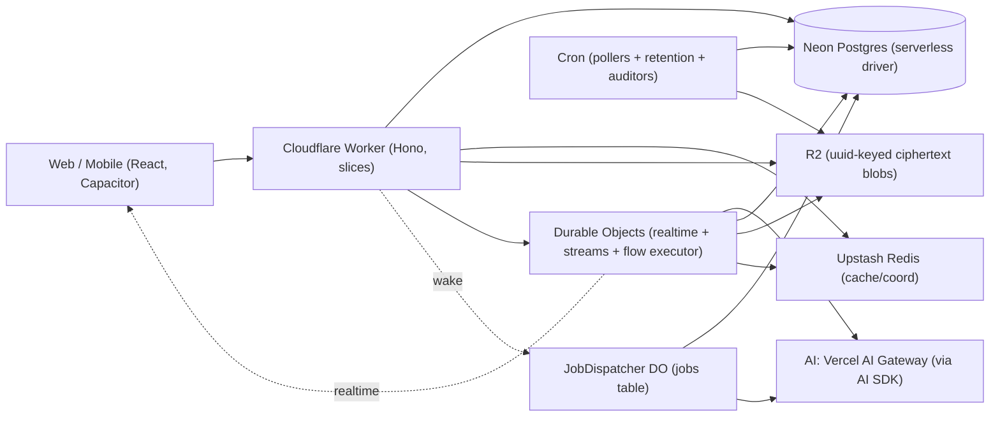

# HushBox Backend Redesign — Design & Plan of Record

> **Status:** Design locked; implementation not started; **Wave 0a is dispatchable**.
> Clean-slate **big-bang** rewrite of the backend in a single branch (chosen over an
> incremental strangler-fig cutover — see §19/§20 for how the safety net is preserved).
> The stack deliberately **excludes Cloudflare Workflows, Queues, and Hyperdrive**
> (re-entry triggers in §21). Money and async work rest on the
> **single-settlement rule + the transactional jobs system** (§7/§8 — no sweeps, no
> janitor, no run table; double-entry write-time conservation). §21 records deferred
> decisions and re-entry triggers.
> **The product has no users**, so migration, coexistence, and rollback are *not*
> constraints — we design the end state directly.
>
> **What this is:** the complete design and execution plan. It is the working
> plan-of-record / handoff. The permanent reference docs (`TECH-STACK.md`,
> `CODE-RULES.md`, `AGENT-RULES.md`) will be updated with the *distilled, deduplicated*
> rules once this plan is finalized; until then, this document is the single source for
> the redesign's intent and reasoning.
>
> **Disposition of decisions:** every decision here is evidence-based (codebase
> diagnosis + external research), but revisable. If a rule stops serving the work,
> change the rule *and this doc* — don't silently break it.

---

## 0. How to read this document

Sections 1–3 give the goals, the diagnosis of today's backend, and the shape of the
target. Sections 4–5 are the *domains* and *principles* (what we optimize for and how).
Sections 6–17 are the design proper, slice by slice and concern by concern. **Section 11
(AI Workflows) is the centerpiece** — the composable model+media engine that is the
product's headline capability, with an explicit per-principle table. Section 18 is the
full stack rationale (choice / why / denied). Section 20 is the phased build plan.
Section 22 is a glossary for newcomers.

---

## 1. Context & goals

**HushBox** is an end-to-end-encrypted AI chat aggregator: one interface to 100+ AI
models, with messages encrypted client-side (OPAQUE auth; per-conversation cryptographic
epochs). It runs serverless on Cloudflare. Today's backend is ~32k LOC of API plus ~11k of
shared packages; all tests, lints, typecheck, and e2e currently pass.

**Why rewrite.** The current backend works but cannot absorb the two capabilities the
product is built around, and carries several correctness/security defects (Section 2). We
are rewriting the entire backend to be: *extraordinarily extensible, durable,
error-resistant, naturally self-healing, a joy to develop, maintainable, and free of
duplication.*

**The two headline requirements that shape everything:**

1. **Support brand-new model *types* with little or no code.** New input/output
   modalities (text, image, audio, video, embeddings, speech, reasoning, tool-use, and
   future ones) and new behaviors must be addable as *data + a tiny adapter*, never by
   editing a dozen switch statements.
2. **Compose AI work into arbitrary workflows.** Chain model calls (output → input), fan
   many outputs into one input, run media-transform algorithms mid-flow, branch and loop
   — a typed state machine over model calls and transforms (deadline-bounded and fail-fast
   by policy, §11.6). Initially these workflows are generated **by our own code, dynamically
   and pluggably** (data-defined DAGs over a curated node registry); a user-facing builder
   can layer on later with no engine change.

**Success metrics:** a new *model* onboards with **zero code** (auto-discovered); a
brand-new *modality* is a rare, deliberate, small change (one enum migration + one dispatch
adapter); new workflows ship as versioned definition data (a deploy is needed only for new
node types or the code that generates definitions); no double-charges, lost turns, or stuck
states; the system heals itself; the code is modular, testable, and self-documenting.

---

## 2. Current-state diagnosis (why we rewrite)

A full read of the existing backend (12 subsystem analyses) found a consistent root
cause and a set of concrete defects. Condensed:

**Root cause.** A "model type" is implicitly defined by an *output-only* `Modality` enum
threaded through ~12 hand-edited `switch` statements and 4 hardcoded ID allowlists. There
is no workflow engine — there are **two disjoint, ad-hoc orchestrators** (a text path and
a media path) that cannot compose. Most other smells compound from this.

**Correctness / security defects (now design requirements, not patches):**

| # | Defect | Evidence |
|---|---|---|
| 1 | Step-up auth routes (`/api/auth/*`) skip session-revocation checks | evidence restated per current code in §14: delete-account now mounts revocation; the cleanly exploitable revoked-cookie surface is **2FA-enable**; the uniform default-deny pipeline closes the class |
| 2 | AI stream succeeds but persist/charge fails → the turn **and** the charge are unrecoverable (a `billing_failed` log line exists — observed, not recoverable) | `stream-pipeline.ts:342` `waitUntil(billingPromise.catch(() => null))` |
| 3 | On a transport disconnect the turn's result is not reliably persisted — we *want* it completed, saved, and billed (the user authorized payment on send) | requirement stands; the originally cited evidence (`stream-pipeline.ts:1651`) did **not** verify on the 2026-06-09 re-audit |
| 4 | No charge-idempotency key → a retried turn double-charges | `usage_records` has a *non-unique* index on `(sourceType, sourceId)` |
| 5 | Money is float (`parseFloat` on `numeric(20,8)`) — drift is real (a `FREE_TIER_FLOAT_TOLERANCE_CENTS` hack already exists) | `balance.ts`, `resolve-billing.ts:39` |
| 6 | Data-driven capability path is **dead**: `supported_parameters` hardcoded `[]`; the `/config` merge a comment claims was never implemented | `fetch.ts:187` |
| 7 | Account deletion orphans some group-conversation media in R2 — **acceptable by design**: the GC job reclaims it (not a fix target) | `delete-user.ts:67-93` |
| 8 | Crypto has no decompression bound → a crafted member blob is a zip-bomb on the decrypting client | `compression.ts:8` |

**Structural smells** (re-verified 2026-06-09; 12/16 original claims confirmed at their
cited lines): `opaque-auth.ts` is 1,704 lines (the earlier "431 inline Drizzle calls"
figure was wrong — it delegates to services); the auth middleware bundle is copy-pasted
16× in `app.ts`; `saveChatTurn` is a god transaction; the parent-chain is reassembled in
multiple places (exact rule-divergence unverified); zero `relations()`;
bare-`text()` enums everywhere; no persisted model catalog; modality enum fragmented 5×;
bare `Uint8Array` key material inviting argument transposition.

---

## 3. Architecture at a glance

- **Style:** Modular monolith, **vertical slices** with **pragmatic hexagonal edges**
  (ports only where an implementation genuinely varies — ~6, at infra boundaries).
- **Runtime stack (no Effect):** services return **`Result<T, DomainError>`**
  (neverthrow); per-slice tagged `DomainError` unions map to `{code, details}` via
  **exhaustive ts-pattern**; external calls wrapped in **cockatiel** policies;
  cancellation via **AbortController**; DI via factory functions + Hono `c.var`; Zod at
  boundaries; **Drizzle inference preserved**.
- **Compute topology:** one product Cloudflare Worker (+ one separate admin Worker — §14);
  **Durable Objects** for per-conversation realtime, stream survival/resume, the
  **in-process flow executor** (the DO owns the turn: it calls the gateway and runs
  settlement), and the **per-shard `JobDispatcher`** (§7); **Cron** only for pollers,
  retention scans, and read-only auditors. **No Cloudflare Workflows, no Queues**
  (re-entry triggers in §21): every async need is covered by transactional job rows +
  the alarm-clocked dispatcher (§7), `waitUntil` for declared-best-effort effects, and
  the DO for stateful execution.
- **Data:** Neon Postgres (PG18) via **`@neondatabase/serverless` + Drizzle** as the single
  source of truth (**Hyperdrive deferred** — re-entry triggers in §21); **R2** for
  blobs (uuid-keyed, always ciphertext); **Upstash Redis** for ephemeral cache/coordination
  only.
- **Extensibility spine:** capability-driven **registries** (models, transforms, workflow
  nodes) — new types are *data + a tiny adapter*.
- **Enforcement:** `eslint-plugin-boundaries` (one tool for **both** cross-slice/package
  boundaries and intra-slice layers — `@softarc/sheriff` was dropped: redundant with
  boundaries, pre-1.0, less maintained) + `ts-morph` architecture tests (structural rules
  lint can't express). A rule without an enforcement mechanism is only a suggestion.



---

## 4. Domains — how each is addressed

| Domain | Approach |
|---|---|
| **Data storage & management** | Neon Postgres (serverless driver; Hyperdrive deferred — §18/§21) is the single source of truth for durable state — Drizzle with `relations()`, pgEnums, FKs, **integer minor-unit** money. R2 for blobs: uuid keys, always ciphertext (content-addressing was dropped — §11.4). Redis is ephemeral only (idempotency fast-path, rate limits, OPAQUE challenge, reservation cache) and is *never* the sole store of money or state. Immutability where it pays: append-only ledger, versioned crypto blobs, versioned model descriptors and workflow definitions. Ciphertext at rest. |
| **Data movement & processing** | Three modes: in-request synchronous; **in-DO flow execution** (the conversation DO runs whole definitions in one in-memory, deadline-bounded execution — §11); the **transactional jobs system** (job row in the caller's transaction + alarm-clocked dispatcher — §7) for durable async ops. Inside a flow, values move **in memory**; R2 only at the edges (inputs in, epoch-wrapped finals out). Streaming reaches clients over the DO's hibernatable WebSocket with **abort propagation** and **resumability** (memory-only buffer + `Last-Event-ID`). The turn **completes server-side on disconnect** (best-effort — an eviction/deploy mid-stream saves nothing and bills nothing for **any** flow shape: nothing commits before settlement — §8 single-settlement); only an explicit user-stop aborts. Card charges use a **pre-claim** (Pattern D). |
| **Communication & API design** | Hono + typed `hc<AppType>()`. Errors: per-slice tagged `DomainError` → `{code, details}` via exhaustive ts-pattern → `friendlyErrorMessage`. Cross-slice communication is **only through published barrel APIs** (boundaries-enforced). Realtime via Durable Objects. `Idempotency-Key` required on all mutations (with five declared exemption classes — §8). |
| **Compute & deployment topology** | One product Cloudflare Worker (modular monolith) + one admin Worker (§14). DOs for realtime + stream coordination + flow execution + the JobDispatcher (§7); Cron for pollers, retention, auditors only. Stateless Worker; all state in PG/Redis/R2 (DO holds only in-flight execution — no marker). Deploys kill in-flight DO work — **accepted** (nothing committed + idempotent client retry; §8/§15). GitHub Actions CI/CD. Heavy server-side compute (video transcode, code execution) is **deferred** — see §12. |
| **Reliability & resilience** | Pre-claim + the delayed verify job (no lost/stuck card charges); DB-backed idempotency (exactly-once money); cockatiel retry/timeout on every external call (no in-isolate breakers — §18); **fast-fail flows**: deadline-bounded, never resumed; a breach with a persisted partial **bills** the partial; nothing persisted → **nothing was ever charged** (§8 single-settlement); the jobs system for roll-forward ops; GC crons + read-only auditors as backstops (crash recovery is in-mechanism — §16); best-effort vs critical separation; an explicit user-stop aborts, but a transport disconnect completes + bills best-effort (the user authorized it on send). |
| **Security & identity** | OPAQUE; E2E epoch crypto; **default-deny auth pipeline** (uniform revocation, including step-up); least-privilege per-slice authz; step-up (OPAQUE + TOTP) for sensitive ops; branded key types + versioned blobs + bounded decompression; typed/redacted secrets; zero-trust at the boundary; **ZDR enforced per-request — self-enforced fail-closed** (§10). Product audit via structured logs; **admin actions get a dedicated append-only audit table** (§14, Admin plane). |
| **Observability & operations** | Native Cloudflare (Workers Logs + Analytics Engine + OTel tracing, MCP-queryable) + Sentry for errors (§17; PostHog deferred, no session replay ever); request-ID correlation; health endpoints; job state lives in the `jobs` table, settled-run attribution in `usage_records.runId` + idempotency keys — queryable by SQL and the admin panel; run telemetry rides WAE (§9, §17); one-command local dev with prod parity (the neon-proxy container runs the identical driver path — §18). |
| **Architectural styles & boundaries** | Modular monolith, vertical slices + pragmatic hexagonal. Boundaries enforced by eslint-plugin-boundaries + ts-morph. Coupling is the explicit, lint-enforced import graph; cross-slice writes go through published APIs; the orchestrating slice owns each transaction. Capability-driven registries make new types data + a tiny adapter. |

We do not maintain a separate "domains" chapter in the permanent docs; these treatments
are folded into `TECH-STACK.md` / `CODE-RULES.md` where related content already lives.

---

## 5. Principles — what we value and how

Legend: ✅ core value · ◐ valued with a deliberate nuance · ⚠️ deliberately limited.

| Principle | | How it lives in the system |
|---|---|---|
| Enforced idempotency | ✅ | Branded `Idempotent<T>` + `SettlementTx`, five `idempotent.*` patterns, mandatory `Idempotency-Key`, module-graph enforcement (§8) |
| No partial / stuck states | ✅ | Single-settlement (nothing commits mid-run), atomic conditional transitions, deadline-bounded flows (terminal within minutes by construction), lapsing leases + expiring holds |
| Self-healing | ✅ | Crash recovery by construction (single-settlement, leases, TTLs, the dispatcher's perpetual alarm); GC; auditors detect + page, humans redrive |
| Deterministic behavior | ✅ | No `Date.now`/random in flow control; pinned definition versions |
| Consistency guarantees | ✅ | One Postgres; **cross-slice ACID is allowed**; strong for money/state, eventual only for best-effort side-effects |
| Correctness by construction | ✅ | Branded types, exhaustive matching, capability-typed dispatch, Zod boundaries, compile-enforced contracts |
| Exactly-once effects | ✅ | Pre-claim + DB idempotency keys (external provider calls: at-least-once + dedup); per-node charges exactly-once via DB keys |
| Graceful degradation | ◐ | Best-effort ports (push/email/realtime) degrade; **money/auth/persistence never degrade — fail fast** |
| No single point of failure | ◐ | Lean on Neon HA + Cloudflare edge + encrypted backups; we **don't** DIY multi-region — Postgres is a logical SPOF, mitigated not eliminated |
| Fault isolation | ✅ | Slice boundaries, per-call timeouts/retries, per-branch/per-model fan-out isolation |
| Recoverability | ✅ | Durable pre-claim/job state, lapsing leases + the dispatcher's perpetual alarm, frequent encrypted backups (Kopia→B2), idempotent retries |
| Backpressure | ◐ | Strict per-conversation serialization (a second concurrent run is **rejected**, frontend + backend — §11.5), rate limits, bounded fan-out widths, bounded job batches |
| Modularity / separation of concerns | ✅ | Vertical slices, published barrels, lint-enforced boundaries |
| Loose coupling, high cohesion | ✅ | Import-graph boundary; cohesion via **single-writer-per-table slicing** |
| Evolvability | ✅ | Data-driven registries; versioned descriptors/definitions; clean-slate removes cruft |
| Backward / forward compatibility | ◐ | No users → no live back-compat burden now; but we **version** crypto blobs, descriptors, and workflow definitions (in-flight instances pinned). API versioning deferred |
| DRY without over-abstraction | ✅ | Single-source types (Drizzle/Zod); shared node primitives reused by chat + engine; **reject** anemic over-porting |
| Testability | ✅ | 95% coverage, TDD mandatory, factory DI + mock adapters, fresh test layers, behavioral tests preserved as spec |
| Observability | ✅ | Native CF logs + Analytics Engine + tracing (MCP-queryable) + Sentry; redaction-by-default; product analytics deferred |
| Diagnosability | ✅ | Typed errors with context, request-ID correlation, no swallowed errors |
| Reproducibility | ✅ | Deterministic builds, local=prod parity, cassette-replayed AI tests, time mocking |
| Automated, reversible deployment | ✅ | GitHub Actions; revert (never reset); preview branches |
| Configurability over rebuild | ✅ | **Headline** — descriptors, workflow definitions, transform registry are *data*; new models appear with zero code; new flows are new definitions |
| Operational simplicity | ✅ | One product Worker + one admin Worker, managed services, one-command dev, **fewest moving parts** (Workflows and Queues are excluded — every remaining service has multiple irreplaceable consumers) |
| Secure by default | ✅ | Default-deny pipeline, E2E default, redacted secrets, ZDR |
| Least privilege | ✅ | Per-slice authz, scoped secrets, step-up for sensitive ops |
| Zero-trust | ◐ | Enforced at the API/client boundary (never trust client IDs); internal same-process calls are trusted — no internal mTLS |
| Auditability | ◐ | Via structured logs, **not** a hash-chained Postgres audit table (deferred until compliance demands it) |
| Data integrity | ✅ | FKs, constraints, transactions, AEAD, idempotency |
| Simplicity | ✅ | "No Effect, ~6 ports, 4 patterns" is simplicity-driven; simplicity is the tiebreaker |
| Single source of truth | ✅ | Drizzle (DB types), Zod (contracts), model catalog (model facts), workflow definitions (flow), one modality enum |
| Principle of least surprise | ✅ | Lint-enforced conventions, no magic, consistent patterns |
| Explicitness | ✅ | Result error channels, factory DI, explicit boundaries, fail-fast over silent fallback |
| Composability | ✅ | Workflow engine, node primitives, capability registries, Result/policy combinators |
| Immutability where possible | ✅ | Append-only ledger, versioned blobs, pinned workflow versions |
| Self-documenting / intent-revealing | ✅ | Types as docs, named patterns, intent-revealing names, comments only for durable non-obvious facts |

**Also valued (already in our docs / added in this redesign):** 95% test coverage ·
fail-fast / never-hide-problems · type-safety, no `any` · serverless mindset / no
in-memory state · accessibility (WCAG) · no security through obscurity · local-dev parity
· frequent forever backups · DX-first · cost efficiency · **single-writer-per-table slicing**
· **capability-driven extensibility** · **AI SDK as the portability seam (single Vercel AI Gateway)** ·
**behavioral-tests-as-spec**.

**Honest tension — vendor lock-in.** "Minimal vendor lock-in" is a stated value, yet we
deliberately deepen our Cloudflare commitment (Durable Objects, R2). We treat
this as **◐ deliberate**: we trade lock-in-minimization for operational simplicity and
platform power, and we **isolate** the lock-in behind ports/adapters so each piece is
swappable in principle. (The surface is reduced — Workflows and Queues are excluded and
Hyperdrive is deferred — so the deepest remaining coupling is the DO programming model;
that is where to look if lock-in-avoidance is ever reweighted higher.)

---

## 6. Slices & boundaries

### Slice map

Slices are organized by feature and by **write ownership**. The checkable rule is
**single-writer-per-table**: every table has exactly one owning slice, and only that
slice's published write helpers touch it — cross-slice transactions compose those
helpers, never reach into another slice's tables.

| Slice | Owns (tables / responsibility) |
|---|---|
| `identity` | OPAQUE auth, sessions (including the distinct **billing-only session** type), TOTP, step-up, token-login, email verification + resend, recovery (incl. the enumeration-safe wrapped-key retrieval with timing-safe dummy response), TOTP/deletion lockouts, session revocation (`sessionActive` + `passwordChangedAt`), **link-guest as a first-class principal type** (consumed by realtime + media authz); **account deletion** (Pattern A + GC — §7); the default-deny pipeline |
| `conversations` | `conversations`, `epochs`, `epoch_members`, `conversation_members`, `conversation_forks`, `shared_links`, `shared_messages`; key rotation; mute/pin; shared-message creation **and the unauthenticated public share read endpoint** (IP rate-limited); link privileges; member limit; full-history-vs-rotation add semantics (`visibleFromEpoch`); key chains |
| `chat` | the turn: `messages`, `content_items`, `llm_completions`, `media_generations`; orchestration + persistence; **trial mode as an explicit no-persist/no-charge variant of the same pipeline** (5/day quotas); regenerate; **Smart Model** (the classifier-routing flow, consumed as a workflow definition — §11.7) |
| `billing` | `wallets`, `ledger_entries`, `usage_records`, `payments`, `member_budgets`, `conversation_spending`; Helcim; webhooks (with retry + service-evidence logging — CI's `verify:evidence` depends on it); payment expiration; free-tier daily allowance; **wallet provisioning** (published `provisionWalletsWithinTx`, composed by identity at registration); usage-analytics read endpoints; exposes `chargeWithinTx` (holds are short-lived Redis keys, not a table) |
| `models` | model catalog + capability registry + inference orchestration over the `ModelProvider` port; premium-tier gating; ZDR-reachability |
| `media` | R2 GC, presign (**epoch-gated**: membership AND an `epoch_members` row for the message's epoch), media-transform node implementations |
| `notifications` | email, push (suppressed by mute + DO presence), device-tokens |
| `account` | user search, encrypted custom instructions, accessibility preferences (LWW merge); **data export** (an `export.build.v1` job — §7) |
| `workflows` | the generic DAG engine (the in-DO executor), the node registry, the **definitions library** (incl. Smart Model — §11.7), the typed builder |

Beyond the slices, two app-level areas: **`platform`** (health, roadmap proxy, app-update/
download routes, the dev-only routes the e2e suite depends on, version-check middleware +
its exemption list, the rate-limit registry) lives in `apps/api` as cross-cutting routes;
the **admin plane** is a *separate* `apps/admin-api` Worker + `apps/admin` SPA — full design
in §14 (Admin plane).

The ConversationRoom DO class straddles three concerns and has a named owner for each:
`packages/realtime` owns the **class** (platform glue — WS, alarms, hibernation); the
`chat` slice owns its **turn-coordination behavior**; `workflows` owns the **executor it
hosts**.

Model **descriptor schemas** live in `packages/shared` (consumed by chat, billing,
workflows); the **catalog service** is the `models` slice; persistence is `packages/db`.
Ports that earn their keep (infra edges only): `ModelProvider`, `Storage`,
`PaymentProvider`, `EmailSender`, `RealtimeBroadcast`, `Telemetry` (best-effort) — six —
plus `TransformCompute` (implementation #1 is the in-process server adapter — §12; the
heavy backend is deferred, so the port has a live consumer from day one, not an
ossifying placeholder) and a reserved-but-deferred `FeatureFlags`. (There is no `QueuePublisher` or `WorkflowRunner` port — their backing
services are out of the stack.) We do **not** wrap `Db`/`Cache`/`Crypto` behind anemic ports (it would discard
Drizzle/Zod inference).

### Boundary rules (each with enforcement)

- A slice's `index.ts` barrel is its only public surface. *(boundaries)*
- Slices may not import each other's internals; they communicate via barrel types or
  published methods. *(boundaries)*
- Domain code imports only from its slice's `ports/`; only adapters import infra
  libraries. *(eslint-plugin-boundaries)*
- Routes contain no business logic — stated checkably: route files
  have an import allowlist (own slice's domain barrel + middleware + shared) and a fixed
  handler shape *(ts-morph)*; the statement cap is a **review lens, not a gate** (a Goodhart
  magnet — agents split functions to dodge it); the rest is review.
- `apps/*` import `packages/*`, never the reverse; `packages/shared` imports nothing
  internal beyond other shared subpaths. *(boundaries + pnpm)*

### Cross-slice communication & transactions

We **do** support cross-slice communication, and because we run one Postgres in one
Worker, that communication **can be transactional** — this is the main benefit of choosing
a modular monolith over microservices, and we keep it. The rule:

> A slice may touch another slice's tables **only through that slice's published barrel
> API** (including transactional write helpers such as `billing.chargeWithinTx(tx, …)`).
> The **orchestrating slice owns the transaction** and composes other slices' published
> writes inside it. Direct schema reach-in is banned. *(boundaries + ts-morph)*

So `chat`'s `saveChatTurn` calling `billing.chargeWithinTx(tx, …)` is the **normal**
pattern, not an exception. A "transactions never cross
slices" rule (and the contrived "row-kind ownership in a shared table" workaround it
forces) is rejected. Coupling
stays explicit and lint-enforced; atomicity stays intact. One more ts-morph rule keeps
the handle honest: **slice code may reference only its own slice's schema objects** —
`chargeWithinTx`'s `SettlementTx` is a transaction capability, not a cross-table
backdoor (holding the handle does not grant other slices' tables).

---

## 7. The four operation patterns

Every write operation is exactly one of these (three canonical patterns plus the one
today's code proved necessary):

- **A — Single DB transaction.** Atomic, no external calls inside. The default. *Failure:*
  Postgres rolls back; HTTP error; client retries.
- **B — Single external call in-request.** One external call + one DB update. *Failure:*
  HTTP error; client retries with `Idempotency-Key`; the cached response replays the
  original outcome.
- **C — Transactional job (the jobs system).** Durable async work that
  must roll forward to completion. A `jobs` row is inserted **inside the caller's domain
  transaction** (creation is atomic with the work that requires it); the **alarm-clocked
  dispatcher** (below) executes it via the claim protocol. There is **no cron sweep and no
  queue**: the row is the only record, the dispatcher's alarm the only scheduler. Terminally
  failed jobs are `status='dead'` rows — queryable forever, redriven by `UPDATE`, visible in
  the admin panel. *Failure:* per-failure backoff, dead rows + Sentry, explicit admin redrive.
- **D — External-effect-then-reconcile (pre-claim).** A **card charge** moves money at the
  processor and we must capture it **exactly once**: write a durable **pre-claim** (the
  `payments` row in `pending`/`awaiting_webhook`) *before* the charge, then finalize via the
  webhook. The same transaction also enqueues a **delayed `payment.verify.v1` job**
  (in place of a pre-claim reconcile cron): it fires past the webhook threshold,
  no-ops if the webhook landed, otherwise queries Helcim and resolves or expires the
  pre-claim. **Model calls and media generation are *not* Pattern D** — they are
  *saved ⟺ billed* (persist + charge in **one** settlement transaction), so a crash saves
  nothing and bills nothing for any flow shape (§8 single-settlement).

There is no fifth pattern. If an operation doesn't fit A–D, the slice boundary is probably
wrong — redraw it (and show the redraw concretely, don't hand-wave).

### The jobs system (Pattern C's mechanism in full)

**Doctrine.** Four mechanism classes, each with an admission rule: **jobs** (a producer
exists; the row commits transactionally with its trigger; must happen) · **conversation-DO
alarm** (live-run control only — the deadline timer; there is no janitor, §11.5) ·
**cron** (no producer can exist: pollers, retention scans, read-only auditors) ·
**`waitUntil`** (declared best-effort, allowed to be lost). Crash recovery is in-mechanism
(leases, TTLs, the perpetual alarm); **auditors detect bug-class failures and page humans**;
repair is explicit redrive — never a silent self-healing sweep.

**The `jobs` table** (full column set in §9): `type` (versioned name, e.g. `export.v1`),
`shard` (`default` | `bulk`), `priority`, `payload` jsonb (Zod per type; mutable — checkpoint
state), `result` jsonb, `dedupeKey` (**partial unique** `WHERE status IN
('pending','running')` — "at most one active"; finished rows never block re-enqueue;
a caller needing re-enqueue-*after-completion* semantics must re-read the terminal row —
the dedupe window closes at terminal state; `ON CONFLICT DO NOTHING` so a duplicate can't
abort the caller's transaction), `status`
(`pending|running|succeeded|cancelled|dead`), **two counters** — `claims`/`maxClaims`
(poison detection; incremented at claim, so deploys never burn retries) and
`failures`/`maxFailures` (drives backoff and `dead`) — `scheduledAt`, `nextAttemptAt`
(delayed start = future value), `claimedAt`/`claimedBy` (lease anchor + completion-fence
identity; long jobs heartbeat-touch `claimedAt` **through the same `claims`/`claimedBy`
fence as terminal writes** — a zombie's heartbeat cannot keep a dead lease alive),
`leaseSeconds` (per type), `cancelRequested`,
`errors` jsonb (full `{at, claim, error}` history).

**Handler registry** — registration is rejected if incomplete:
`{type, payloadSchema, handler, idempotency, leaseSeconds, maxFailures, backoff?, shard?, paused?}`.
`idempotency` is mandatory: `txn` (DB-only effect — effect + terminal transition commit in
**one** transaction, exactly-once) | `natural` (e.g. R2 delete) | `providerKey` (e.g. Resend
key derived from `jobId`, never jobId+attempt) | `byEventId` (e.g. Helcim-derived credits).
Handlers return `ok(result?) | fail(error) | yield(checkpoint) | dead(error)` — **`yield`
re-pends with updated payload and neutralizes its claim increment** (checkpoints never
consume retries), and the checkpoint write goes through the same `claims`/`claimedBy`
fence as terminal writes (a zombie's checkpoint cannot corrupt the live claim);
deterministic errors (payload parse, 4xx-class) return `dead` directly.
Default backoff `failures⁴ s ± 10% jitter, capped 1 h`. Payload evolution by versioned type
names + tolerant parsing; unknown/unparseable ⇒ `dead` with a distinct code.
**Yield-budgeting is a hard rule for bulk-shard jobs:** every pass must fit the 15-min
alarm wall cap with margin (`export.build.v1`'s 900 s lease sits at that wall).

**The dispatcher** — one Durable Object per shard, stateless except its alarm; `wake()` =
`setAlarm(min(getAlarm() ?? ∞, now))`, called via `waitUntil` after any enqueueing commit
(lossy by design). `alarm()` **never throws** (all fallibility is per-job); its steps:
1. **Arm-first:** `setAlarm(now + 30 s)` before any fallible work (verified: setAlarm in a
   throwing handler persists — workerd source; the re-arm, not platform retries, is the pulse).
2. **Dead-letter pass:** any claimable row past `maxFailures`/`maxClaims` → `dead` + Sentry —
   death happens at claim time, so a poison job that kills isolates can never loop a batch.
3. **Claim:** `UPDATE … SET running, claims+1, claimedAt=now(), claimedBy=$id WHERE id IN
   (SELECT … WHERE shard=$s AND ((pending AND nextAttemptAt<=now() AND NOT cancelRequested)
   OR (running AND claimedAt + lease < now())) AND claims < maxClaims
   ORDER BY priority, nextAttemptAt, id LIMIT $batch FOR UPDATE SKIP LOCKED) RETURNING *` —
   batch 20 (`default`) / 2 (`bulk`); fresh Neon connection per invocation.
4. **Execute** (`allSettled`, 6-connection-aware; each handler races a per-job execution
   timeout derived from its `leaseSeconds` — a hung handler can't eat the pass). Terminal
   writes go through the
   **completion fence** `WHERE id=$id AND status='running' AND claimedBy=$me AND
   claims=$myClaim` (0 rows ⇒ roll back / zombie loss logged); `cancelRequested` at the
   fence ⇒ `cancelled` (pending-cancel is a plain atomic `pending→cancelled`).
5. **Re-arm, race- and skew-safe:** more due work ⇒ re-arm *now* (drain chaining, bounded
   per-pass wall budget inside the 15-min alarm cap); future-scheduled work ⇒
   `setAlarm(min(now + pgDelay, getAlarm() ?? ∞))` — the alarm is the **exact**
   `nextAttemptAt`: `pgDelay` is fetched **as an interval** from Postgres
   (`min(nextAttemptAt) − now()`, floor 250 ms; never compare PG timestamps to the DO clock),
   and the `getAlarm()` min closes the wake-overwrite race. **Idle decay applies only when
   no pending or future-scheduled work exists:** 60 s → 2 m → 5 m
   → 15 m → 30 m cap (lets Neon scale to zero; idle decay never displaces an exact
   `nextAttemptAt`); any `wake()` resets. Lost-wake worst case: ≤30 s busy, ≤30 m fully
   idle, ≤25 m via the auditor nudge when the alarm is wedged.

**Timing:** enqueue → first attempt ~10–50 ms; retries at exact backoff, second-precision;
delayed starts second-precision; crash mid-job = lease + ≤30 s (fast) / ≤lease + 30 s (bulk).

**Liveness & audit:** the **jobs-health auditor** (read-only cron, **every 15 minutes**)
pages on anything
stuck past `nextAttemptAt + 10 min` or `2× lease`, then calls `wake()` on both shards — the
one blessed clock-nudge, because the platform's at-least-once alarm has a documented
observed violation (cloudflare-docs#18324). Queue depth + oldest-pending age → WAE per pass.
**Retention:** `succeeded` rows pruned after **7 days** (batched, partial index on
`finishedAt`); `dead`/`cancelled` kept forever, revivable. **No DLQ, by design** — exhausted
work is a row, not an evaporating message.

**Launch job types:** `trueup.fetch.v1` (default, lease 60 s, maxFailures 8 → dead =
accept estimate + audit row, `txn`) · `payment.verify.v1` (default, delayed, `byEventId`) ·
`media.reclaimUser.v1` (bulk, `natural`) · `export.build.v1` (bulk, lease 900 s,
checkpointing yields, `txn` + deterministic R2 chunk keys) · `admin.executeAction.v1`
(default, delayed = §14 tier, cancellable) · `admin.notify.v1` (default, `providerKey`).
Scale path: `shardKey` is in the enqueue API from day one; shard by type when the
jobs-health metric shows cross-type delay.

---

## 8. Enforced idempotency

**Goal:** every mutation is exactly-once *in effect*, and the safety is enforced by the
compiler, lint, and tests — not by developer discipline.

**Type spine.** There is no `Mutation<T>` brand: a "brand absorption" rule would require
call-graph analysis that the syntactic-only ts-morph constraint (§18) cannot perform —
unimplementable as specified, with its hole sitting on the canonical `chargeWithinTx`
pattern. v2 keeps the *useful* compile-time signal via two sound mechanisms:

```ts
declare const IDEMPOTENT: unique symbol
export type Idempotent<T> = T & { readonly [IDEMPOTENT]: 'Idempotent' }
// runMutation (the route helper) accepts only Idempotent<T>;
// the sole producers are the idempotent.* wrappers.

declare const SETTLEMENT: unique symbol
export type SettlementTx = Transaction & { readonly [SETTLEMENT]: 'SettlementTx' }
// constructible ONLY inside the settlement helper; every *WithinTx money write
// requires it — transactional composition is a capability, not a convention.
```

Containment of raw writes is **module-graph, not call-graph**: raw Drizzle mutations exist
only inside repository/adapters modules; `*WithinTx` helpers are exported only from their
slice's published barrel and importable only by allowlisted composers
(eslint-plugin-boundaries). `as Idempotent<…>`/`as SettlementTx` casts are lint-banned.

**The five strategies.**

| Wrapper | Mechanism | Used for |
|---|---|---|
| `idempotent.byKey` | client `Idempotency-Key`; first call acquires it via a **Postgres unique insert**, stores the response; retries replay it (Redis caches the hot path) | general mutating endpoints |
| `idempotent.byUpsert` | `INSERT … ON CONFLICT`; DB unique constraint is the guard | natural-key creation (device tokens, member add) |
| `idempotent.byTransition` | `UPDATE … WHERE status = <expected>` in a txn; assert rows-affected = 1. **0 rows ⇒ read the actual state and disambiguate**: already-terminal = idempotent no-op; illegal state = defect → Sentry | state-machine steps (payment, turn) |
| `idempotent.byEventId` | atomic claim on a unique event id (Postgres for money, Redis `SET NX` + TTL otherwise — the Redis tier is admissible **only where losing the dedup record is tolerable**, i.e. non-money; money events always claim in Postgres) | webhook consumers, job handlers |
| `idempotent.byExternalPreClaim` | write a `pending` row before an external effect we must capture exactly once; finalize/reconcile after | card charges (Pattern D); rarely needed elsewhere |

**Money is DB-backed, never Redis-only.** Unique idempotency-key constraints on the charge
rows — `usage_records`, `ledger_entries`, `payments`; Redis eviction can never cause a
double-charge because the DB constraint is authoritative. **Reservations are *not* money** —
they are short-lived Redis holds (TTL); losing one risks at most a small bounded overspend in a
rare race, never lost money, because the ledger is authoritative. Money is integer minor-units
(`bigint`), so there's no float drift in comparisons.

**The single-settlement rule.** Charging per node mid-run would require a multi-actor
settlement protocol (`settleFlowRun`, janitor credit passes, canonical credit
keys, a deadline cron, a standing credit-reconcile query) to compensate those charges when
a run dies. Instead, the premise is removed: **nothing commits mid-run.**

> **All money and all content commit in ONE settlement transaction at run end**: message +
> content items + every node's `usage_records` row (per-generation rows for agentic steps,
> materialized from memory) + ledger legs + the idempotency-key flip. A run that dies
> before settlement leaves an expiring Redis hold, in-memory state that evaporates, and
> **zero committed effects — "nothing happened," atomically.** There are no credits because
> there is nothing to credit; the entire failure-compensation machinery is deleted.
> - **Failure is bookkeeping, not money**: a *live* executor that terminal-fails (node
>   failure, cost circuit, deadline with nothing persisted) records the failure to
>   telemetry; the only money-bearing transition in the system is settlement itself.
> - **A deadline breach with streamed partial output is finalized by the live executor as a
>   normal settlement of the partial** — exactly like an explicit stop, and therefore
>   billed. The "breach" failure path applies only when nothing was persisted.
> - **The referee is the idempotency-key row** (there is no `flowRuns` table — §9): the
>   settlement transaction is fenced by the key row's `claimed → succeeded` transition,
>   checked against `claimedBy` + `claims` inside `settle()`; dead-run detection for
>   retries is the key row's **heartbeat lease** (~90 s — the live DO touches `claimedAt`;
>   a killed run is retryable in seconds, never deadline + grace). One state machine,
>   not three.
> - **Settlement discipline:** the transaction is **one statement** — the **`settle()`
>   pl/pgsql function** (one statement = one network round trip on this driver; a `RAISE`
>   inside it aborts everything). A data-modifying-CTE variant is rejected: PostgreSQL
>   executes data-modifying CTEs exactly once, to completion, even when unreferenced — a
>   0-row fence CTE cannot suppress sibling writes unless every write takes an explicit
>   dependency on it, and one missed dependency is an unfenced money write. Lock order,
>   in full: content → wallet → `member_budgets`/`conversation_spending` (period rows) →
>   the `conversations` row → the key row; **no external or Redis calls inside it,
>   ever** (a named rule, reviewed); the Redis hold is released after commit and is
>   advisory only — it never authorizes money.

**Conservation is a write-time constraint (lightweight double-entry).** Every
money event writes ≥2 signed ledger legs sharing a `transactionId` that **sum to zero**
(user wallet ↔ `revenue` / `payments-in` / `promo` house accounts), enforced at commit. A
bug that creates or destroys money fails the write instead of surfacing in an audit. The
hourly **ledger-conservation auditor** remains as the read-only detector (per-transaction
zero-sum across history, wallet balance ≡ Σ legs, charge rows ⟺ content rows), surfaced on
the admin dashboard and alerted via Sentry. Settlement is additionally tested by randomized
crash/interleaving simulation (settle × retry-claim × cancel with a crash injected between
any two steps, asserting conservation and exactly-once).

*Structural enforcement:* ledger writes only inside `slices/billing`; money `*WithinTx`
helpers require the branded `SettlementTx` handle (above); every `usage_records` row is
**inserted with a non-null FK to the run's settlement-anchor content item — enforced
inside `settle()`** (billed ⟹ the run persisted content; the column itself is nullable
with `ON DELETE SET NULL` so financial retention survives hard deletion — §9).

**Idempotency-Key rows are THE run referee (dual-role).** The
table serves two lifecycles, split by a `kind` column: `request` (generic mutation dedup)
and `run` (the settlement fence). The row carries the same **`claims` + `claimedBy`
fence** the jobs table has (§7). The state machine: first arrival INSERTs `claimed` (the
unique constraint *is* the claim — race-free); `succeeded` replays the stored response;
`claimed` + live lease ⇒ for `kind=run`, **attach** (return the handle, rejoin the live
stream); for `kind=request`, **409-in-progress**;
`claimed` + lease expired or `failed` ⇒
a retry claims re-execution via `byTransition` (`claims+1`, `claimedBy` reset). For runs,
**the claim transition is performed inside the conversation DO** — claim and
execution-start are atomic in one actor; what serializes execution is DO
single-instancing + the in-DO hard block (§11.5), with the lease as the liveness signal,
not the serializer. **The live DO heartbeat-touches the key row's `claimedAt` on a short
interval** (through the fence — §7's rule), so the lease is short (**~90 s**) regardless
of run deadline: a deploy-killed run is retryable in seconds, not deadline + grace. The
completion fence on `settle()` checks `claimedBy` + `claims`. **Semantics,
stated precisely: serialized, client-driven retries — at most one execution in
flight per key, ever**; each re-execution requires a fresh client request, gated by rate
limits and admission. The body hash is computed over **canonicalized JSON** (key reordering
must not 409); reused key + different body ⇒ 409, Stripe-style. Scope `(userId, route,
key)` is deliberately per-route (laxer than Stripe — recorded as intentional); trial sends
scope by trial-session principal. **TTL floor is config-asserted**: TTL > max run deadline
+ grace + the client's max auto-resubmit horizon (a purged `succeeded` row would turn a
late resubmit into a duplicate execution); the purge skips non-terminal rows, and **read
paths never depend on the purge having run**.

**Admission's Redis state has named freshness rules**: the
balance snapshot is **written through after every ledger-committing transaction carrying
the ledger sequence, and the write CASes on it** — two commits racing can never regress the
snapshot to an older balance; a short TTL forces a PG re-read on miss (staleness bound =
TTL); `member_budgets` consumption is folded into the same admission Lua script
(check-then-act is banned — CODE-RULES), read from **period-keyed rows** (§9 — no resets);
the Lua script is pinned by its source: the SHA is **derived at Worker init** (SHA-1 of
the bundled script source — the repo file *is* the pin; no config value exists), then
EVALSHA, with NOSCRIPT → SCRIPT LOAD → retry of the same canonical script
(integration-tested against the SRH emulator). **Redis-down =
fail-closed**: with an unguarded settlement charge, fail-open admission is
unbounded negative exposure — paid runs are refused with a typed error + loud alert.
There is **no degraded admission mode of any kind** — no fallback to separate Redis
commands, no PG-fallback path. Fail-closed is *forced*, not merely safer: with no
durable in-flight run record (`flowRuns` does not exist — §9), no fallback could bound
concurrent exposure. The
honest exposure bound is `(K−1) × Σ(concurrent holds)` per wallet per chargeback cycle,
plus one maximum step cost per run (the cost circuit evaluates at step boundaries — §13)
(admission passes at balance; the §13 cost circuit allows K×; the concurrent-run cap
multiplies) — welcome credit and K (initial value 5 — §13) are sized against this
formula, and a **snapshot-drift
auditor** (hourly, read-only) alerts when Redis and ledger diverge past bound.

**Retry composition.** `cockatiel` retry policies may only wrap an already-`Idempotent<T>`
value (type + lint enforced). Inside the flow engine, nothing commits before settlement, so
per-node call retries are free of money concerns by construction.

**Composition.** Canonical form: `ResultAsync<Idempotent<T>, E>` at the route
seam. Transactional composition needs no absorption rule: a `*WithinTx` helper simply
requires the branded `SettlementTx` handle, which only the settlement helper can mint —
compile-time, sound, zero analysis.

**Enforcement.** *Type:* `runMutation` requires `Idempotent<T>`; money `*WithinTx` writes
require `SettlementTx`. *Structural:* no raw Drizzle mutations outside repos/adapters;
`*WithinTx` exports only via barrels, imports allowlisted (boundaries); the Idempotency-Key
middleware is mounted on every mutating route (ts-morph); route handlers may not import
their own slice's repos directly — domain layer only (ts-morph). *Runtime:* middleware rejects
mutations missing the key. *Tests:* each pattern has duplicate-delivery + retry +
crash-recovery tests; the pre-claim path has a "crash after external effect" integration
test asserting no double-charge and no loss.

**Idempotency-Key exemptions.** The header is required on every mutating route *except*
those declaring one of five exemption classes in the route definition. A ts-morph test
asserts every exempted route's handler uses the matching `idempotent.*` wrapper internally —
no unclassified mutation can ship:

| Class | Routes | Why safe without the header |
|---|---|---|
| `opaque-protocol` | login/register/2FA/recovery init+finish | Redis challenge state is the dedup; a retry restarts the handshake harmlessly; rate-limited |
| `token-is-key` | token-login | the one-time token itself is the idempotency key (deterministic session id) |
| `webhook-event-id` | `/webhooks/*` | `idempotent.byEventId` on the provider's event id |
| `internal-consumer` | job handlers, cron | `byEventId` / `byTransition`; no client involved |
| `naturally-idempotent` | logout, decline-invite | same end-state on repeat (`byUpsert`/`byTransition` underneath) |

---

## 9. Data model

Neon Postgres (PG18, serverless driver — Hyperdrive deferred, §18). Highlights of the
redesigned schema:

- **Money is integer nano-USD (`bigint`)** everywhere. No `numeric`/float for
  money; conversions only at boundaries. Nano (1e-9) over micro: storage pricing
  ($0.0003/1k chars ≈ 0.3 µUSD/char) is sub-micro, and nano guarantees no rounding anywhere
  while fitting comfortably in `bigint` (cap ≈ $9.2B).
- **pgEnums** for every status/type/privilege field **and for modality** (no bare `text()`
  enums; exception: `jobs.type` is text by design — job types are versioned names, §7).
  A brand-new modality is a rare, deliberate event — one enum migration
  + one dispatch adapter — and we accept that small deploy in exchange for closed-set type
  safety everywhere. (The "open modality string tags" alternative is rejected: it
  conflicts with pgEnums and buys flexibility we don't need at that frequency.)
- **Lightweight double-entry ledger:** signed legs sharing a
  `transactionId`, per-transaction zero-sum enforced at write time; house accounts
  (`revenue`, `payments-in`, `promo`) beside user wallets; `ledger_entries.kind`
  discriminator (deposit / charge / true-up / clawback / promo / refund). Markup math runs
  in `numeric` and casts back (bigint overflow above ~$922k intermediates); rounding is
  banker's (half-even), applied **once** at settlement, implemented **inside `settle()`**
  (PG's `round(numeric)` is half-away-from-zero); Drizzle `mode:'bigint'`; money
  serializes as a **branded `NanoUSD` string** at JSON boundaries, and `Number()`
  coercion on money is lint-banned (2^53 ≈ $9.007M — user wallets never approach it;
  house-account aggregates will).
- **Saved ⟺ billed is referential at insert:** `usage_records.contentItemId` is a
  **nullable FK with `ON DELETE SET NULL`** pointing at the run's **settlement-anchor
  content item**, plus a plain `runId` uuid for grouping (no parent
  table — `flowRuns` is deleted, below). The invariant is enforced at insert time inside
  `settle()`: **every usage_record is inserted with a non-null reference** — billed ⟹
  the run persisted content; hard deletion may later null the column (financial
  retention — a NOT NULL column would make deletion and retention contradict).
- **`relations()`** declared for every table (so Drizzle's relational queries are usable
  and joins aren't all hand-written).
- **FKs added:** `messages.parentMessageId`, `messages.epochNumber → epochs`, all model
  references → `modelCatalog`, `epochs.previous_epoch_id` (referential epoch chain).
- **New tables:** `modelCatalog` + `modelPricing` (persisted capability/pricing catalog;
  **surrogate uuid PK + `UNIQUE(id, version)`** — single-column FKs everywhere,
  metadata-in-effect pinned by construction), `modelOverrides` (manual supplements for
  capability gaps the gateway can't express); **`jobs` + the `job_status` pgEnum** (the
  jobs system — full column set and semantics in §7; partial indexes: claim probe on
  `(shard, priority, nextAttemptAt) WHERE status IN ('pending','running')`, dedupe
  `UNIQUE(dedupeKey)` under the same predicate, prune on `(finishedAt) WHERE
  status='succeeded'`); **`idempotency_keys`** (scoped `(userId, route, key)` + `kind`
  (`request`|`run`), outcome state + response + canonical body hash + the
  `claims`/`claimedBy` fence (same semantics as `jobs` — §7) + the heartbeat `claimedAt`
  lease + plain `runId` per the §8 referee; TTL + purge cron with the config-asserted floor);
  `admin_audit` (append-only — §14). **`shared_messages` gains a `createdBy` FK** so a
  creator's deletion severs their public shares (a verified hole in today's code).
- **Deleted tables:** **`flowRuns`** (the run referee is the idempotency-key row;
  billing grouping is `usage_records.runId`; run forensics are WAE/Sentry events; a run
  table returns only with a durable executor — §21 trigger); **`exports`** (now
  `export.build.v1` jobs, archive key in `jobs.result`); **`admin_pending_actions`** (now
  `admin.executeAction.v1` delayed jobs with `cancelRequested`). **The `projects` table and
  its feature are deliberately deleted** — the web route dies in T4.4.
- **Column additions:** `users.lockedAt`/`lockReason` (chargeback auto-defense —
  §13); `shared_links.revokedAt` + `expiresAt` (revoke/expiry enforced **lazily at the read
  path** — a predicate, not a process); `member_budgets` and the free-tier allowance are
  **period-keyed** (`(memberId, month)` / `(userId, day)` rows upserted at settlement — no
  reset jobs exist; rollover is a new row by construction). Periods are **UTC-keyed**, and
  the boundary rule is: a run settles into the period of its **settlement commit time**
  (a boundary-straddling run bills where it settles, not where it started).
- **Constraints:** `messages UNIQUE(conversationId, sequence)` (the DO's strict
  serialization, DB-enforced); `wallets UNIQUE(userId, type)`; **every FK column gets an
  index or a written justification** (Postgres does not auto-index FKs; unindexed-FK
  cascades are the classic deletion-stall bug).
- **Idempotency:** unique idempotency-key constraints on the **charge** rows — `usage_records`, `ledger_entries`,
  `payments` idempotency-key columns.
- **Lifecycle/status columns** live only on genuinely multi-step, crash-spanning entities —
  `jobs`, `idempotency_keys`, the existing `payments` (reserve→capture→webhook), and a
  `deletionRequestedAt` column on users (the chunked-deletion fallback — §7). The **chat
  turn gets none**: settlement is one atomic transaction (saved ⟺ billed, referential),
  in-flight state lives in the conversation Durable Object, and the Redis hold auto-expires
  — a crash saves nothing and bills nothing for any flow shape (§8 single-settlement),
  leaving no half-state to reconcile.
- **Storage keys are uuid everywhere**: uploads keep `media/{conv}/{msg}/{uuid}` (the key
  schema embeds ownership, which is what makes list-and-check orphan GC possible). A
  short-TTL `inputs/{flowRunId}/{uuid}` class exists **only** as the large-input fallback
  (§11.4) — flows hold intermediates in memory, never in R2. Content-addressing was
  **dropped** — full rationale in §11.4.
- **Single modality enum** sourced from `packages/shared` (one const array feeding the
  pgEnum, the Zod schema, and the dispatch types), consumed by DB + API + AI.
- **Hard deletion, no soft-delete of user data** (the privacy promise is *full* deletion):
  account deletion physically removes rows + R2 objects (GC sweeps orphans). Financial/ledger
  rows are *retained but pseudonymized* — the user link is severed via `ON DELETE SET NULL`;
  the rows remain pseudonymous, not anonymous (e.g. `cardLastFour`), retained under GDPR
  Art. 17(3)(b) legal-obligation retention — record-retention, not a soft-deleted copy of
  user data.

Append-only `ledger_entries`, **double-entry legs summing to
zero per `transactionId`**; a running `balanceAfter` exists **only on user-wallet legs** —
house-account legs carry no running balance (a single `revenue` row with a running balance
would serialize every settlement on one row lock); financial rows survive user deletion
(deliberate audit retention via `ON DELETE SET NULL`).

### Complete table inventory (completeness is checkable, columns live in Drizzle)

A table absent from this list does not exist; "carried" is an explicit claim, not an
implication. T0.5's acceptance covers **every row** of this inventory. *(New)* `jobs`.
*(Changed)* `users` (+lockedAt/lockReason/deletionRequestedAt) · `wallets` (+UNIQUE
(userId,type), nano-USD) · `ledger_entries` (double-entry legs, `kind`, nano-USD) ·
`usage_records` (+contentItemId nullable FK `ON DELETE SET NULL` — non-null at insert
inside `settle()`, +runId, idempotency unique, nano-USD) ·
`llm_completions`/`media_generations` (tool-step shape — T0.5) · `payments` (nano-USD,
idempotency unique) · `member_budgets` (period-keyed) · `conversation_spending`
(period-keyed) · `messages` (+parent/epoch FKs, +UNIQUE(conversationId, sequence)) ·
`content_items` (nano-USD cost) · `conversations`/`conversation_members`/
`conversation_forks` (FKs, enums) · `epochs` (+previous_epoch_id)/`epoch_members` ·
`shared_links` (+revokedAt/expiresAt)/`shared_messages` (+createdBy) · `modelCatalog`/
`modelPricing` (surrogate PK)/`modelOverrides` · `idempotency_keys` (+kind/runId/body-hash/
claims/claimedBy/lease) · `admin_audit` · `device_tokens`, `custom_instructions`, accessibility prefs,
verification tokens (carried, enum/FK pass). *(Deleted)* `flowRuns` · `exports` ·
`admin_pending_actions` · `projects`.

---

## 10. Capability-driven model system

The mechanism that makes "new model types with ~no code" real.

**Descriptors are data; modalities are a closed enum.** A model self-describes. Modalities
come from the single shared enum (§9) — **a new model is pure data; a new *modality* is a
rare, deliberate enum migration + one dispatch adapter** (see §9):

```ts
export const MODALITIES = ['text', 'image', 'audio', 'video', 'embedding'] as const
export const Modality = z.enum(MODALITIES)   // one source: feeds pgEnum, Zod, dispatch types

export const ModelDescriptor = z.object({
  id: z.string(),
  provider: z.string(),
  version: z.string(),
  inputs: z.array(Modality),
  outputs: z.array(Modality),
  parameters: z.record(z.string(), ParamSpec),  // ParamSpec = {type, min?, max?, values?, default?,
                                       //   required?, step?, requires?, conflictsWith?, wire?}
                                       // requires/conflictsWith express real surfaces
                                       // (the SDK's generateImage takes size XOR aspectRatio);
                                       // wire = providerOptions vs first-class arg; anything
                                       // beyond this closed shape goes through the named-
                                       // constraint registry (§11.3) — the explicit escape hatch
                                       // gateway supported_parameters seeds names (language models);
                                       // modelOverrides supplies full ParamSpecs where metadata can't
                                       // (image/video). A ParamSpec→Zod compiler validates at admission;
                                       // the client renders controls generically.
  behaviors: z.array(z.string()),      // 'streaming' | 'tools' | 'reasoning' | 'web-search' | …
  limits: z.record(z.string(), z.number()),
  pricing: PricingSchema,              // integer nano-USD (§9) — estimates/display ONLY, never billing (§13)
  zdrReachable: z.boolean(),           // MODEL-granular: provider on the gateway's ZDR list
                                       // AND not a documented model-level exclusion (via modelOverrides)
  fetchedAt: z.number(),
})
```

**One modality-agnostic port** replaces the per-modality switch fan-out. Dispatch is a
`Map<outputFamily, Adapter>` keyed by **output family, defined as the SDK call-shape**:
`languageModel | imageModel | videoModel | embeddingModel`, derived from the
gateway model `type` — not from the `outputs` array, which can hold several modalities.
**Multi-output rule:** a text+image model streams `file` parts through the *language*
call-shape; the language adapter maps `file` parts → media events. (Rationale:
keying by exact input+output signature would make a new input combination of
existing modalities require code; new input combinations *within* a family are zero-code, a
new family is an adapter.) (The Vercel AI SDK's own internal
pattern, lifted one level):

```ts
export interface ModelProvider {
  infer(req: InferenceRequest, d: ModelDescriptor): InferenceStream   // ONE generic method
  listDescriptors(): Promise<ModelDescriptor[]>
}
```

**Vercel AI Gateway as the single gateway; the AI SDK as the portability seam.** We route
**all** inference through the **Vercel AI SDK** (v6 — already installed), pointed at the
**Vercel AI Gateway** (one gateway, exactly as today). The reason to go through the SDK is
*portability*: the SDK is the vendor-neutral seam, so a future move to another gateway/provider
touches one adapter, not the domain. We reach for **Vercel-proprietary APIs only when the SDK
can't express something** — never per-model direct-to-provider routing.

**ZDR is enforced per-request — with honestly-stated granularity.** Every
inference call sets `providerOptions.gateway.zeroDataRetention: true`. The gateway's
enforcement is **provider-granular, not model-granular**: it routes only to providers under
a ZDR agreement (`no_providers_available` otherwise), but Vercel documents that
**model-level ZDR exclusions are NOT failed** — a documented-exception model passes the
flag silently. The flag is **undocumented for image/video/embedding calls** (81 of 282
live models); its **enforcement for image and video calls is founder-verified
(founder-verified 2026-06-10 — undocumented behavior)**; embeddings remain unverified.
Therefore: the descriptor's `zdrReachable` is
**model-granular** — derived from the ZDR-provider list (~14 names, manual sync) *minus*
documented model-level exclusions maintained in `modelOverrides` — and **we self-enforce
fail-closed**: anything unverified — model or modality — is treated
as ZDR-unreachable and hidden until verified. **Strict fail-closed is the launch
posture**: the currently exposed image and video
models are manually marked ZDR-eligible in `modelOverrides`, founder-verified working with
ZDR (founder-verified 2026-06-10). **Verification is aged data, not a constant**: each
verification is recorded with a `verifiedAt` timestamp, surfaced on the admin dashboard,
and Sentry-alerted when older than 90 days — the same standard the ZDR-provider list
lives under (`syncedAt` timestamp, dashboard-surfaced, staleness-alerted); these are the
only gates for these models, so silent
staleness is exposure. (Per-request flagging is free on our Pro tier; the account-wide
toggle stays off — it's billed per-request.)

**Honest scope limits (verified against the live gateway, 2026-06-09):**
- **Audio does not exist on the gateway** — no TTS/STT model type, open feature request
  upstream. *(Audio today is not a route — it's a flag-gated modality of
  the chat stream route returning a typed 503, with a complete working pipeline behind the
  flag: per-second billing, voice config. The v2 plan removes that pipeline deliberately —
  T2.4's brief says so explicitly so an implementer doesn't "preserve" it.)* Audio stays
  **deferred** until the gateway supports it; if a feature ever forces it sooner, a
  direct-provider exception must be *designed* (it breaks the single-gateway ZDR story),
  not slipped in. When audio arrives it will be **two call-shapes** — speech (TTS) and
  transcription (STT) — i.e., two adapters, not one.
- The "one generic `infer()`" maps cleanly onto **language models** (true streaming). Image
  (three different API shapes — multimodal-LLM `file` parts via `generateText`, image-only
  models via `generateImage`, and OpenAI-style `image_generation` **tool results** the
  language adapter must also map to media events), video (non-streaming,
  minutes-long), and embeddings are separate promise-returning SDK calls — the adapter
  layer wraps each as a single-event stream behind the same port. Plan for **one adapter
  per modality family**, not "a tiny adapter" in the singular. (SDK v6 naming: the
  definition field `maxSteps` maps to the SDK's `stopWhen`/`stepCountIs`.)
- **There is a third tier beyond data + adapter (stated honestly):**
  interaction-pattern families that break the *port*, not the adapter — realtime
  bidirectional audio (no `infer(req)→stream` shape) and computer-use (requires a client
  action loop, violating no-client-after-send, and an open tool surface against the closed
  `toolRegistry`). These are **architecturally out of scope** until deliberately designed;
  implementers must not bend the port to admit them.

**Multimodal I/O contract** replaces today's text-or-one-blob event model:

```ts
export const InputPart = z.discriminatedUnion('modality', [
  z.object({ modality: z.literal('text'), text: z.string() }),
  z.object({ modality: z.literal('image'), ref: MediaRef }),
  z.object({ modality: z.literal('audio'), ref: MediaRef }),
  // extending = add a variant here alongside the enum migration (rare, deliberate — §9)
])
export const InferenceRequest = z.object({
  model: z.string(),
  inputs: z.array(InputPart),
  parameters: z.record(z.string(), z.unknown()),  // validated against descriptor.parameters
  outputs: z.array(Modality),
})
export const InferenceEvent = z.discriminatedUnion('kind', [
  z.object({ kind: z.literal('text-delta'), index: z.number(), content: z.string() }),
  z.object({ kind: z.literal('reasoning-delta'), index: z.number(), content: z.string() }),
  z.object({ kind: z.literal('tool-call'), id: z.string(), name: z.string(), args: z.unknown() }),
  z.object({ kind: z.literal('tool-result'), id: z.string(), name: z.string(), result: z.unknown() }),
  z.object({ kind: z.literal('step-start'), step: z.number() }),     // agentic loops: one SDK
  z.object({ kind: z.literal('step-finish'), step: z.number(), generationId: z.string() }),
  // generation per step — clients see tool activity; each step's generationId
  // feeds its own usage_records row (§13); persisted tool-step shape defined in T0.5/T0.6
  z.object({ kind: z.literal('media-start'), index: z.number(), modality: Modality, mimeType: z.string() }),
  z.object({ kind: z.literal('media-done'), index: z.number(), value: MediaValue }),
  z.object({ kind: z.literal('finish'), metadata: ProviderMetadata }),
])
```

**Catalog persistence & refresh.** A cold-start normalization reads gateway model metadata,
normalizes to `ModelDescriptor`, and upserts into `modelCatalog` (idempotent by
`(id, version)`). A Cron Trigger re-runs periodically so added/retired models propagate
without a deploy. The metadata is **two-tiered** (verified live): the list endpoint
(`/v1/models`) gives id/type/tags/limits/pricing; **modalities and `supported_parameters`
live only on per-model `/endpoints` calls** — the refresh makes N+1 requests (fine for a
cron). Known metadata weaknesses the normalizer must handle: `supported_parameters` is
boilerplate for non-language models (it cannot drive image/video parameter UIs — overrides
fill that), several models ship **empty pricing objects** (excluded from exposure unless an
override supplies pricing), and image/video models report zeroed context/token limits.
**Reranking models are excluded from the v1 catalog** (five exist on the
gateway, no product feature consumes them; the modality enum value arrives via the budgeted
rare-migration path when one does), and **embeddings' modality is normalized from the
`type` field, not `architecture`** (which reports a bogus `text→text` for them). An
**unknown gateway `type` value fails closed**: the model is excluded from exposure and a
Sentry alert fires — the catalog cron never crashes on it. The
catalog cron is **bounded: hourly, jittered, skip-unchanged** (it makes N+1 per-model
calls). Billing and content rows FK into `modelCatalog`, so pricing and capability are
joinable and versioned. Sync is **one-directional** (gateway → catalog, with
`modelOverrides` layered on top) and **append-mostly**: a metadata change creates a new `(id, version)` row so historical
records keep referencing the metadata in effect at the time; retired models are marked
inactive, never deleted (FK integrity). Persisting (vs querying live) buys FK integrity,
historical pricing, availability independent of the gateway, and rich local queryability.
Where the metadata omits a capability, the `modelOverrides` table supplies *only* the missing
field — the sole manual input, used only where automatic discovery is impossible.

**No model is ever added by CODE — zero code, not zero touch.** The model list,
capabilities, and pricing are discovered
**automatically** from the gateway metadata and refreshed by cron — a **language** model
the gateway advertises appears on its own, zero-touch. **Image/video models ride a
deliberate manual data pipeline before exposure**: override ParamSpecs + pricing in
`modelOverrides` + ZDR verification (above) — still data, never code. The manual inputs
are (a) a `modelOverrides` supplement,
used **solely** to fill a field the metadata genuinely can't express (known cases: non-language
parameter surfaces, empty-pricing models, capability gaps like missing audio-input flags), and
(b) the ~14-name ZDR-provider list sync (above). The *only* code ever required is a new
**dispatch adapter**, and that is for a genuinely new *modality* the AI SDK handles differently
(paired with the §9 enum migration) — never for adding a model.

---

## 11. ★ AI Workflows — the system we want

This is the product's headline capability and the heart of the design. Everything the
product does with AI is expressed as a **workflow**: a typed, directed graph of **nodes**
over **typed channels**, executed in-process in the conversation DO (§11.5). A chat turn is
a short definition — single-model turns are one `modelCall`, the shipped multi-model turn is
a data-driven `fanOut` (§11.7); a complex flow is many nodes chained, branched, looped,
fanned in/out, with media transforms interleaved.

### 11.1 Design tenets

- **Definitions are DATA; behavior is CODE.** A workflow is a serializable, Zod-validated
  JSON DAG. Node *implementations* live in a versioned code registry keyed
  `(type, version) → NodeImpl`. A new flow is new definition data; a new capability is one
  node implementation (tiny code). This is "configurability over rebuild." (Stated honestly:
  definitions authored at runtime ship without a deploy; the *generation code* and node
  implementations deploy like any code.)
- **Authoring: typed builder functions now; a capability planner later.**
  **Level 1 (built in this plan):** product flows are written as **plain typed builder
  functions** over the node registry (no fluent DSL — same validation, less machinery);
  `build()` runs the same graph-compile validation as save-time (edge type-compatibility,
  cycle checks, bounded fan-out) and emits the JSON definition. Flows ship as a small
  library of versioned definitions, reviewable in PRs.
  **Level 2 (deferred until a feature needs it):** a planner that auto-assembles a
  definition from `(available inputs, desired outputs, model prefs)` by querying the catalog
  and inserting adapter nodes. It emits the same definition contract, so deferring it costs
  no engine change. *(User-facing authoring likewise layers on later — a builder UI emits
  the same contract. User-supplied custom-code nodes are deferred: they would need
  Cloudflare Dynamic Workflows / Worker Loader.)*
- **No client participation after send (load-bearing constraint).** A flow may
  require the client **only at the moment the request is sent**; it must never block on the
  client again. The execution/privacy model this forces is §11.4.
- **Fast-fail, never resumed.** Interactive flows exist to answer a waiting user.
  Every definition carries an **instance deadline** (default ~5 min; media-heavy ~15 min).
  Past deadline or a terminal node failure: the run terminal-fails, **nothing was ever
  charged** (§8 single-settlement), the client is told, and the user's retry is the
  recovery path. We do not resurrect old runs — by the time a resume would land, the user
  has already retried.
- **In-process execution on the conversation DO.** The engine is an
  in-memory interpreter running inside the per-conversation Durable Object — one continuous
  execution, values passed in memory, the terminal node streaming to the client. There is no
  durable-execution substrate behind interactive flows (Cloudflare Workflows is excluded —
  §21 records re-entry triggers). Crash/deploy mid-run = terminal-fail with zero committed
  effects (§8 single-settlement), which is exactly the fast-fail policy.

### 11.2 Node taxonomy

All nodes implement one interface, so the engine never special-cases them:

```ts
export interface NodeImpl<In, Out> {
  readonly type: string
  readonly version: number
  readonly inputSchema: z.ZodType<In>
  readonly outputSchema: z.ZodType<Out>
  run(input: In, ctx: WorkflowCtx): Promise<Result<Out, NodeError>>   // pure wrt durable state
}
```

**The `ValueStore` seam.** Nodes touch content values (`ContentValue` — inline bytes/text or
a ref) only through `ctx.values.resolve(v)` / `ctx.values.store(v)`. There is
**one shipped implementation** — in-memory, since all interactive flows run
in-process in the DO — but the *interface* is deliberately preserved: it is the seam through
which a future durable executor (R2-ref-based, for flows that must survive deploys or exceed
isolate memory) plugs in without touching a single node. *Enforcement:* a ts-morph rule
forbids node implementations from importing storage/R2 modules directly.

**`WorkflowCtx` is closed** — the seam is only real if nodes can't route around
it. The ctx enumerates everything a node may touch: `values` (the ValueStore), `clock` /
`rng` (raw `Date.now`/`Math.random` are ESLint-banned in `engine/**` + `nodes/**`),
`emit()` (a **reserved** best-effort ephemeral progress side-band — spec'd, not built), the
ports declared by the node's registration, and nothing else. Lint bans `fetch`, storage,
and slice-barrel imports inside `nodes/**`; node impls may be imported only by the
registry.

**Tool use:** `tool-call` events exist in the
inference contract, but there is no tool-execution *node* — near-term, agentic tool loops
live **inside `modelCall`** via the AI SDK's multi-step execution against a closed,
server-side `toolRegistry`. **Each step is its own gateway generation** (verified —
`stopWhen`/`stepCountIs`): N steps means N `generationId`s and N `total_cost`s, so an
agentic `modelCall` produces **per-generation `usage_records` rows under one node-charge
umbrella**, the node's declared `maxSteps` feeds admission like fanOut width, and the
`hold × K` circuit evaluates per step. Tool activity reaches clients via the
`tool-result`/step events (§10); the persisted tool-step shape is defined in T0.5/T0.6.
`loop` is specified as a **typed fold**: iteration state in → state′ out, with a
registered, named predicate — so "what does iteration N+1 receive" has one answer.

| Node | Purpose |
|---|---|
| `modelCall` | invoke any model via the `ModelProvider` port + a descriptor (any modality) |
| `transform` | run a media/data transform via the `TransformCompute` port (server locus — §12) |
| `fanOut` | spawn N parallel branches — static, or data-driven (LangGraph `Send`-style) |
| `fanIn` | combine many upstream outputs into one input via a typed **reducer** |
| `branch` | conditional routing on a typed predicate over state |
| `loop` | bounded iteration until a typed condition |
| `subWorkflow` | nest a workflow as a node (composability) |

The set is **extensible**: a new node type is one registered implementation; the engine and
all existing definitions are untouched.

### 11.3 Typed channels, state, and fan-in

```ts
// Base fields on EVERY variant: `version` (pins impls; CI fails on a dangling
// (type,version) in the definitions library), `out: PortId` (every node's output is
// addressable by an Edge), `optional` + `onError` (typed optional branches — billable when
// the run succeeds, §11.6).
const NodeBase = { id: NodeId, version: z.number(), out: PortId,
                   optional: z.boolean().default(false),
                   onError: z.enum(['fail', 'skip']).default('fail') }
export const Node = z.discriminatedUnion('type', [
  z.object({ ...NodeBase, type: z.literal('modelCall'), model: z.string(),
             params: z.record(z.unknown()), in: PortRef,
             maxSteps: z.number().int().min(1).default(1) }),   // agentic loops: declared max
                                                                // feeds admission (§13)
  z.object({ ...NodeBase, type: z.literal('transform'), transform: z.string(), in: PortRef }),
  z.object({ ...NodeBase, type: z.literal('fanOut'), over: PortRef, body: NodeId,
             maxWidth: z.number().int() }),                     // admission prices max width
  z.object({ ...NodeBase, type: z.literal('fanIn'), reducer: z.string(), ins: z.array(PortRef) }),
  z.object({ ...NodeBase, type: z.literal('branch'), predicate: z.string(),
             cases: z.record(z.string(), NodeId), else: NodeId }),  // N-way (Smart Model
                                                                    // needs it)
  z.object({ ...NodeBase, type: z.literal('loop'), body: NodeId, until: z.string(),
             maxIterations: z.number().int() }),                // admission multiplies by it
  z.object({ ...NodeBase, type: z.literal('subWorkflow'), ref: z.string() }),
])
// `'end'` is a reserved NodeId sentinel for early exit.
export const WorkflowDefinition = z.object({
  version: z.number(),
  nodes: z.array(Node),
  edges: z.array(Edge),
})
```

- **Typed edges — TypeTag v1 is deliberately minimal.** "Assignability"
  cannot be computed from Zod schemas, so edge-compatibility runs on a closed **TypeTag
  algebra** in `packages/shared` — and v1 ships exactly **four rules**, with the written
  laws table they imply (a half-specified structural lattice at the engine's most
  load-bearing joint fails *confidently* — mid-run, after charging; minimal rules fail
  *strict* — at `build()`, the safe direction):
  1. **Exact tag equality** — and `json` is **never bare**: `json<schemaName>`
     references the named-constraint registry; equality is on the name, `zodFor` resolves
     the registered schema. A bare `json` tag would make runtime re-validation decorative
     (`z.unknown()`) at exactly the most common joint (classifier → branch),
  2. **Media subset**: assignable iff modality equal AND producer mimeTypes ⊆ consumer's
     accepted set (producer mimes may be config-dependent via `ports(config)`),
  3. **`optional<T>`** — fanIn over optional branches needs "maybe-absent" (§11.6 bills
     them),
  4. **`list<T>`** — ships in v1, not later: data-driven `fanOut.over` iterates a
     collection-valued port; the flagship multi-model turn cannot run over an untyped
     channel.
  The `isAssignable(producer, consumer)` signature, the ten-line laws table (reflexivity,
  media-subset transitivity, optional covariance), and the property-test harness ship as
  the **seam**: `list<T>`/`union<…>` arrive behind the same signature when a definition
  needs them — callers unchanged, laws table grows. **`zodFor(tag): ZodType` is the single
  source of node typing**: node *runtime* schemas are **derived** from declared
  ports, never hand-written alongside them — killing the dual-type-system failure where a
  mismatched node passes graph-compile and explodes mid-run. Each `NodeImpl` exposes
  `ports(config) → {in: TypeTag[], out: TypeTag}`; `Edge`, `PortRef`, `PortId` are defined
  alongside the algebra. Checked at `build()`, at save, and re-validated at runtime.
  Format mismatches insert an explicit adapter node (e.g., `jpeg→avif`); never a silent
  coercion. *(Honest scope: this is a structured-flow engine — typed DAG + branch/loop/
  fan-in — not an arbitrary-state automaton; that's the claim, stated once.)*
- **Reducer state for fan-in — tuple-typed.** Fan-in is a node whose registered **reducer** merges N upstream outputs
  deterministically (concat, object-merge, vote, select-best, custom). Each registration is
  **tuple-typed**: `(in: TypeTag[], out: TypeTag)` — still fully static at graph-compile,
  but able to express the product's headline combine case ("N images + a text prompt → one
  model input"), which monomorphic `(element, arity)` typing forbade. Reducers over
  `optional<T>` elements (skipped branches) are explicit.
- **One closed named-constraint registry, reused three ways:** loop/branch
  predicates, fanIn reducers, and ParamSpec cross-field constraints are all "definition
  data names registered, versioned code" — one mechanism, not three ad-hoc string
  registries.
- **The transform registry's home, stated once:** T2.9 ships the generic
  `transform` node that calls a registry; T2.5 ships the media transform *implementations*
  behind the media barrel; T3.1 wires registrations. Entry contract:
  `(name, version, in/out TypeTags)`.
- **Tools are language-family-only:** `behaviors: ['tools']` is valid only on language
  descriptors, enforced at graph-compile (no `tools` exists on image/video/embedding
  call-shapes).

### 11.4 Execution & privacy model: no client after send, nothing at rest mid-flow

**The constraint.** A flow may involve the client **only at the initial send**; it must run
to completion with no client online. With in-DO execution this is satisfied
*trivially*, and the privacy story is strictly better than any staged design: **mid-flow, no
user content exists at rest anywhere** — only in the DO's memory, the same place a request's
plaintext already transiently lives (the server must see plaintext to call models — README's
published threat model; it encrypts to the epoch public key at persist and can never decrypt
again — verified: `beginMessageEnvelope(epochPublicKey)` is how AI outputs are persisted
today).

**The mechanism:**

1. **All inputs are supplied at send.** The request carries the prompt, parameters, and any
   media inputs. A flow referencing *historical* encrypted content ("transform the image
   from message 5") has the client decrypt and attach it at send — never a later round-trip.
   Small inputs ride the request body straight into the DO. **Large inputs:** direct request
   body first (simplest — no storage involved at all); if body limits ever bite, the
   fallback is a short-TTL `inputs/{flowRunId}/{uuid}` staging object, client-encrypted with
   a request-scoped key the DO uses once and deletes at flow start.
2. **Intermediates live in DO memory only.** Values pass between nodes in-process via the
   in-memory `ValueStore`. No R2, no durable state, nothing retained by any vendor system.
3. **Final outputs are wrapped to the epoch public key at persist.** **Epoch-at-persist rule,
   with its enforcing mechanism:** the settlement transaction locks the **`conversations`
   row `FOR SHARE`** and asserts `conversations.currentEpoch` equals the wrap target —
   rotation's first-write-wins `UPDATE` on that row serializes against it; row locks
   are the tool (advisory locks don't exist on our driver path). Finals wrap to the epoch
   current *at persist time* (today's exact behavior); if the initiating user is no longer
   an epoch member by then, the run terminal-fails and persists nothing — and therefore
   bills nothing (§8). **Added-member rule:** a member who joined mid-run *can* decrypt the
   answer (current epoch) without the question (prior epoch) — consistent with the existing
   `visibleFromEpoch` partial-visibility semantics; documented, not changed.
4. **What survives a run:** the persisted finals (E2E from that moment), the settled
   idempotency-key row + `usage_records` (cost metadata — the same metadata class the
   product already stores in plaintext), and nothing else; a failed run survives only as
   telemetry (§8).

**Operating limits:** the ~128 MB
isolate budget is **per-isolate and shared across co-located DOs of the class** — a single
~100 MB flow can OOM neighboring conversations, and per-flow metering cannot see neighbors,
so the budget is hygiene that bounds *this flow's contribution*, never a global OOM guard.
Because actual bytes are a *runtime* property, the budget is **metered at runtime by the
in-memory `ValueStore`** — at `store()` AND at adapter ingress — and is set at
**≤20 MB metered, assuming a ≥3× real-memory multiplier** (verified: the SDK dual-
materializes base64 + bytes; UTF-16 doubles large text; the replay buffer counts).
Over-budget → terminal-fail (nothing was charged — §8). Video generation gets a size cap
plus STREAM-style chunked encryption (chunk-index in the AAD, last-chunk flag — T0.7), and
**video exceeding the in-DO cap is rejected at validation** ("route to the heavy-compute
tier from day one" would route to a tier §12 defers; honest wording: not
supported until that tier ships, which also reintroduces R2 intermediates). Fan-out width
is bounded by the validator (a static property — that one is real) **and by the platform's
6-simultaneous-outbound-connections cap** (`maxWidth` > 6 queues at the socket
layer; admission prices declared width, the doc records the cap). The large-input staging
fallback is **in scope at launch** (the zone request-body cap is 100 MB) and inherits the
K_inst safeguards explicitly: Kopia backup exclusion, AEAD binding to `(runId, ref)`, and
GC sweeping the `inputs/` prefix — its "short TTL" is **GC-cron-enforced**, not
R2-lifecycle-enforced (lifecycle granularity is days + best-effort lag).

**Content-addressing is dropped.** The rejected alternative keyed transform outputs by
`HMAC(epochSecret, content)` — but that hash is computable only client-side, which violates
the no-client constraint for every server-produced artifact, and a server-computable
substitute (server-keyed HMAC) would store a durable fingerprint of plaintext, weakening the
at-rest story. What CAS bought is covered anyway: fan-out branches share the *same in-memory
value* (nothing to dedup), per-node charges are exactly-once via DB idempotency keys, and
cross-run dedup of generated content was always marginal (generated artifacts are rarely
byte-identical). **All storage keys are uuid** (§9). If upload dedup is ever wanted, it's a
client-side-at-send optimization that can return later without touching the engine.

**Recorded design — staged durable execution (not built).** If a future feature needs flows
that survive deploys, exceed isolate memory, or hand off to containers, a durable executor
returns behind the `ValueStore` seam with this recorded design: a per-run ephemeral key
(**K_inst**) generated client-side at send; *all* content — including user-authored node
params — passed as K_inst-encrypted R2 refs while control values ride inline; a terminal
cleanup step + status-checked GC deleting staging; backups excluding the staging prefix;
AEAD binding each ciphertext to `(runId, ref)`; K_inst as a branded Secret type that cannot
serialize into progress JSON, error context, or Sentry. §21 names the re-entry triggers.

```ts
export const MediaValue = z.object({
  ref: z.string(),           // R2 key: media/{conv}/{msg}/{uuid} (epoch-wrapped final) or
                             // inputs/{flowRunId}/{uuid} (short-TTL large-input fallback).
                             // Ciphertext only. Mid-flow values are in-memory, not refs.
  mimeType: z.string(),
  modality: Modality,
  byteLength: z.number(),
  metadata: z.record(z.unknown()),
})
```

**Consequence for transforms:** `computeLocus` collapses to **`server`** (+ the deferred
heavy-compute backend — §12). There are no client-locus nodes; the server transforms
transiently-held plaintext exactly as it already processes prompts.

### 11.5 Execution on the conversation DO

One generic interpreter inside the per-conversation Durable Object runs a stored definition
as a single in-process execution:

- **Topological walk, in memory.** Nodes execute in dependency order; parallel branches via
  `Promise.all`; values pass through the in-memory `ValueStore`; the terminal node streams
  through the `ModelProvider` port to connected clients (§11.7). No step persistence, no
  replay, no step naming, no step budgets — none of the durable-engine machinery exists.
- **Deadline enforcement — the alarm is run *control*, not cleanup.** The
  executor enforces a definition-declared deadline (default ~5 min, media-heavy ~15 min)
  via the DO's alarm: at deadline it stops the stream and settles any billable partial
  (§11.6). **There is no janitor and no in-flight marker** — under §8's
  single-settlement rule a killed run leaves zero committed effects, so there is nothing to
  clean: the Redis hold TTLs out, the idempotency-key row's lease lapses (the retry path's
  dead-run detection — §8), and the client's own deadline timer surfaces "run failed — not
  billed" UX without any server actor. Each definition declares a **wall-clock sub-deadline
  budget** (workerd exposes no CPU metering to user code; `limits.cpu_ms` is set
  to its 5-min max as the platform backstop and the validator reasons in wall-clock).
- **Strict serialization per conversation — one run, hard-blocked.** One run executes at a time in a conversation's DO; a second send while one
  is in flight is **rejected with a typed error** (no server-side queue), and the frontend
  disables send while a run is active — enforced at both layers. Accepted consequence: a
  long media flow blocks that conversation's turns, bounded by the media deadline; §21
  carries the re-entry trigger if product feedback demands concurrency. **Multi-stream
  *within one run* is a v1 requirement, not a future** (the multi-model turn's N
  branches stream concurrently): the DO event envelope's `streamId` is fully specified —
  allocation per branch, a per-stream monotonic cursor for `Last-Event-ID` replay, and
  interleaved delivery; "streaming-terminal" is an explicit node capability flag the
  executor dispatches on, not a special case it denies having.
- **A run is pinned to its definition version**; a deployed definition is never mutated — a
  change forks a new version.
- **Postgres is the record — at settlement.** Mid-run there is deliberately *no* record
  (§8): the key row marks the attempt, memory holds the work, telemetry (WAE) carries
  progress events for multi-node flows. There is no second engine-of-record to reconcile
  against because there is no first one until settlement commits.
- **Deploys kill in-flight runs — accepted.** No separate DO deploy script, no
  content checkpointing (plaintext tokens in DO storage would breach posture, and
  epoch-encrypted checkpoints can't be read back to continue). Nothing was committed, so
  nothing needs cleanup; the idempotent client auto-resubmit (same `Idempotency-Key` →
  lease-expired re-execution, never a double charge — §8) makes a deploy kill a transparent
  retry for a connected user.

### 11.6 Failure, billing, self-healing (fast-fail)

**Two profiles, two disciplines:**

- **Interactive flows** (everything user-facing, the chat turn included): deadline-bounded,
  fail-fast, **never resumed** — by the time a resurrection would land, the user has already
  retried. Per-node retries are small and short (cockatiel; `NonRetryableError` stops
  spinning); a node failure past its retries, or the instance deadline, terminal-fails the
  run.
- **Infra ops** (data export — the lone current member): the **jobs system** (§7) — roll
  forward, retried until done, no deadline. A deletion must never give up because the user
  "probably retried."

**Failure billing — one hard rule:
persisted ⟺ billed, and referential.** Nothing commits mid-run; **all node charges
materialize in the single settlement transaction** (§8), each `usage_records` row FK'd to
the content it billed. **A deadline breach with partial streamed output is finalized by the
live executor as a normal settlement of the partial — exactly like an explicit stop — and
is therefore billed**; this closes both the never-press-stop incentive and the
engineered-breach free-content exploit without ever basing money on client-delivery claims.
A breach (or any terminal failure) where **nothing persisted bills nothing — because
nothing was ever charged**; there is no credit machinery and no eventual invariant: the
guarantee is immediate and by construction, for every flow shape. An *optional* branch that
fails inside a run that still **succeeds** stays billed (its generations settle with the
run) — exactly how **Smart Model's classifier** behaves today (captured by T0.0):
classifier failure falls back to a default route rather than terminal-failing, and a
completed classifier call is billed even when its routing was discarded. One honest loss:
gateway spend on killed runs has no committed local record — `generationId`s are
emitted to WAE mid-run (telemetry, never ledger) so provider-cost observability survives.

**Money mechanics under fast-fail:** one balance check + **one Redis hold at admission**
covers the entire run — TTL = deadline + margin, released at terminal state, auto-expiring
otherwise (minutes-bounded flows are what make a single TTL hold sufficient). The authorized
amount is the estimate shown at send; actual cost is billed (§13 — negative balance
supported).

**Recovery, by construction:** an evicted run needs
no cleaning (nothing committed; hold TTLs out; the key lease enables the retry — §8/§11.5);
`isEstimated` stragglers are `trueup.fetch.v1` jobs (§7); GC reclaims orphaned R2 objects.
Auditors (conservation, jobs-health, snapshot-drift) **detect** bug-class failures and page
via Sentry; repair is explicit admin redrive. The only realistic manual-fix case is a
permanently failing external payment refund.

### 11.7 The chat turn is just a short definition (Smart Model included)

There is **one executor** (§11.5), and the chat turn is a short definition it runs — *not
always a single node*: the shipped **multi-model turn** (one prompt
fanned to N selected models, shared `batchId` — a backend-internal field; the e2e specs
exercise the behavior, integration tests assert the id) is a **data-driven `fanOut`** over
the selection, with admission holding the **sum** of the branch estimates priced at the
declared max width. **Multi-model branches are optional-by-definition**:
one flaky model must not terminal-fail the run and destroy N−1 fully-streamed answers — the
reducer persists + bills the successful subset, preserving today's per-branch independence.
The single-model turn is the one-branch degenerate case. **Smart Model
is the same mechanism, not a one-off**: a 3-node definition —
`classify (modelCall, optional) → branch → answer (modelCall, streaming)` — built with the
same builder functions, validated by the same graph-compile, billed like any nodes (its
spec facts — fallback-on-classifier-failure, single-eligible short-circuit with zero
classifier bill, cheapest-eligible selection — are captured by T0.0 and encoded in the
definition). Future routing/ensemble features (draft-then-refine, multi-model voting) are
likewise just definitions.

**Ownership, in one sentence:** the engine owns run *sequencing* — deadline, the key-row
claim, settlement ordering — for **every** run; a definition declares two **typed policy
hooks**: an **admission hook** (chat's = the §13 balance check + Redis hold; trial's = the
no-charge quota check — admission is policy, and trial proves it varies) and a
**settlement-transaction hook** (chat's = `saveChatTurn` + `chargeWithinTx(SettlementTx,
…)`). That sentence is the anti-duplication seam: there is no second place where lifecycle
logic may live, and no run starts or settles except through its declared hooks.

**The streaming seam is the `ModelProvider` port, stated honestly.** `NodeImpl.run()` is
promise-shaped and cannot express token deltas — so non-terminal nodes resolve to values,
and the *terminal* streaming node consumes the port's event stream directly, tokens flowing
through the DO's buffer to clients while the node's resolved value feeds the finalize
transaction. The unity claim is precise: one definition format, one executor, one
`ModelProvider` port — not "every node streams."

One honest caveat: disconnect-survival is carried by the DO and is **best-effort** — an
eviction or deploy mid-run kills pending work (verified platform behavior; the key-row
lease + idempotent client auto-resubmit make it clean — §8/§11.5). The consistency
invariant is unharmed and immediate: a killed run saves nothing and bills nothing, for any
flow shape (§8 single-settlement).

### 11.8 Extensibility worked examples

- **New model type** (e.g., audio+image→video): add a descriptor (data) + one adapter if the
  provider API differs. Immediately usable as a `modelCall` node anywhere. No engine or
  switch edits.
- **New transform** (e.g., "extract key frames"): register one `transform` implementation.
- **New product flow** (e.g., "summarize a meeting recording into action items with a
  diagram"): a new definition composed from existing nodes via the builder — shipped as
  reviewable definition data, no engine change.
- **New routing behavior** (e.g., Smart Model, multi-model voting): also just a definition
  (§11.7) — classifier and judge calls are ordinary `modelCall` nodes.

### 11.9 Principles, applied to the workflow system

How each principle the project cares about is realized *specifically in the workflow engine*:

| Principle | How it's realized in the workflow system |
|---|---|
| Enforced idempotency | All charges commit exactly-once inside the fenced settlement transaction (§8); the run's `Idempotency-Key` makes client resubmits safe |
| No partial / stuck states | Deadline-bounded runs are terminal within minutes by construction; a killed run committed nothing (single-settlement) — there is no orphan state to exist; no half-applied DAG persists (finals commit atomically) |
| Self-healing | Crash recovery by construction: expiring holds, lapsing key leases, client auto-resubmit; `isEstimated` stragglers are jobs (§7); auditors detect, humans redrive |
| Deterministic behavior | No `Date.now`/random in flow control; topology fixed per definition version |
| Consistency guarantees | Finals persist + charge in one transaction; reducer merges deterministic; DB writes only via owning slice's transactional API |
| Correctness by construction | Zod-validated DAG; edge type-compatibility checked at `build()`, save, **and** runtime; node registry + reducers typed |
| Exactly-once effects | One fenced settlement transaction per run; external effects via pre-claim; nothing mid-run to deduplicate |
| Graceful degradation | Optional/best-effort nodes can fail without failing the run; critical nodes fail fast |
| No single point of failure | State in PG/R2; the DO is per-conversation (one conversation's eviction touches no other); ◐ in-flight runs die with their DO — accepted, nothing committed |
| Fault isolation | Node failures isolated; fan-out branches independent; one branch's failure can't corrupt siblings (reducer merges only successful results) |
| Recoverability | Nothing to recover by design — runs are terminal in minutes, failure commits nothing, the user's retry is the recovery path; version-pinned definitions |
| Backpressure | Admission check + hold before any run starts; per-model rate limits; bounded fan-out width; strict per-conversation serialization (second run rejected, both layers — §11.5) |
| Modularity / SoC | Nodes are independent units; engine separate from node impls; registries per concern (model/media/control) |
| Loose coupling, high cohesion | Nodes talk only via typed named edges; engine never sees node internals; node impls call slice barrels |
| Evolvability | New node type = one registered impl + schema; new flow = new definition; engine untouched; a future durable executor plugs in behind `ValueStore` |
| Backward / forward compatibility | Definitions versioned; in-flight runs finish on their version (they're minutes long); node impls versioned `(type,version)→impl`; deployed definitions immutable (fork to change) |
| DRY without over-abstraction | The chat turn and Smart Model are just short definitions on the one executor; shared reducers; no per-flow bespoke code |
| Testability | Each node unit-tested with mock ports; the executor tested in-process with a fake registry (no platform emulation needed); DAG validation unit-tested |
| Observability | Each node emits structured start/done/error events with cost + duration to WAE; settled runs queryable by SQL via `usage_records.runId`; the admin panel reads keys + usage + WAE |
| Diagnosability | Typed node errors with context; failure events (node, reason, generationIds) ride WAE/Sentry — failed runs deliberately leave no domain rows (§8) |
| Reproducibility | Deterministic definitions; cassette-replayed model calls in tests; pinned versions |
| Automated, reversible deployment | Engine + node impls deploy via CI; definitions are data (roll forward/back as data); reversible |
| Configurability over rebuild | The headline: flows are definition data composed from a stable node set; our code generates them dynamically and pluggably |
| Operational simplicity | One executor, in-process, zero orchestration infrastructure; no bespoke orchestration per feature |
| Secure by default | Definitions Zod-validated before execution; node registry is closed (no arbitrary code); inputs validated; authz checked at run entry |
| Least privilege | Each node gets only the ports it needs; a run executes under the initiating user's authz scope |
| Zero-trust | Inputs validated at the boundary; cross-slice node calls go through published APIs, never raw DB |
| Auditability | Settled work is fully attributable (`usage_records.runId` + content FKs + double-entry legs); failures are telemetry events; structured logs |
| Data integrity | Node outputs typed + validated; reducer merges typed; FK to model catalog for cost |
| Simplicity | A closed node set + one in-process interpreter beats N bespoke orchestrators *and* beats a durable-execution platform serving a fast-fail policy |
| Single source of truth | The definition is the single source for the flow; the node registry for behavior; the model catalog for model facts |
| Principle of least surprise | Uniform node interface; consistent edge typing; predictable deadline/settlement semantics |
| Explicitness | The DAG is explicit data; edges are explicit typed channels; reducers explicit; no hidden control flow |
| Composability | The core property: nodes compose into arbitrary graphs; outputs feed inputs; fan-in combines; sub-workflows nest; the chat turn is a short composition (1 node single-model; data-driven fanOut multi-model) |
| Immutability where possible | Definitions versioned + immutable once deployed; runs pinned; ledger append-only |
| Self-documenting / intent-revealing | A definition reads as the flow it represents; node types/names reveal intent; typed edges document data shape |

---

## 12. Media & storage

- **`MediaValue`** (§11.4) is the uniform media value; mid-flow it is an in-memory value,
  at rest it is a reference. **All storage keys are uuid** (content-addressing dropped —
  §11.4); R2 holds ciphertext only (epoch-wrapped finals; short-TTL large-input fallback
  objects).
- **Where transforms run (`computeLocus`): `server` only (§11.4).** Under the
  no-client-after-send constraint there are no client-locus nodes: the server transforms the
  plaintext it transiently holds, exactly as it already processes prompts. Light image ops
  run in-Worker (Cloudflare Images binding / WASM).
- **Heavy server-side compute is deferred.** The `TransformCompute` port's implementation is
  pluggable and **not built now** (no video transcode or code-execution feature is in scope).
  When a feature forces it, prefer **Cloudflare Containers / the Cloudflare Sandbox SDK**
  (one vendor, integrated) over re-introducing Fly.io; evaluate E2B/Modal then. The
  *capability* exists in the model; the *backend* is a later, swappable decision.
- **Delivery of generated media.** *(Verified current state: there are
  no polling endpoints today — media already arrives via SSE events carrying a download URL.
  The v2 delta is therefore DO fan-out, resumability, and the gating below — not
  "polling → streaming".)* The client holds the conversation stream (the DO's hibernatable
  WS); the DO emits `media-start` (+ provider progress where available); on completion the
  server uploads ciphertext to R2, persists the content item + charge in the one atomic
  transaction, then broadcasts `media-done` with the content-item id; the client mints the
  presigned download URL, fetches ciphertext, decrypts locally, renders. A disconnected user
  finds the completed message on reconnect via normal fetch + stream replay; a completion
  push for long generations is a product option via the notifications slice.
- **Presign authorization has two paths (crypto end-state of shares is
  invariant).** *Member path:* conversation membership AND an `epoch_members` row for the
  message's epoch. *Share path:* a valid `shareId` (unauthenticated, IP rate-limited, scoped
  to exactly that shared message's content items) — preserving today's share model exactly;
  **no re-encrypt-at-share**. Without this carve-out, universal epoch-gating would break
  shared messages containing media. Additionally, shares get a **revoke endpoint +
  optional expiry**; share-path presign re-mints are **rate-limited per shareId**; shares
  are **severed when their creator's account is deleted** (`createdBy` FK — §9); and
  flow-start + presign both get explicit **rate-limit registry entries**.
- **GC never deletes an object younger than max-flow-deadline + margin.** Without it, the orphan sweep can delete a
  just-uploaded R2 object whose finalize hasn't committed — a billed message with
  permanently missing media, breaking persisted ⟺ billed in effect. Implementable with
  plain `uploaded` timestamps from `list()`; T2.5 carries an
  upload → GC-runs-pre-finalize → object-survives integration test.

---

## 13. Billing & money

- **Billing invariant — saved ⟺ billed, unconditionally.** If a turn does not
  error and a message or media artifact is persisted, it **is** billed — always, even if the
  user has already left, **and even if the charge takes the balance negative**: completed
  work is never free. A turn that errors before anything is saved is **never** billed.
  Enforced *by construction*: `chargeWithinTx` runs **inside** the same `saveChatTurn`
  transaction that persists the content, so "saved" and "charged" commit together and cannot
  diverge (a partial save bills for the partial).
- **Negative balances are supported.** The finalize charge has **no balance
  guard** — the old `UPDATE … WHERE balance >= cost` conflict (bill-always vs guard) is
  resolved in favor of billing. Balance checking moves entirely to **admission**: hold +
  entry check before any model call, bounding exposure to the per-run worst case. A negative
  balance lives on the purchased wallet, is never offset by the free-tier allowance, blocks
  new paid turns until top-up, and is surfaced in the UI.
- **Integer nano-USD (`bigint`)** everywhere; conversions only at boundaries (§9).
- **Charge the estimate immediately; true-up from gateway stats; gate the DISPLAY, not the
  transaction.** The settlement transaction commits content + charge **at
  stream end using the observed-usage estimate** (real token counts × catalog rates),
  flagged `isEstimated` — no stats wait inside or before the txn, so the
  answer-visible-but-unsaved window shrinks to milliseconds. The **true-up** fetches the
  gateway's authoritative per-generation `total_cost` and posts a ledger **adjustment leg**,
  clearing the flag — attempted inline by the DO right after settlement; an inline miss
  enqueues **`trueup.fetch.v1`** (§7 — per-item backoff 5s→1h; `maxFailures` reached ⇒
  accept the estimate, clear the flag, write an audit row; no cron sweep exists). **The
  user never sees two numbers**: `done` carries `cost: pending`; a `cost-final` event
  follows inline true-up (~1–2 s, the common case); past the display timeout the UI shows
  the estimate `~`-marked and the adjustment lands silently; usage screens always render
  the summed effective cost. Rounding is **banker's (half-even), applied once at
  settlement, implemented inside `settle()`** (PG's `round(numeric)` is
  half-away-from-zero).
  Rationale for stats-over-metadata-math (verified): empty pricing objects, reasoning
  tokens, cache pricing, tiered rates, per-size image matrices (a documented 4.4×
  discrepancy incident). **All modalities unify on estimate-at-settlement + true-up**:
  the gateway's per-generation cost endpoint works for image and video as well as
  language (founder-verified 2026-06-10 — undocumented behavior; the docs cover language
  models only). The estimate path stays **first-class** precisely so missing or changed
  stats can never block billing; image/video display may show the estimate as final
  (no `~`) until their true-up lands.
- **Monthly gateway-invoice reconciliation:** a read-only auditor compares the gateway
  invoice total against Σ `usage_records` per modality and pages on drift (T4.2's auditor
  roster) — the authoritative backstop above per-generation true-up.
- **Append-only ledger** with running balance; one purchased + one free-tier wallet per user.
- **Admission → charge — and admission is atomic.** Admission is a per-wallet
  **Redis Lua check-and-add** over a holds hash plus a balance snapshot — N parallel
  first-turns can no longer each pass against the same $5 — plus a **per-wallet
  concurrent-run cap**. The hold (TTL = the run's deadline + margin) reserves the estimate
  *before* any model call; data-driven fanOut is priced at its **declared max width**; and a
  **mid-run cost circuit caps actuals at `hold × K`** (the 4.4× incident proves estimates
  undershoot; the circuit runs on in-memory observed-usage accrual, evaluated at
  step/branch/node boundaries). **K is a named code constant, initial value 5** (headroom
  above the documented 4.4× worst case), owned by T2.3a (the admission/hold readout) and
  enforced by T2.9b (the circuit) — an acceptance test in each; because the circuit
  evaluates at step boundaries, the true per-run exposure bound is **`hold × K` + one
  maximum step cost**. The charge is applied **atomically with persistence**
  (`chargeWithinTx(SettlementTx, …)`) at settlement, with no balance guard at that point
  (negative supported). The hold is not money — it auto-expires; the ledger is the durable
  truth. A crash before settlement saves nothing and bills nothing, for any flow shape
  (§8 single-settlement). Honest exposure bound + Redis-down posture: §8.
- **Disputes claw back.** A Helcim chargeback/reversal webhook posts a
  `byEventId` ledger debit — the dispute path exists in the design, not just the happy path.
  Event handling is enumerated: **auto-defense (lock + session revoke — below) triggers
  only on actual chargeback/reversal events; inquiries/retrievals notify admins but never
  lock.**
- **Group turns: the initiator's wallet pays**; `member_budgets` are checked at admission.
- **Abuse bounds:** a global trial/welcome-credit budget with non-IP keying limits Sybil
  farming (email is otherwise the only gate); and "15% over base provider cost" is defined
  as **base = what the gateway charges us** (upstream provider cache discounts the gateway
  doesn't pass through are out of scope). Hard deletion means a deleted account's email
  can re-register and receive the welcome credit again — this loop is deliberately
  accepted and bounded by the global trial/welcome budget (no fraud record survives
  deletion: full deletion outranks grant dedup).
- **Billing survives client disconnect.** Payment is authorized at send; a transport disconnect
  does not void it. The turn completes server-side, the answer is persisted, and the wallet is
  charged regardless of whether the client is still connected. Only an explicit user *stop*
  cancels (billing any partial per policy).
- **DB-backed idempotency** on every money row (unique key); Redis only caches.
- **Helcim** with idempotency-key forwarding; webhooks idempotent via atomic status claim —
  and **verification fails closed** (replacing today's verified fail-open branch):
  verifier configured + signature headers missing = **401**; the code never branches on
  header presence.
- **Agentic turns bill per generation:** a multi-step `modelCall` produces one
  `usage_records` row per gateway generation under one node-charge umbrella (§11.2); the
  declared `maxSteps` feeds admission; `hold × K` evaluates per step.
- **Chargeback auto-defense:** an actual chargeback/reversal event (never an
  inquiry/retrieval), besides the `byEventId`
  clawback debit (a double-entry reversal pair — §9), also locks the account
  (`users.lockedAt`/`lockReason`) and revokes sessions — both reversible, so they
  qualify for §14's defensive (no-delay) class — bounding load-spend-dispute to one cycle
  per identity.
- **No silent zero/negative cost:** missing generation stats are flagged estimated, not
  charged as 0; negative provider costs are rejected, not credited.
- `chargeWithinTx(tx, …)` is billing's published transactional write, composed inside
  `chat`'s `saveChatTurn` transaction (§6).
- **Fee structure:** HushBox charges a **15% markup over base provider cost** —
  the marketed figure, accurate as the customer-facing markup; after card/processing costs
  the net profit margin is ≈6%. All pricing math uses the 15%-over-provider-cost definition.

---

## 14. Security & identity

- **OPAQUE** zero-knowledge auth; the server never sees the password.
- **E2E epoch crypto:** per-conversation keypairs; messages encrypted to the epoch public
  key; membership change → new epoch; **`epochs.previous_epoch_id`** gives the chain a
  referential backbone.
- **Default-deny auth pipeline:** one pipeline mounts `ironSession → session` for all `/api/*`
  except an explicit public allowlist, so revocation (`sessionActive` + `passwordChangedAt` +
  `billingOnly`) is enforced **uniformly, including on step-up routes** — closing the bypass
  (Defect 1). The copy-pasted 16× middleware bundle is gone. **The pipeline includes a
  `pending-2FA` route class**: routes like `login/2fa/verify` must run while the
  session is mid-2FA — without this class, default-deny breaks login-time 2FA. Three
  pinned edges: **WS upgrade requests run the full default-deny pipeline**; the
  pending-2FA class is **exact-match routes**, never a prefix; and the **public allowlist
  gets a ts-morph assertion**. *(Defect 1's
  evidence restated per current code: delete-account now mounts revocation with an
  intentional-skip comment elsewhere; the cleanly exploitable revoked-cookie surface is
  2FA-enable. The uniform pipeline closes the whole class regardless.)*
- **Step-up** (OPAQUE re-auth + TOTP) for sensitive ops; least-privilege per-slice authz.
- **Crypto hardening:** branded key types (no argument transposition); a versioned header on
  **every** blob (including symmetric); AAD context binding that includes `senderId` and
  binds the wrapped content key — AAD is **location-binding, not authorship** (anyone
  holding the epoch public key, including the server, can mint valid ciphertext); fresh
  random nonces per STREAM chunk (never a zero-nonce pattern); **bounded decompression**
  (Defect 8) as an **absolute streaming-abort cap** — abort mid-inflate at the byte
  limit, never a ratio check, never inflate-then-measure; keyed (HKDF)
  epoch confirmation; one `wrapSecretTo`/`unwrapSecret` primitive taking
  **domain-separation labels**. Compress-then-encrypt is safe here: no cross-source
  co-compression in one stream ⇒ no CRIME-shaped leak (padding optional).
- **ZDR enforced per-request** — self-enforced fail-closed (§10: the gateway's enforcement
  is provider-granular; unproven modalities are treated as unreachable); the catalog's
  derived `zdrReachable` gates model exposure.
- Secrets typed + redacted-by-default; zero-trust at the API boundary (validate everything,
  never trust client IDs).

### Admin plane

A complete admin control panel, usable from anywhere, security-first. Researched against
current practice and Cloudflare Access capabilities (2026-06); all choices below are locked.

**Architecture: a fully separate plane, talking via service-binding RPC.**
`apps/admin` (React SPA on Pages at `admin.hushbox.ai` — subdomain) +
a **separate `apps/admin-api` Worker** — never admin routes in the product Worker. An
"all actions via slice barrels" design would be self-contradictory (the plan's own lint bans
`apps/*` importing `apps/*`, and bundling product slices into the admin Worker would defeat
the isolation rationale). Instead: the product Worker exposes a small internal **RPC
surface over a Cloudflare service binding** (`adminCreditWallet`, `adminRedriveJob`,
`adminListFlowRuns`, … — mirroring the panel scope, typed end-to-end in the monorepo),
reachable **only** via the binding, never HTTP. Consequences that *strengthen* isolation:
the admin Worker's bundle
contains **zero product code** and **zero Neon credentials of any kind** — only Access
verification; **the product Worker writes `admin_audit` structurally on RPC receipt**
(caller-written audit is no audit — a compromised admin Worker must not be able to skip its
own logging), and reads return through the same audited RPC surface. Every admin mutation
executes inside the product Worker, under its role, through the same invariants as
everything else (the §8 settlement discipline, idempotency, billing's published APIs).
**Action tiers (defensive/ops/money/deletion) are product-side constants keyed by RPC
method name — never a forwarded parameter** (a compromised admin Worker must not
be able to mark a credit adjustment "defensive"); **`adminRedriveJob`'s tier derives from
the target job's type** (redriving a money-class job is a money-tier delay), never the
RPC method alone. A fully compromised admin Worker can do
exactly what the RPC surface permits, at the tier the product Worker says it has. Hand-rolled UI reusing `packages/ui`/`shared`; internal-tool
platforms rejected (cloud ones proxy our data; self-hosted ones need an always-on server
and have a real CVE history — Appsmith unauthenticated RCE).

**Four defense layers (what stops anyone who isn't an admin):**

1. **Cloudflare Access in front** (Zero Trust free tier; Cloudflare-as-IdP / one-time-PIN —
   no external IdP). One Access app covers SPA + API. Policy: the 1–3 allowlisted admin
   emails + **Independent MFA requiring a passkey** (platform authenticators — Touch ID /
   Face ID / Windows Hello; **no hardware keys** — passkeys sync via iCloud/Google,
   which makes hardening those accounts part of the threat model). A random visitor fails
   here: they can't receive the OTP for an allowlisted inbox, and even with the inbox they
   can't produce the origin-bound WebAuthn assertion without an enrolled device.
2. **In-Worker JWT validation on every request** — the admin Worker verifies
   `Cf-Access-Jwt-Assertion` (`jose` + remote JWKS, issuer + audience + email allowlist) and
   fails closed (no header → 401). Access enablement alone validates nothing; this layer
   holds even if someone reaches the Worker around Access. Side doors closed in config:
   `workers_dev: false` *in wrangler config* (dashboard-only toggles re-enable on deploy),
   preview URLs gated via the Pages preview-deployment Access toggle — which does **not**
   cover the production `*.pages.dev` host: the admin SPA gets its **own Access app
   covering the production `pages.dev` host** (or a custom domain with `pages.dev`
   disabled), and
   `Cache-Control: no-store, private` on all admin responses.
3. **In-app WebAuthn step-up** for the irreversible tiers (money, deletion) **and for
   immediate defensive executions** — a fresh assertion against the admin Worker
   itself (separate registration from Access's). Money/deletion elevation is cached
   ~10 minutes; defensive executions take a fresh assertion per action with no elevation
   cache (layer 4). Routine ops and account-state mutations do **not** require step-up —
   their control is delay-and-notify (layer 4). A stolen live
   Access session still can't move money, delete, or fire defensive actions.
4. **Delay-and-notify on every mutation (no four-eyes — it deadlocks at 1–3
   people).** Mutations are **delayed `admin.executeAction.v1` jobs** (there is no
   `admin_pending_actions` table; `nextAttemptAt` = tier delay,
   `cancelRequested` = the cancel path, checked at claim), notify all admins out-of-band
   immediately, and execute after the tiered delay unless cancelled (cancellation also
   notifies): ops actions (catalog refresh, job redrive) **2 min** · account-state changes
   **10 min** · money (credits, refunds) **30 min** · **any deletion 24 h**. **Exception:
   purely defensive, fully reversible actions — lock account, revoke sessions,
   disable a model, redrive a failed credit — execute immediately** (delaying defense helps the attacker) but notify
   just as loudly, require a **fresh WebAuthn assertion per action (no elevation
   cache)**, and carry **bulk-target caps + a rate limit on the defensive class** (a
   hijacked session inside an elevation window must not mass-lock the userbase).
   Notification delivery is itself an **`admin.notify.v1` job with retries**, over **one
   channel: email to every admin email via the existing Resend path** (Resend idempotency
   key derived from the jobId — §7); "delivered" = accepted for ≥1
   **non-initiating** admin — honestly stated: at exactly one admin this degenerates to
   self-notification, accepted until a second admin exists. Accepted consequence: a
   Resend outage freezes non-defensive mutations until recovery — they are delayed jobs
   and fire when delivery succeeds; the **defensive class is execute-then-retry-notify**
   and never waits on delivery.

**CLI/scripts:** Access service tokens (default 1-year, extendable; Service-Auth policy,
expiry alerts), verified through the same JWT path.

**Audit.** Structural middleware **in the product Worker, on RPC receipt** (not
per-handler opt-in, and never written by the caller) records every admin action **and
read** to **append-only `admin_audit`**: actor, action, target type+id, result, request id,
IP, reason, non-sensitive before/after summary. The writing role has INSERT/SELECT only —
no UPDATE/DELETE grants; corrections are appended events. Daily export to an **R2 bucket
with bucket locks** (WORM) + per-batch SHA-256 — tamper-evidence without hash-chain
machinery. Access's own auth logs are pulled daily by cron (free tier retains 24 h). Admin
logs are **not** mentioned in public privacy commitments.

**Scope (v1 panel).** Dashboard (reconcile/cron status, job backlog + dead-row counts,
failed-credit count, WAE metrics) · Users (search, metadata view, revoke sessions, lock,
credit adjust, delete) · Billing (payments, refunds/credits, ledger incl. `isEstimated`
stragglers, webhook replay) · Models (catalog view, **`modelOverrides` CRUD**,
ZDR-reachability, premium flags, force refresh) · Jobs (queue depth, dead-row inspection +
redrive, pause switches) · Runs view (idempotency keys + `usage_records.runId` + WAE —
there is no run table) · Audit viewer (read-only).

**What admin can see — stated honestly.** The plane **can never read
content** (ciphertext by construction) but **can read the full plaintext metadata graph**:
emails, membership/social graph, costs, share links. The four defense layers gate
*mutations*; therefore **reads are audited too** (same `admin_audit` middleware), SELECT
grants are scoped per panel area, and the break-glass Neon/R2 credentials get specified
offline storage + rotation. **Delay-and-notify fails closed for non-defensive
mutations**: if the out-of-band
notification cannot be delivered, the queued action does not execute — otherwise delays are
rubber stamps; the defensive class executes first and retries notification (blocking
defense on delivery would help the attacker). Any "test endpoint" feature is SSRF —
destination allowlists only.

**Break-glass.** Access has real outage
history (Nov 2025, Oct 2023). Shared fate mostly covers us (edge down = panel down anyway).
An Access-edit API token would restore nothing: with Access down, layer 2
still 401s every request because no Access-issued JWT can exist — removing Access never
re-opens the API, which is correct and is exactly why that token is useless. Instead:
an explicit **break-glass auth mode on the admin Worker** — an offline-stored static key
accepted *in lieu of* the Access JWT only when a `BREAK_GLASS` flag is set via deploy,
every use audited and Sentry-alerted — plus direct Neon/R2 credentials (offline storage,
rotation) for out-of-band scripts. The break-glass deploy is **one pre-staged, tested
command**; it covers an Access outage but **not** a Cloudflare control-plane outage
(`wrangler deploy` rides api.cloudflare.com) — the offline Neon/R2 credentials are the
true last resort. Step-up (layer 3) still applies in break-glass mode.

**Verified:** Independent MFA on the Zero Trust free tier (GA'd 2026-04-15). **Verify at
implementation:** the 50-user free-tier figure.

---

## 15. Streaming & realtime

- **The DO owns the turn end-to-end.** It calls the gateway, holds the stream, and
  runs finalize (`saveChatTurn` + `chargeWithinTx`) — gateway credentials and DB access are
  DO-runtime dependencies (same Worker, same bindings; the DO+DB-finalize vitest path is a
  **blocking** item in T0.4). A transport disconnect detaches the client; the turn **runs to
  completion, persists, and is billed**.
- **Survival is engineered, not assumed.** An in-flight
  outbound fetch blocks hibernation but does **not** prevent eviction, and deploys restart
  DOs with no grace window or shutdown hook (verified platform behavior — there is no
  "stays alive while fetching" *guarantee*; in practice, **a DO sustaining a minutes-long
  outbound fetch — including after the client disconnects — is founder-verified
  (2026-06-10)**). A kill needs no cleanup: **nothing was committed** (§8
  single-settlement) — the hold TTLs out, the key lease lapses, the client's own deadline
  timer shows "turn failed — not billed," and the idempotent auto-resubmit re-executes.
  **Deploy kills are accepted (no separate DO deploy script).** An
  `AbortController` is threaded into the model call **only for an explicit user *stop***
  (which settles any partial per policy); the stop itself is a **plain HTTP `POST`**,
  never WS-dependent — a WS-blocked user must be able to abort a paid run.
- **Resumable streams:** tokens are buffered in the per-conversation Durable Object —
  **memory-only, current-turn-only, capped (per-turn byte cap; overflow drops
  replay and the client falls back to fetch-after-settlement; an unknown `streamId` on
  reconnect gets an explicit "stream gone — fetch" response)**. Plaintext in DO storage
  would breach the at-rest posture; the buffer dies with the turn. Events carry per-stream
  monotonic ids (§11.5 multi-stream); a reconnect sends `Last-Event-ID` and replays from
  there, then resumes live. After settlement the buffer is dropped and replay = normal
  message fetch. Routing guarantees the reconnect lands on the same DO.
- **Hibernatable WebSocket is the sole DO transport.** Turn tokens, flow progress,
  and realtime events all ride the conversation WS; `POST /chat` initiates and returns a
  handle. SSE-from-the-DO is out — an open HTTP stream pins the DO and blocks hibernation,
  gutting "idle conversations cost ~nothing." **The unrecorded failure population is
  measured from day one:** corporate/school proxies and some mobile middleboxes
  block WS upgrades — for them the product produces zero output with a working API — so a
  **WS upgrade-failure WAE metric** ships with T2.7b, paired with a **client-side
  beacon** (an HTTPS report when the client's WS fails or goes silent — server-side WAE
  alone cannot see middleboxes that kill before the edge), and §21 carries the transport
  re-entry trigger. **No fallback is built (unverified problem):** noted for the
  record that a degraded fallback is *cheap* if ever needed — because turns complete and
  persist server-side regardless of transport, a client whose WS fails could simply poll
  message-fetch until the turn is terminal; the metric is the instrument that would justify
  building it.
- **No zombie sockets (a verified hole in current code).** A WS is authorized once at upgrade today and never re-checked: a member removed
  mid-conversation keeps receiving live plaintext token streams indefinitely. v2 rule:
  membership change, epoch rotation, session revocation, **and link revocation** each
  trigger eviction — addressed via a broadcast-time membership check whose Redis entry is
  a **short-TTL cache of authoritative membership with a DB recheck on miss** — never an
  expiring "revoked" signal (a TTL lapse would un-revoke) — plus a per-user active-DO set
  for fan-out of `evict(principalId)` (broadcast-time
  revalidation is the guarantee; "or heartbeat" was a leak window and is dropped).
  **Redis-down broadcast policy: fail-closed with a bounded last-known-good window** —
  delivery continues to principals validated within the last N seconds; beyond that,
  delivery pauses rather than risk plaintext to evicted members.
  Acceptance lives in T1.5/T2.2/T2.7b.
- **Durable Object** = per-conversation realtime hub (hibernatable WebSockets, presence —
  fixed to emit the real `conversationId`) + the resumable-stream buffer; injected via DI, not
  reached through raw `env`. **Every conversation gets a DO, including solo chats**:
  the DO's primary job in the redesign is stream coordination, and a solo user closing a
  laptop mid-answer gets the same resume + completion guarantees a group member does. DOs are
  lazy and hibernate — a quiet solo conversation costs effectively nothing.
- Generated media is delivered through the same stream (`media-start`/`media-done` + presigned
  fetch — §12); the old polling endpoints are gone.
- One streaming path (no divergent trial copy); broadcast is unified, not two batch loops.

---

## 16. Reliability & self-healing

**The doctrine: crash recovery is in-mechanism and by construction; auditors
detect bug-class failures and page humans; repair is explicit redrive. There are no backup
mechanisms and no silent self-healing sweeps — a sweep that silently repairs a bug's damage
also silently hides the bug.**

- Saved ⟺ billed is **referential** (§9) + single-settlement (§8) → a crash at any moment
  leaves zero committed effects: no lost turns, no stuck states, nothing to reconcile.
  Pattern D pre-claim + the transactional `payment.verify.v1` job for card charges.
- DB-backed idempotency (fenced settlement, charge-row uniques, double-entry zero-sum) →
  exactly-once money, enforced at write time.
- cockatiel retry/timeout on every external call (no in-isolate circuit breakers — §18).
- **Fast-fail flows**: deadline-bounded, never resumed; a breach with a persisted partial
  settles + bills the partial; nothing persisted → nothing was ever charged (§8, §11.6).
  Recovery primitives are all passive: expiring holds, lapsing key leases, the client's
  idempotent auto-resubmit.
- Reservations are short-lived **Redis** holds (TTL = run deadline + margin); losing one
  risks at most a small, bounded overspend in a rare race — never a double-charge or lost
  money. The hold + admission check is the overspend guard (the settlement charge is
  deliberately unguarded — negative balances are supported, §13); the ledger is the source
  of truth.
- **Jobs cannot be silently lost.** Every must-happen async op is a `jobs` row created
  transactionally with its trigger (§7); the dispatcher's perpetual alarm is the only
  scheduler; terminally failed jobs are `status='dead'` rows — queryable forever, visible
  in the admin panel, redriven by `UPDATE`. (No DLQ by design: a row cannot evaporate.)
- **Auditors (read-only; jobs-health every 15 minutes, the others on their declared
  cadence):** ledger conservation, jobs health (+ the one blessed
  clock-nudge — §7), snapshot drift, and the rest of T4.2's roster. They alert via
  Sentry with a two-level discipline: **routine, expected-frequency anomalies (true-up
  stragglers, transient drift) flow to a daily digest; pages are reserved for invariant
  violations** (conservation breaks, stuck jobs past bounds). They never mutate domain
  state.
- Best-effort vs critical separation (push/email degrade; money/auth/persistence fail fast).

---

## 17. Observability & operations

**Stack (native-first, minimal vendor sprawl, MCP-queryable):**
- **Logs — Cloudflare Workers Logs** (native, structured, arbitrary-field search; 7-day
  retention, Logpush to R2 for longer). Queryable from the coding assistant via the
  **Cloudflare Observability MCP**.
- **App/business metrics — Workers Analytics Engine** (native; model usage, token counts, cost,
  latency, tier — high-cardinality, 3-month retention, **SQL API only**). Replaces behavioral
  product analytics for counts.
- **Errors — Sentry** (the one third-party gap: native has no grouping/dedup/alerting/release
  regression). Source maps + native Tail-Worker integration; queryable via the **Sentry MCP**.
  Locked down for privacy (below). **Fingerprinting includes `errorCode`** (stack-
  only grouping splits one logical failure across call paths). **Backend only — no
  client-side Sentry SDK, as a rule:** browser capture (DOM breadcrumbs,
  URLs) lives too close to plaintext space; frontend errors are debugged from reports.
- **Tracing — Cloudflare native OTel tracing** (vendor-neutral OTLP, exportable to Sentry).
  Open beta, billed as observability events, metrics not exportable — **verify at
  implementation** (§21), with Sentry tracing as the fallback.
- **Product analytics (PostHog) — deferred.** No client analytics SDK, no autocapture, **no
  session replay, ever** (incompatible with the privacy mission). If ever needed: self-hosted,
  replay/autocapture off, server-side allowlist events only.
- **Feature flags — deferred** as a system; a `FeatureFlags` port is reserved (a small DB/KV
  flag store when needed, not PostHog). **Marketing analytics — none.**
- Job state is first-class domain data: the `jobs` table, queryable by SQL and the admin
  panel (§14); settled-run attribution via `usage_records.runId` + idempotency keys; live/
  failed-run telemetry rides WAE (no run table — §9); health endpoints. **Every WAE metric
  names its watcher** (WAE has no native alerting): each metric is either read by
  an auditor that pages, or rendered on the admin dashboard, or it doesn't ship. The
  **WAE-metrics auditor** (read-only cron polling the WAE SQL API on the auditor
  cadence — T4.2) is the named watcher for threshold metrics, the WS upgrade-failure
  metric (§15) first among them.

**Telemetry discipline (privacy mission — enforced, not hoped):**
- One **`Telemetry` port**, **best-effort** (error channel `never`; never blocks or fails a
  request).
- **Redaction-by-default = allowlist-only structured logging.** The logger accepts only a typed
  `SafeLogFields` shape (`requestId, userId, conversationId, runId, jobId` — all opaque ids
  (without them a log line can't be correlated to the stuck job or run the admin
  panel shows) — `route, method, statusCode, latencyMs, modelName, inputTokens,
  outputTokens, costUsd, errorCode`) **plus a `msg` field restricted to compile-time string
  literals** (a lint rule rejects non-literal arguments; the leak vector
  is *dynamic* strings, and fixed fields cannot describe a novel failure: without `msg`,
  the first incident is debugged blind and context gets smuggled into `errorCode`). There
  is no `message`/`prompt`/`content`/`body`/`text` field — user content is unrepresentable.
- **Never logged:** message content, prompts, model outputs, decrypted data, ciphertext, keys,
  secrets, email/PII, request/response bodies. *Enforcement:* ESLint `no-restricted-syntax` bans
  `console.*` string interpolation and logging any variable matching
  `/message|prompt|content|body|text/i`; `console.*` is additionally **patched at the
  Worker entry point** — dependency console output otherwise reaches Workers Logs around
  both the port and the lint; the OTel redaction processor
  (`allow_all_keys:false` + allowlist) is **mandatory when tracing ships** —
  auto-instrumented spans embed SQL and URLs.
- **Errors carry codes, not content.** Sentry: `sendDefaultPii:false`, `beforeSend` strips
  user/request-body/cookies/headers/breadcrumbs, drop console+xhr breadcrumbs, remove the
  RequestData integration, plus server-side Advanced Data Scrubbing. `DomainError` messages never
  embed user content. **Structural `cause`-chain scrubbing lives at the `Telemetry` port**:
  driver errors embed query parameters in nested causes — the port walks and
  strips the chain before anything leaves the process; the redaction regex lint is
  **advisory only** (renaming bypasses it; the typed `SafeLogFields` logger + port scrubbing
  are the real mechanisms).
- **Metrics are dimensional, never content.** WAE data points use safe blobs/doubles only.
- **MCP-queryable is a selection criterion** — observability is first-class from the coding
  assistant.

**Operations:** one-command local dev (`pnpm dev`) with prod parity: Postgres + the
neon-proxy container (the identical production driver path runs locally — a parity strength
Hyperdrive's local mode lacked, §18), Redis + SRH emulator, MinIO for R2, Wrangler for
Workers/DO. External APIs mocked locally; real-API tests in CI with evidence assertions.
Encrypted backups (Kopia → B2) already wired.

---

## 18. Runtime stack & rationale

Format: **Choice** — why. *Denied:* alternative (reason). 🆕 = new/changed in this redesign.

### Compute & topology
- **Cloudflare Workers** — serverless scale-to-zero, edge latency, native streaming, one
  ecosystem with DO/R2. *Denied:* Node/Bun on VM/container (idle cost, ops);
  AWS Lambda (cold starts, no edge-native streaming); Vercel Functions (less primitive
  control, no DO equivalent); Deno Deploy (smaller ecosystem).
- **Cloudflare Pages** — FE + marketing hosting co-located with Workers. *Denied:*
  Vercel/Netlify (split vendor); S3+CloudFront (ops).
- **Durable Objects** — per-conversation realtime + resumable-stream coordination +
  single-threaded consistency + hibernation; plus the **per-shard `JobDispatcher`**
  (§7) — stateless except its alarm, the platform's only guaranteed timer. *Denied:*
  Pusher/Ably (vendor, cost, no co-located state); Redis pub/sub (no ordering/coordination,
  no hibernation); stateful server (not serverless).
- 🆕 **No durable-execution service; no message queue.** Interactive flows run in-process in the conversation DO
  (fast-fail by policy makes resume-after-crash — the headline feature of any durable
  engine — explicitly unwanted); durable async ops use the **transactional jobs system**
  (§7: job row in the caller's transaction + alarm-clocked dispatcher — no sweep,
  no queue); fire-and-forget effects use `waitUntil` (declared best-effort). The denial of
  Queues rests on **two atomicity asymmetries**: (a) a queue send can never be atomic with
  a Postgres commit
  (the outbox problem — the job row IS the outbox); (b) for **`txn`-class jobs**, a queue
  ack can never be atomic with
  the effect (the fenced completion transaction is). Pull-consumers and pause/purge exist
  on Queues now, so cancellation and queue management are no longer differentiators —
  but dead jobs as rows (queryable
  forever, admin-visible, redriven by `UPDATE` — vs a DLQ's 14-day evaporating retention)
  still favor rows, and the asymmetries are decisive.
  The dispatcher's alarm supplies the push latency a queue would have offered (~10–50 ms
  first attempt, second-precision retries).
  *Denied:* **Cloudflare Workflows** (zero in-scope consumers after fast-fail + Pattern-A
  deletion; platform still young — the V2 rearchitecture shipped 2026-04, which does not
  change the zero-consumer denial; user-reported multi-minute start
  jitter); **Cloudflare Queues** (the two atomicity asymmetries above);
  Temporal / Inngest / Trigger.dev / DBOS (external control planes, heavier than
  the need); pg-boss / graphile-worker (daemon-shaped: polling loops, LISTEN/NOTIFY,
  long-lived pools — workerd has no daemons; their battle-tested *patterns* — SKIP LOCKED
  claims, partial-unique dedup, snooze-not-attempts, errors history — are adopted in §7,
  their runners cannot be). **Re-entry triggers recorded in §21** — these services return
  behind existing seams when a named condition is met.
- **Heavy compute (deferred)** — see §12. *Denied for now:* Fly.io Machines (second compute
  vendor for a not-yet-existing feature). Future preference: Cloudflare Containers / Sandbox
  SDK.

### Database & data
- **Neon Postgres (PG18)** — serverless, branching previews, scale-to-zero, native uuidv7, full
  relational + concurrency. *Denied:* Cloudflare D1 (SQLite — too limited); PlanetScale (MySQL,
  lacks PG features); Supabase (more bundled than needed); CockroachDB (cost/over-kill); RDS
  (ops).
- 🆕 **`@neondatabase/serverless` retained; Hyperdrive deferred.** The
  driver that runs production today stays for v2: PG18 + native `uuidv7()` retained,
  interactive transactions + `FOR UPDATE` already proven in production code, identical
  driver path in local dev (neon-proxy container). **v2 keeps the WebSocket `Pool`**
  (the HTTP driver cannot do interactive transactions).
  **Hyperdrive itself does support interactive transactions** (transaction-mode pooling),
  and both Cloudflare and Neon now recommend `pg`-through-Hyperdrive as the default Workers
  path — so expect the §21 re-entry trigger to fire eventually; the deferral rests on the
  concrete blockers, not a capability myth. Hyperdrive's value, weighed
  against our own decisions: its headline (query caching) **must be disabled** for us (not
  read-your-writes safe — verified); its pooling benefit binds at scale we don't have
  (Neon's pgbouncer covers connection counts meanwhile); and adopting it now costs a
  **PG17 downgrade** (Hyperdrive doesn't support PG18 — re-verified 2026-06-10, docs say
  9.0–17.x),
  two unresolved test risks at the foundation of the critical path (DO+Hyperdrive vitest
  #10275; `pg` ESM friction), a local-parity *regression*, and new constraints (60s query
  cap, no advisory locks, per-request-client discipline, caching-off footgun). Same test as
  Workflows/Queues: one consumer, deferred benefit, five risks. The swap later is contained
  to one client module + config (Drizzle queries are driver-agnostic). **Re-entry triggers
  in §21.** *Denied for now:* Hyperdrive + `pg` (above); direct `pg` without Hyperdrive (no
  pool at all); Prisma Accelerate (different ORM).
- **Drizzle ORM** — type-safe, lightweight, identical Neon/local, schema-as-source-of-truth,
  inference preserved (no `Db` port wrapper). *Denied:* Prisma (heavy engine, Workers-awkward,
  codegen); Kysely (lower-level, less schema-as-truth); TypeORM (decorators, heavy); raw SQL
  (loses types).
- **R2** — S3-compatible, zero egress, Workers-native binding. *Denied:* S3 (egress cost,
  cross-vendor); B2 as primary (slower — used for backup); DO storage for blobs (size/cost).
- 🆕 **uuid keying everywhere** — content-addressing was considered and **rejected**:
  the privacy-safe variant requires the client mid-flow, violating
  no-client-after-send; dedup/idempotency are covered by in-memory value sharing + DB
  idempotency keys (§11.4).
- **Backblaze B2 + Kopia** — cross-vendor disaster-recovery backup, encrypted dedup. *Denied:*
  R2→R2 (no vendor isolation); AWS Backup (vendor); Restic (Kopia dedup/UX better).

### Cache / coordination
- **Upstash Redis (REST)** — serverless Redis for rate limits, OPAQUE challenge, idempotency
  fast-path, reservation cache; never the sole store of money/state. *Denied:* self-hosted Redis
  (ops, not serverless); Cloudflare KV (eventually consistent — wrong for counters/locks); DO
  storage for global counters (wrong scope).

### Backend framework & contracts
- **Hono** — ultrafast, Workers-native, streaming, typed `hc<AppType>()`. *Denied:* Express (not
  Workers-native); tRPC (couples FE/BE more, less HTTP-idiomatic); `@effect/platform` HttpServer
  (would replace Hono, lose `hc` + `streamSSE`); itty-router (too minimal).
- **Zod** — runtime validation + inference, shared FE/BE, `.brand()`. *Denied:* Yup/io-ts
  (inference/ergonomics); Valibot (smaller ecosystem — revisit); `@effect/schema` (needs Effect).

### Backend domain stack 🆕
- **neverthrow** — typed `Result` error channel at service seams; explicit, never-swallowed
  errors. *Health note (verified):* releases have stalled (~16 months), bus factor 1 —
  acceptable on a small vendorable surface, **but a must-use lint is mandatory** or dropped
  Results fail silently: the community forks peer-require ESLint ≥10 (the repo is on 9),
  so the single must-use rule (~100 LOC) is **vendored into `packages/config`** in T0.2.
  **The throw/Result boundary, stated once:** domain code returns `Result`; adapters
  translate infra throws (including cockatiel's timeout/cancel errors) into typed errors
  at the port; any exception reaching a route handler is a defect → 500 + Sentry capture.
  *Denied:* **Effect-TS** — stated honestly: Effect 3.x is mature and Workers-capable; the
  denial rests on team fit, agent-idiom friction, migration cost, and discarding
  Drizzle/Zod inference — not on viability;
  fp-ts (heavier); ts-results/oxide.ts (less maintained);
  throw+catch only (implicit, swallow-prone).
- **ts-pattern** — exhaustive matching (DomainError→code, node dispatch); compiler catches
  unhandled variants. *Denied:* `switch`+`assertNever` (verbose, drift-prone); Effect `Match`
  (needs Effect).
- **cockatiel** — composable retry / timeout / bulkhead (healthy, zero-dep, web-API based).
  **Circuit breakers: not in-isolate** — breaker state in ephemeral Worker isolate
  memory never accumulates meaningful failure counts and violates our own no-in-memory-state
  rule; use retry + timeout policies only, and if a breaker is ever genuinely needed, back its
  state with Redis/DO. *Denied:* p-retry + p-limit (two libs); Effect `Schedule` (needs
  Effect); opossum (heavier, Node-oriented).
- **Factory DI via Hono `c.var`** — request-scoped, typed, zero framework, correct serverless
  lifetime. *Denied:* InversifyJS/tsyringe/awilix (decorators + reflect-metadata,
  Workers-hostile); Effect `Layer` (needs Effect).

### Architecture enforcement 🆕
- **eslint-plugin-boundaries** — ONE tool for both cross-slice/package boundaries and
  intra-slice layer rules (element types with capture groups express both). Healthy, ESLint 9
  flat-config native. *Denied:* **@softarc/sheriff** (redundant with boundaries,
  pre-1.0, Angular-gravity, 13× fewer downloads); dependency-cruiser (kept in reserve for
  repo-wide graph rules if boundaries hits a wall); tsarch (semi-dormant); review-only
  (doesn't scale).
- **ts-morph** — structural architecture tests boundaries can't express (idempotency wrapping,
  mutation rules, no-raw-Drizzle-in-domain, exemption-class verification, ValueStore
  isolation). Keep tests syntactic (no `getType()`) — fast in CI at this codebase size.
  *Denied:* hand-rolled AST; lint-only (can't express structural rules).

### AI / LLM (Vercel AI Gateway via the AI SDK)
- **Vercel AI SDK (v6)** — provider-agnostic inference and the **portability seam**: all
  inference goes through it so a future gateway/provider swap touches one adapter, not the
  domain. One adapter per modality family (§10): language streams; image/video/embeddings are
  promise-shaped and get wrapped as single-event streams. *Denied:* LangChain.js (heavier,
  opinionated); per-provider raw fetch (reinvent, loses the seam).
- **Vercel AI Gateway** — the **single** gateway (one API for 100+ models, per-request
  self-enforced fail-closed ZDR via `providerOptions.gateway.zeroDataRetention` (§10's
  granularity caveats) — Pro tier,
  account-wide toggle deliberately off; the model-metadata catalog; the per-generation
  `total_cost` API that is the **billing source of truth** — §13). Known limits: **no audio
  models** (audio deferred); metadata gaps covered by `modelOverrides` (§10). We use
  Vercel-proprietary APIs **only when the SDK can't express something**, never per-model
  direct routing. *Denied:* OpenRouter (switching = full inference-layer rewrite; the SDK seam
  makes it a future option, not now); multi-gateway / direct-to-provider (multiplies ZDR
  enforcement + discovery work for no gain today).

### Auth & crypto
- **@cloudflare/opaque-ts** — zero-knowledge PAKE; server never sees the password. *Denied:*
  server-side bcrypt/argon at login (server sees password — breaks threat model);
  Auth0/Clerk/Supabase Auth (3rd party holds credentials); WebAuthn-only (recovery/UX gaps —
  complementary).
- **iron-session** — stateless encrypted cookies. *Denied:* JWT (revocation pain); server
  session store (stateful); Lucia (more than needed).
- **otplib** — TOTP. *Denied:* hand-rolled TOTP; 3rd-party 2FA (vendor sees secrets).
- **@noble/ciphers|curves|hashes** — audited, zero-dep, identical browser+Workers. *Denied:*
  WebCrypto-only (uneven primitive coverage); libsodium.js (WASM weight); node:crypto (absent in
  Workers/browser).
- **hash-wasm (Argon2id)** — WASM password hashing in both runtimes. *Denied:* native argon2
  (not in Workers); PBKDF2 (weaker).
- **@scure/bip39** — recovery phrases. *Denied:* custom mnemonic.
- **fflate** — deflate before encrypt. *Denied:* pako (larger); gzip (per-message overhead).

### Email & payments
- **Resend** — HTTP transactional email, CI test addresses, good DX. *Denied:* SendGrid/Mailgun
  (heavier); SES (verification friction); SMTP (not Workers-friendly).
- **Helcim** — credit loading, lower fees, idempotency keys, sandbox. *Denied:* Stripe (higher
  fees); Paddle/LemonSqueezy (merchant-of-record changes tax/flow); PayPal (UX).

### Observability & telemetry 🆕
- **Cloudflare Workers Logs** — native structured logs, arbitrary-field search, MCP-queryable,
  Logpush to R2 for retention. *Denied:* Axiom (native covers it; a vendor for marginal
  retention/query gain — revisit only if long-retention ad-hoc querying hurts).
- **Workers Analytics Engine** — native high-cardinality app/business metrics, 3-month retention,
  SQL API only. *Denied:* Datadog (enterprise cost); Grafana (local-MCP friction).
- **Sentry** — error grouping/dedup/alerting/release-regression (a real native gap), source maps,
  Tail-Worker integration, best-in-class MCP. *Denied:* native-only error visibility (no
  grouping/alerting); Highlight/Rollbar/Bugsnag (Sentry's DevEx + MCP lead).
- **Cloudflare native OTel tracing** — vendor-neutral OTLP, exportable. *Denied now:*
  Honeycomb/Dash0 (add only if request flows get complex).
- **PostHog — deferred**; if adopted, self-hosted, no replay/autocapture. *Denied as default:*
  client-side analytics + session replay (incompatible with the privacy mission).
- **Marketing analytics — none.** *Denied:* Plausible/Fathom/CF Web Analytics (out of scope).

### Frontend (unchanged — listed for completeness)
- **React 19** · **Vite** · **TanStack Router/Query** · **Zustand** · **shadcn/ui + Tailwind** ·
  **Streamdown/Shiki/KaTeX/Mermaid** · **Framer Motion** (reduced-motion aware; GSAP/anime/
  motion-one banned by a11y rules) · **Lucide / React Virtuoso / input-otp / react-qrcode-logo**.
- **Astro** (marketing SSG/SEO) · **Capacitor** (one React codebase → native; RN/Expo/Flutter =
  separate codebase/rewrite; PWA-only limited native APIs).

### Dev, test, CI
- **Turborepo** (graph caching) · **pnpm** (strict workspaces) · **Vitest ^4.1** (required by
  the pool — the repo's ^4.0.18 must bump) + 🆕 **@cloudflare/vitest-pool-workers**
  (real Workers runtime in tests; known: DO + WebSocket tests need `--no-isolate`
  single-worker mode — mandate per-test storage cleanup and keep the project small;
  **the pool project runs without coverage** (its coverage support is Istanbul-only and
  actively broken against the required vitest) — all logic lives in plain modules under
  the v8-covered node-environment projects, the thin-shell DO is the default pattern
  (§19), and the DO-finalize
  path is validated in T0.4; alarms tested via
  `runDurableObjectAlarm` with explicit per-test alarm cleanup — they leak across tests) ·
  **Playwright** (cross-browser E2E; CDP virtual WebAuthn authenticator for admin step-up
  tests) · **fishery + @faker-js/faker** · **MinIO** (local R2 emulator) · **execa + tsx** ·
  **GitHub Actions**. Admin plane adds **jose** (Access JWT verification).

---

## 19. Testing strategy

**Context: the rewrite is big-bang.** The e2e suite is dark until Phase 4 — so the
behavioral spec it encodes is **ported downward** during the rewrite and e2e becomes
confirmation at the end, not discovery.

- **TDD is mandatory** (red → green → refactor); no production code without a failing test
  first. **95% line/branch/function coverage per package from the first task** — no deferred
  catch-up; big-bang removes the net that would have caught it.
- **Behavioral spec is ported into per-slice integration tests.** The existing suites
  encode hard-won correctness — key-rotation gates, deletion cascades, quota depletion,
  epoch-gated media authz in e2e; **LWW merge and payment idempotency live in integration
  tests, not e2e** (attribution matters: this section is the spec-source citation). Every
  task brief carries a "behavioral spec" section listing the behaviors it must preserve,
  re-encoded as integration tests, sourced from T0.0's inventory of the **14 spec families**
  (auth, deletion, payments/wallets, group, chat-core, forking, multi-model, regeneration,
  smart-model, media, trial, sharing, usage, platform/contracts). The e2e specs themselves
  are preserved and re-pointed at Phase 4.
- **Integration-first; mocks only at true external seams.** Tests run against real local
  infra — Postgres, Redis, MinIO, workerd (vitest-pool-workers). **Internal slices are never
  mocked** — tests call the real barrel. Mocks/cassettes exist only for: gateway, Helcim,
  Resend, push.
- **Test placement: node-environment vitest is the default.** The vitest-pool-workers
  project exists only for alarms/WS/hibernation behavior; it runs `--no-isolate`
  single-worker, must stay small, and runs **without coverage** — all logic lives in
  plain modules under the v8-covered node-environment projects, where the 95% gate
  applies. The **thin-shell DO is the default pattern, enforced by an arch rule**: DO
  classes contain only platform glue.
- **Standard batteries per pattern (enforced, checkably).**
  Every `idempotent.*` call site ships three tests by convention: duplicate delivery,
  retry-after-crash, concurrent race (money paths additionally the settlement
  races: settle-vs-lease-expired-retry, zombie-claimant-vs-completion-fence,
  cancel-vs-claim, late true-up). Every flow definition gets an **eviction-mid-run test
  asserting nothing committed** (no message, no charges, no ledger legs) **and that the
  key-row lease enables exactly-one re-execution**. The jobs system adds: lost-enqueue
  (crash between commit and wake → next pulse executes), poison-batch (claim-time
  dead-letter), checkpoint-yield (attempts not consumed), and the alarm-always-armed
  property test. Randomized interleaving tests carry **mandated seeds + replay artifacts**
  (unseeded randomized tests are flake generators). The `it()`-title convention
  is a **review lens, not a ts-morph gate** (a Goodhart magnet — §20).
- **Test layers** per slice via factory DI + mock adapters; a helper builds a fresh layer per
  test (no state leak) — plain factory composition.
- **AI tests** use HTTP-level cassettes (record once, replay by canonical hash), extended to
  all modality families + the generation-stats endpoint. **Failure-shape fixtures (new):**
  live 4xx/5xx are correctly never cached, which means error paths never replay — so
  hand-curated synthetic failure cassettes (`no_providers_available` for ZDR fail-closed,
  429s, truncated streams) are injected at the same fetch seam, making error handling
  deterministic in CI. Real-API tests run in CI with `verify:evidence`. **Development and
  implementation agents never hold production credentials**; real-API verification
  questions are answered by the founder and recorded as dated facts in this doc (CI's
  restricted-key tests are unchanged). (**Rejected:**
  a scheduled cassette-wipe/real-call canary, and mutation-testing gates.)
  **Stryker disposition:** the existing weekly mutation run's globs
  (`packages/shared`, `packages/db`) **exclude v2 paths during coexistence** and are
  **restored — re-pointed at the final tree — in T4.7's acceptance**; README/TECH-STACK
  stay true throughout.
- **The flow executor** is tested in-process with a fake node registry (no platform
  emulation needed — it's plain code in the DO); DO behavior (deadline alarm, buffer, the
  JobDispatcher) via `runInDurableObject`/`runDurableObjectAlarm`. The settlement machine
  additionally gets **seeded randomized crash/interleaving simulation** (§8): settle ×
  lease-expired retry × cancel × true-up with a crash injected between any two steps,
  asserting conservation (write-time zero-sum) and exactly-once.
- **Early e2e signal during the big-bang:** `app-v2`
  mounts on a **dev-only prefix from T0.3**; each slice ships a **`registerRoutes`
  manifest entry** consumed by `app-v2`'s dev-prefix mount, so live routes exist per
  slice as each slice lands (slice tasks edit only their own dir); a per-slice
  **API-level smoke project** (typed
  `hc` client against `app-v2`) runs from Wave 2; a **browser-crypto round-trip harness**
  exercises T0.7's AAD envelopes from Wave 1; T4.4a's transport swap gets a thin
  **sub-spike pulled forward** to Wave 2c. The frontend/crypto integration is otherwise
  untested until the last five serialized tasks — these four artifacts close that.
- **The `x-mock-*` per-request header seam is named, owned, and preserved.**
  Today's e2e determinism rides on it (per-request mock resolution incl. classifier
  behavior/failure/delay); losing it would make
  Phase-4 re-pointing silently impossible. v2 carries the seam (dev/CI only, stripped at
  the edge in production); owned by T4.3/T4.6; in T0.0's platform/contracts family.
- **Architecture tests** (ts-morph) assert the structural rules (idempotency wrapping +
  exemption classes, no raw Drizzle in domain, ValueStore isolation, boundary integrity).
- **New e2e suites (Phase 4/5), beyond re-pointing the existing spec:**
  1. *Disconnect/billing invariants* — kill the connection mid-stream → answer persisted,
     billed exactly once; reload mid-stream resumes via `Last-Event-ID`; explicit stop bills
     the partial; double-submit with one `Idempotency-Key` charges once.
  2. *Flow engine* — a multi-step flow (mocked gateway) completes with progress in the UI;
     a deadline breach with streamed partial output **persists + bills the partial**; a
     breach with nothing persisted terminal-fails with **zero committed effects — nothing
     saved, nothing billed**; the client is told either way; Smart Model routes via its
     definition. (The cross-app admin-redrive
     spec lives in suite 5 / T5.4 — it needs the admin plane.)
  3. *ZDR gating* — a ZDR-unreachable model is unselectable and the API refuses it with the
     right code.
  4. *Media delivery* — progress events → `media-done` → presigned fetch → client-side
     decrypt renders; share-path presign works for shared messages with media (the §12
     carve-out); member-path presign denies non-epoch members.
  5. *Admin panel* (own Playwright project) — Access faked at the real seam (test JWKS; the
     suite mints JWTs so our actual validation code runs); step-up via Playwright's virtual
     WebAuthn authenticator; unauthenticated/wrong-audience/expired-JWT blocked; per-area
     CRUD; delay-queue lifecycle (queue → notify → cancel / execute) on test-tier delays via
     `envUtils`; audit rows asserted after every mutation. Accessibility checks: whatever the
     existing suite applies, no more.

---

## 20. Execution plan

Clean-slate, single branch, **big-bang**: the old backend stays untouched and green
until Phase 4 assembly replaces it; e2e is dark until then, so every task brief carries a
**behavioral-spec section** (the e2e-encoded behaviors it must preserve, re-encoded as
integration tests — §19; extracted up front by T0.0). Tasks are sized for one focused
implementer pass (the former oversized identity/billing/chat tasks are split below); ⚠️ marks
sensitive tasks (auth, authz, payments, crypto, user data, deletion, uploads, admin) that
receive a multi-lens review. Each task: **objective · acceptance (testable) · owns (paths)**.
**Owns convention:** a slice task owns `slices/<name>/**` plus any named extras;
chained sub-tasks (T2.1a→c, T2.3a→c, T2.7a→b) share their slice dir and serialize
(T2.7c and T2.7d follow T2.7b in parallel on disjoint paths — trial/regenerate vs the
multi-model/Smart-Model paths); the
orchestrator runs a **same-wave glob-intersection check** before dispatching any wave.
Named collision resolutions: the **true-up/stats client is owned by T2.3a** (T1.2a provides
only the raw gateway client; T2.4 consumes); T2.1c's link-guest principal lives in
`slices/identity/**` while T2.2 consumes it via barrel; **T0.3 owns the pipeline + context**
(`middleware/pipeline*`, `lib/context`) while **T4.1 owns the edge-middleware files**.
**Sweep/GC logic lives in the owning slice** and is invoked directly by Phase-2/3
integration tests; T4.2 adds only the `scheduled.ts` triggers — otherwise T2.5/T3.3
acceptances would be untestable when they run.
**Review stopping criterion:** a task passes when the review has **no
findings at severity ≥ correctness/security**; convention findings land in a **follow-up
ledger**, not blockers — an **end-of-phase sweep task** drains the ledger; the fix→review
loop caps at three cycles with human escalation — "must find
nothing valid" with no bar invites rubber-stamping or infinite churn. Each fix→review
cycle uses a **fresh-context reviewer**; one review lens explicitly owns
**spec-coverage** — T0.0's behavioral specs demonstrably encoded as tests.

### Coexistence mechanics (how the old backend stays green mid-rewrite)

The repo carries both systems until T4.7 deletes the old one. The rules that make that work:

- **v2 code lives in new paths.** Slices under `apps/api/src/slices/**` (new tree); the v2
  assembly is `app-v2.ts`, mounted nowhere until T4.3. The live `app.ts` (and the `AppType`
  the web app imports — e2e does not import it) is untouched until cutover.
- **Dual schema trees — namespaced and filtered.** `packages/db/src/schema/**`
  is frozen; v2 lives in `packages/db/src/schema-v2/**` with its own migrations dir and
  drizzle config, **all v2 tables in `pgSchema('v2')`**, and **each drizzle config carries
  an explicit `schemaFilter`** (`['v2']` vs `['public']` — without it, push/drift-check on
  one tree tries to drop the other's objects); T4.7 moves v2 to `public` via
  `ALTER TABLE … SET SCHEMA` **plus `ALTER TYPE … SET SCHEMA` for the pgEnums**, then
  regenerates a clean baseline migration (no users, no data-copy risk). Drift checks are
  scoped per tree. The weekly Stryker globs exclude v2 during coexistence (§19).
- **`shared`/`crypto` are additive-only.** Old surfaces frozen (no edits); v2 modules in new
  subpaths. v2 env vars live in a new `packages/shared/src/v2` env module **composing**
  the frozen `env.config.ts` (same per-mode/Zod pattern; merged back at T4.7). The
  frozen-path diff guard permits **additive exports-map keys** in frozen `package.json`s
  (new subpath entries only — existing keys immutable; v2 subpaths are unreachable without
  them). The 7 consumer packages keep compiling throughout.
- **Both DB drivers coexist.** The old neon-serverless client (+ neon-proxy container) stays
  until cutover **and beyond** (Hyperdrive deferred — v2 keeps neon-serverless,
  so `client-v2` is a thin wrapper over the same driver and T4.7 deletes only the old
  client module, not the proxy).
- **Tooling scoped to v2.** boundaries/ts-morph arch rules, jscpd, knip, and the 95%
  coverage gate apply to v2 paths; legacy is exempted (it already passed its own bar).
- **T4.7 collapses the tree** to the end-state layout: delete legacy routes/services/old
  schema/neon-proxy, unfreeze + prune shared/crypto, repoint `AppType`, retighten
  knip/coverage to the whole repo.

### End-state directory tree (the T4.7 target; indicative, not exact)

```
apps/
├── web/                          # React SPA
├── marketing/                    # Astro
├── api/                          # the product Worker
│   ├── wrangler.toml             # DO bindings (no Workflows/Queues/Hyperdrive)
│   └── src/
│       ├── index.ts              # Worker entry: fetch/scheduled; re-exports the DO class
│       ├── app.ts                # assembly: default-deny pipeline, mounts slice routes
│       ├── middleware/           # rate-limit, CSRF, CORS, version-check, security headers
│       ├── platform/             # health, roadmap, app-updates, dev-only routes
│       ├── jobs/                 # job-type handlers + registry (§7); cron: pollers, retention, auditors
│       ├── lib/                  # idempotency/ jobs/ result/ errors/ resilience/ telemetry/
│       └── slices/               # identity · conversations · chat · billing · models ·
│           │                     #   media · notifications · account — each:
│           │                     #   routes.ts / domain/ / ports/ / adapters/ / index.ts (barrel)
│           └── workflows/
│               ├── engine/       # in-DO interpreter, ValueStore, deadline, graph-compile
│               ├── nodes/        # modelCall, transform, branch, fanOut, fanIn, loop, subWorkflow
│               ├── definitions/  # versioned flow library: smart-chat, media flows, …
│               └── builder/      # plain typed builder functions
├── admin-api/                    # admin Worker — Access verification only; zero Neon credentials (§14)
└── admin/                        # admin SPA (Pages)
packages/
├── shared/                       # Zod contracts, modality enum, error codes, descriptors,
│                                 #   WorkflowDefinition, ContentValue/MediaValue, brands
├── db/                           # Drizzle schema + relations(), migrations, neon-serverless client
├── crypto/                       # branded keys, versioned blobs, bounded decompression, envelopes
├── realtime/                     # ConversationRoom DO: hibernatable-WS hub, stream coordinator,
│                                 #   in-DO flow execution context, deadline alarm; JobDispatcher DO (§7)
├── ui/                           # shared component library
└── config/                       # eslint (boundaries), tsconfig, ts-morph arch harness
e2e/                              # Playwright: web project (+ suites 1–4), admin project (suite 5)
```

### Phase 0 — Foundations
- **T0.0 Behavioral-spec extraction** — mine the existing e2e + integration suites into
  per-slice behavioral-spec lists covering the **14 spec families** (auth, deletion,
  payments/wallets, group, chat-core, forking, **multi-model/batchId**, regeneration,
  smart-model, media, trial, sharing, usage, platform/contracts), which every later task
  brief cites; capture exact current constants against source (lockout counts, quotas,
  confirmation phrases, rate-limit registry); capture **Smart Model's real semantics**
  (classifier-failure fallback, billed-on-completion, single-eligible short-circuit with
  zero classifier bill, cheapest-eligible selection); document what the deleted `projects`
  feature did and its full surface (marketing entry, `ROUTES.PROJECTS`,
  `conversations.projectId` FK + zod + factory, API response fields); capture the
  grounding deltas: **empty `length`-finish = billable truncation, not an error**
  (cd1737a), the new tool-error/stream-error recovery semantics (f79d690), and the
  **`x-mock-*` header seam** (§19). *Acc (self-contained):* **every e2e spec file is mapped
  to a family or explicitly marked out-of-scope — checked by an ad-hoc script living inside
  the artifact dir, not CI**; constants extracted with source citations. *Brief notes:*
  this task carries an explicit **`.md`-write grant** for its artifact paths
  (AGENT-RULES otherwise makes docs read-only) and a **TDD/coverage waiver** (docs-only
  task — there is no code to cover). *Owns:* `docs/plans/behavioral-spec/**` (working
  artifact, deleted at T4.7).
- **T0.1 Slice scaffolding + boundary enforcement + coexistence tooling** — slice template,
  eslint-plugin-boundaries (cross-slice AND intra-slice rules), ts-morph harness — **scoped
  to v2 paths**; plus the coexistence config nobody else owns: the **frozen-path
  manifest + CI diff guard** (the shared/crypto/schema freeze is enforced, not hoped),
  per-glob vitest coverage thresholds inside `apps/api`, jscpd scoped to v2, knip given v2
  *entries* (the `app-v2.ts` entry is added **commented, activated by T0.3** when the file
  exists), a **`vi.mock` ban on internal-slice imports** (the "internal slices are
  never mocked" rule gets its check), and a **per-task config-extension slot** (a
  conventions dir later tasks append to without editing T0.1's files — resolves the
  T0.2-same-wave conflict). The frozen-path manifest lists **exact globs, captured at
  HEAD** (incl. the live `app.ts` and `packages/shared/src/env.ts` — f79d690 touched it);
  the diff guard permits **additive exports-map keys** in frozen `package.json`s (new
  subpath entries only — existing keys immutable).
  *Acc:* cross-slice internal import fails lint; intra-slice layer violation fails lint;
  **a PR touching a frozen path fails CI** (a new exports-map subpath key does not);
  `vi.mock` of a slice barrel fails lint; arch
  tests run in CI; legacy paths exempt. *Owns:* `slices/_template/**`,
  `packages/config/**`, `.github/workflows/*` (tooling steps only).
- **T0.2 Lighter runtime primitives** — neverthrow/ts-pattern/cockatiel; `Result` convention
  + **must-use-Result lint** (the single rule **vendored**, ~100 LOC — the community forks
  peer-require ESLint ≥10 and the repo is on 9, §18; wired via T0.1's config-extension slot,
  not by editing T0.1's `packages/config` files — avoiding the same-wave conflict), base
  `DomainError` taxonomy
  (the *taxonomy*; the route-level error→code map is T0.6's — deliberate scope split),
  cockatiel policy factory (retry/timeout only — no in-isolate breakers, §18) **+ a
  `no-restricted-imports` rule: raw `cockatiel` importable only by the factory module**
  (lint, not ts-morph — same guarantee, cheaper mechanism), AbortController
  helpers. *Acc:* unit-tested incl. retry/timeout; dropped `Result` fails lint; raw
  `cockatiel` import outside the factory fails lint. *Owns:* `lib/{result,errors,resilience}`, its config-extension file.
- **T0.3 Default-deny DI pipeline** ⚠️ — per-request `c.var` DI; one default-deny chain
  **including the `pending-2FA` route class** (`login/2fa/verify` must run while
  the session is mid-2FA or login-time 2FA breaks); envUtils; fail-fast on missing binding.
  *Acc:* unmarked route is denied (test); a pending-2FA session reaches only its route class
  (test); env only via envUtils; **`app-v2` is mounted on a dev-only prefix from this task
  forward** (the early-signal seam: §19's API smoke project runs against it from
  Wave 2). *Owns:* `middleware/pipeline*`, **`app-v2.ts` skeleton** (the live `app.ts` is
  untouched), `lib/context` (edge-middleware files belong to T4.1).
- **T0.4 v2 DB client (neon-serverless — Hyperdrive deferred)** ⚠️ — `client-v2` as
  a thin module over `@neondatabase/serverless` (today's known-good production driver);
  PG18 + native `uuidv7()` retained; neon-proxy stays; a **latency-injection mode on the
  local driver** (config-enabled fixed delay per statement, e.g. ~30 ms — the local
  wsproxy's ~0 ms round trips otherwise hide the transaction-shape regressions that
  production's per-statement latency exposes, e.g. settlement lock-hold growth). *Acceptance
  (much smaller than a Hyperdrive spike would be):* multi-statement txn + `FOR UPDATE`
  through the v2 client locally; latency mode demonstrably inflates a multi-statement
  txn's wall time (test);
  **DO-finalize under vitest-pool-workers validated (blocking — the DO runs finalize,
  §15)**; the DO is a **thin shell** over a plain executor+finalize object (the default
  pattern, arch-rule-enforced — §19), billing logic tested in the node-environment
  projects, `runInDurableObject`
  reserved for alarms/WS/buffer. *Owns:* `packages/db/src/client-v2*`, `scripts/ensure-stack`.
- **T0.5 DB schema redesign (v2 tree)** ⚠️ — §9 in full, in `schema-v2/**` under
  `pgSchema('v2')` with explicit `schemaFilter` (coexistence rules). *Acc (shape-tests
  cover **every row of
  §9's table inventory**):* **nano-USD bigint** money (`mode:'bigint'`, string-serialized);
  pgEnums **including modality** (+ `job_status`); **double-entry ledger** (signed legs,
  `transactionId`, zero-sum constraint, `kind`, house accounts); **`usage_records`
  nullable content FK (`ON DELETE SET NULL` — the insert-time non-null invariant lives in
  `settle()`, §8/§9) + `runId`** + idempotency uniques; **`jobs`** (full §7 column set + the three
  partial indexes); `idempotency_keys` (+ `kind`, body-hash, the `claims`/`claimedBy`
  fence, lease, `runId`);
  `modelCatalog` surrogate PK + `UNIQUE(id,version)` + `modelPricing` FKs;
  `epochs.previous_epoch_id`; `relations()` everywhere; **every FK column indexed or
  justified**; `messages UNIQUE(conversationId, sequence)`; `wallets UNIQUE(userId,type)`;
  period-keyed `member_budgets`/allowance; `users.lockedAt`/`lockReason`/
  `deletionRequestedAt`; `shared_links.revokedAt`/`expiresAt`; `shared_messages.createdBy`;
  `admin_audit`; **the persisted tool-step shape (§11.2)**; shape-tests also assert the
  **absence** of `flowRuns`/`exports`/`admin_pending_actions`/`projects`. *Owns:*
  `packages/db/src/schema-v2/**`. (dep T0.4, T0.6a)
- **T0.6a Modality const** — a 10-minute pre-task, one commit: the single **closed**
  modality const array + its Zod enum (the one source feeding the pgEnum, the Zod schema,
  and the dispatch types — §9). T0.5 and T0.6 both depend on it. *Acc:* one modality
  source exists in the v2 subpath; nothing else ships. *Owns:* the modality-const module
  in `packages/shared`'s v2 subpath.
- **T0.6 Shared contracts rewrite** — builds on T0.6a's modality const (the single closed
  enum); API Zod schemas; exhaustive error-code system; `ModelDescriptor`
  (with model-granular `zdrReachable` + `ParamSpec` records), multimodal I/O,
  `WorkflowDefinition` (base fields on every node variant — §11.3), `ContentValue`/
  `MediaValue`, **the TypeTag v1 algebra (four rules + written laws table — §11.3) +
  `isAssignable()` + `zodFor(tag)` + `Edge`/`PortRef`/`PortId`**, the ParamSpec shape +
  **ParamSpec→Zod compiler**, the named-constraint registry contract, the extended
  `InferenceEvent` (tool-result + step events), the `FlowExecutor` interface (the DO↔engine
  composition seam); `.brand()` types. *Acc:* one modality source (T0.6a's); error map
  compile-exhaustive;
  `isAssignable()` property-tested against the written laws; **node runtime schemas derived
  via `zodFor` — a hand-written schema alongside declared ports fails the arch test**;
  schemas unit-tested; no type duplicated vs Drizzle. *Owns:* **new v2 subpaths of
  `packages/shared` only** (the frozen-path guard covers the rest; the modality-const
  module is T0.6a's). (dep T0.6a)
- **T0.7 Crypto hardening (v2 modules, additive)** ⚠️ — branded key types; versioned blob
  headers; **AAD context binding** (the envelope binds `(version,
  conversationId, messageId, contentItemId, position, epochNumber, senderId)` **and binds
  the wrapped content key** — location-binding, not authorship (§14): a splice/relocation
  fails the AAD check; end-state model unchanged); bounded decompression as an **absolute
  streaming-abort cap** — abort mid-inflate at the byte limit, never a ratio check, never
  inflate-then-measure (**enforced at DO ingest
  too, not just client-side**); keyed epoch confirmation; `wrapSecretTo`/`unwrapSecret`
  taking **domain-separation labels**;
  previous-epoch support; **large-media strategy**: per-flow media cap in the tens of MB
  (the isolate budget is shared across co-located DOs — §11.4) + STREAM-style chunked
  encryption (chunk-index AAD, last-chunk flag, **a fresh random nonce per chunk — never
  a zero-nonce pattern**) for what remains; **this task picks and
  records the per-flow media-cap constant**. Compress-then-encrypt rationale, recorded: no
  cross-source co-compression in one stream ⇒ no CRIME-shaped leak (padding optional).
  *Acc:* transposition blocked (type
  test); **the bounded-decompression primitive aborts mid-inflate at the byte limit**
  (no DO ingest exists in Wave 0a; ingest-point enforcement is T2.7b's); splice
  attempt fails AAD check (test); every blob versioned; round-trip behavioral tests pass;
  old crypto surfaces untouched. *Owns:* `packages/crypto/src/v2/**`.
- **T0.8a Idempotency framework** ⚠️ — 5 wrappers + `Idempotent<T>` +
  `runMutation` + the **branded `SettlementTx` handle** (no `Mutation<T>` brand, no
  absorption rule — §8) + Idempotency-Key middleware **+ the five exemption
  classes (§8)** + the **key-row state machine** (`kind`, attach/replay, 409-in-progress
  for claimed `request` keys, serialized
  client-driven re-execution, the **`claims`/`claimedBy` fence + heartbeat `claimedAt`
  lease (§8)**, canonical-JSON body-hash → 409, TTL-floor
  config assertion). *Acc:* each wrapper tested incl.
  dup/retry; `as Idempotent`/`as SettlementTx` casts fail lint; ts-morph fails an exempted
  route whose handler lacks the matching wrapper; key-row fence + lease + body-hash +
  TTL-floor tested; pre-claim crash-after-external test. *Owns:* `lib/idempotency/**`,
  its config-extension file.
- **T0.8b The jobs system** ⚠️ — the **complete §7 jobs system**: the `jobs` table
  semantics, `enqueueWithinTx`, handler registry
  (mandatory `idempotency` declaration; registration rejects incomplete types), the
  `JobDispatcher` DO (arm-first, claim-time dead-letter, SKIP LOCKED batch claim,
  completion fence — heartbeat and `yield` checkpoint writes through the same fence,
  per-job execution timeout raced from `leaseSeconds`,
  `ok/fail/yield/dead` outcomes, backoff + jitter, drain chaining, idle
  decay, `min(getAlarm())` re-arm, PG-interval skew rule, `wake()`), shard routing, and the
  7-day succeeded prune as a retention-cron entry. *Acc:* **jobs property tests:
  alarm-always-armed;
  lost-enqueue recovered by the pulse; poison job dead-letters at claim without harming its
  batch; checkpoint `yield` consumes no attempts; zombie claimant loses the completion
  fence (heartbeat and checkpoint writes included); a hung handler cannot eat the pass
  (timeout race); cancel races resolve; lease-expired re-claim works; dead is redrivable**.
  *Owns:* `lib/jobs/**`, the dispatcher class in `packages/realtime` (named
  extra), its config-extension file. (dep T0.8a)
- **T0.9 Telemetry port + redaction logger** ⚠️ — `Telemetry` port (best-effort, `never` error
  channel); typed `SafeLogFields` allowlist logger; ESLint redaction rules; a native
  console/Workers-Logs adapter so logging works from day one. *Acc:* logger rejects disallowed
  fields at compile time; ESLint fails on `console.*` interpolation + logging a
  `/message|prompt|content|body|text/i` variable; unit tests. *Owns:* `lib/telemetry/**`,
  `packages/config/eslint*`.

### Phase 1 — Infra ports & adapters
- **T1.1 Storage port + R2/MinIO adapter** ⚠️ — uuid keys throughout (no CAS, §11.4); presign
  with the **two authorization paths** (member epoch-gate + share carve-out, §12); idempotent
  put; short-TTL large-input fallback class (Kopia exclusion of `inputs/` configured here).
  *Acc:* presign denies a non-epoch member and honors a valid
  shareId (unit/integration); put is idempotent (double-put = one object); `inputs/` objects
  carry the run-binding AAD and are excluded from the backup config (config test); MinIO
  parity suite green. *Owns:* `slices/media/{ports,adapters}/storage*`, backup config.
- **T1.2a ModelProvider port + language adapter** — modality-agnostic `infer` port; the
  **language call-shape adapter** (streaming; multi-step tool loops with per-step
  generationIds + `tool-result`/step events — §11.2; multi-output `file`-part mapping —
  §10); **ZDR flag on every call**; the **raw** generation-info client (the true-up *flow*
  is owned by T2.3a); cassette harness incl. **failure-shape fixtures** (§19); abort wired.
  *Acc:* cassette-replayed stream produces the typed event sequence
  incl. tool-result/step events; failure fixtures (`no_providers_available`, 429, truncated
  stream) produce typed errors; abort mid-stream stops the fetch; ZDR flag asserted present
  on every recorded request. *Owns:* `slices/models/{ports,adapters}` (language paths).
- **T1.2b Image/video adapters** — the remaining call-shape adapters, scoped by the
  **founder-verified gateway facts (§10/§13)** (embeddings deferred with reranking unless
  a consumer exists). *Acc:* per-family cassettes replay; estimate computation inputs
  exposed; ZDR behavior matches the founder-verified per-modality facts (§10 — unverified
  ⇒ family marked
  ZDR-unreachable). *Owns:* `slices/models/adapters` (image/video paths). (dep T1.2a)
- **T1.3 Model catalog + capability registry** — two-tier fetch + normalize (list endpoint +
  N+1 per-model `/endpoints` for modalities/`supported_parameters`), persist to `modelCatalog`,
  cold-start cache + cron refresh, descriptor dispatch map, `modelOverrides` for genuine gaps,
  **`zdrReachable` derivation** from the gateway's ZDR-provider list, **empty-pricing models
  excluded** unless overridden. *Acc:* a new gateway model appears with **zero code and no
  hand-edited list**; a ZDR-unreachable model is hidden; an empty-pricing model is not exposed
  without an override. *Owns:* `slices/models/domain`. (dep T1.2a, T0.5, T0.6)
- **T1.4 PaymentProvider port + Helcim adapter** ⚠️ — idempotency-key forwarding; sandbox/mock;
  **webhook signature verification fails closed** (§13). *Acc:*
  idempotency key forwarded on every charge call (asserted); missing/invalid signature
  headers ⇒ 401 with verifier configured (test); sandbox + mock parity suite green. *Owns:*
  `slices/billing/{ports,adapters}/payment*`.
- **T1.5 Realtime port + the ConversationRoom DO** — the ConversationRoom DO
  (DI-injected; presence fix; **hibernatable-WS-only transport**; capped memory-only replay
  buffer with per-stream cursors — §15; **the deadline alarm — run control only; there is
  no janitor and no marker (§11.5)**; `evict(principal)` hooks + the
  broadcast-time revocation check — §15). **Composition pattern:** the DO class
  in `packages/realtime` is parameterized over the `FlowExecutor` interface from
  `packages/shared`; `apps/api` binds them — preserving the apps→packages import rule.
  *Acc:* hibernation round-trip preserves socket attachments; the deadline alarm fires run
  control at the declared deadline (test); buffer overflow drops replay with the explicit
  "stream gone" response (test); `evict(principal)` closes the right sockets and a revoked
  principal receives nothing at the next broadcast. *(The email port + adapter live in
  T2.6.)* *Owns:* `packages/realtime/**`,
  `slices/conversations/adapters/realtime*`.
- **T1.7 Telemetry adapters** ⚠️ — Sentry adapter (locked down: `sendDefaultPii:false` +
  `beforeSend` scrubbing + Advanced Data Scrubbing), Workers Analytics Engine metrics adapter,
  native OTel tracing wiring. *Acc:* a forced error reaches Sentry with stack + `errorCode` and
  **no** content/PII (scrubbing test); a metric lands in WAE. *Owns:*
  `apps/api/src/lib/telemetry/adapters/**`.

### Phase 2 — Domain slices (oversized tasks split; sub-tasks serialize within a slice)
- **T2.1a identity: OPAQUE + sessions** ⚠️ — registration/login, session lifecycle **including
  the billing-only session type**, revocation (`sessionActive`/`passwordChangedAt`) on the
  default-deny pipeline. *Acc:* revoked/stale cookies rejected on every route class.
- **T2.1b identity: TOTP + step-up + recovery** ⚠️ — 2FA setup/verify/disable, step-up, password
  change, recovery flows (incl. enumeration-safe wrapped-key retrieval), email verification +
  resend, TOTP/deletion lockouts. *Acc:* step-up routes enforce revocation (closes Defect 1);
  lockouts enforced; enumeration timing test.
- **T2.1c identity: token-login + link-guest** ⚠️ — billing-portal token login (token-is-key
  idempotency), **link-guest as a principal type** consumed by realtime + media authz. *Acc:*
  guest WS authz typed against the principal, not ad-hoc checks (the presign half of this
  criterion lives in T2.5: an identity task shouldn't touch media files).
- **T2.2a conversations: core + epochs** ⚠️ — conversations/epochs/members/forks + atomic
  rotation; one unified parent-chain module; mute/pin; member limits;
  full-history-vs-rotation semantics; **membership change / rotation triggers DO
  `evict(principal)`** (the zombie-WS acceptance lands here). *Acc:* rotation
  atomic; epoch FK chain enforced; fork-tip concurrency test; removed member's socket
  evicted (integration with the DO). *Owns:* `slices/conversations/**` (core paths).
- **T2.2b conversations: shares + links** ⚠️ — shared links, shared messages (+ `createdBy`
  severing on deletion), public share read, **share revoke + expiry endpoints**, link
  privileges. *Acc:* share severed when creator deleted; revoke/expiry honored; the share
  endpoint **asserts its rate-limit registry entry** (enforcement itself is
  T4.1). *Owns:* `slices/conversations/**` (share/link paths; serialized after
  T2.2a).
- **T2.3a billing: wallets + ledger + holds + true-up** ⚠️ — wallets/**double-entry
  ledger** (signed legs, zero-sum, house accounts — §9)/usage, Redis holds (TTL = deadline
  + margin; admission **fail-closed on Redis-down**; snapshot write-through CASes on ledger
  sequence — §8), `chargeWithinTx(SettlementTx, …)` (**unguarded — negative balances
  supported, §13**), `provisionWalletsWithinTx`, free-tier daily allowance + member budgets
  as **period-keyed rows** (never offsets negative; no reset jobs — §9), ledger adjustment
  legs + the **`trueup.fetch.v1` job** (inline-first; give-up = accept estimate + audit
  row — §13); nano-USD; DB-backed charge idempotency; the **named cost-circuit constant
  `K` (initial value 5 — §13)** with the hold readout the circuit consumes; the
  **conservation + snapshot-drift
  auditor queries** (consumed by T4.2's cron triggers). *Acc:* concurrent charges never
  double-charge; a zero-sum-violating write is rejected at commit (constraint test); a
  charge exceeding balance commits and goes negative; negative blocks new paid admission;
  Redis-down blocks paid admission with the typed error; the hold readout exposes the
  estimate and `K` (test); true-up adjustment idempotent;
  period rollover needs no mutation; no float math.
- **T2.3b billing: payments + webhooks** ⚠️ — Pattern-D pre-claim, Helcim processing, webhook
  (idempotent claim + retry + service-evidence logging; **verification fails closed —
  §13**), **the chargeback/reversal webhook with `byEventId` clawback + auto-defense
  (§13)**, payment expiration. *Acc:* webhook idempotent; missing signature headers ⇒ 401;
  a dispute event debits the ledger once and locks the account; crash-after-charge
  reconciles exactly once.
- **T2.3c billing: budgets + usage analytics** — member/conversation budgets; the usage-analytics
  read endpoints. *Acc:* the named race battery — **concurrent budget-consumption upserts
  on the same period row never double-count or deadlock**; analytics queries paginated.
- **T2.4 models (inference orchestration)** — multimodal assembly + modality dispatch via
  registry; reasoning/tool/streaming events (tool loops inside `modelCall` via the closed
  `toolRegistry` — §11.2); **estimate computation** (the true-up flow is
  T2.3a's); **audio disposition** (stated honestly): the flag-gated audio
  modality branch is a *complete working pipeline* (per-second billing, voice config) that
  is **deliberately removed**, replaced by a typed unsupported-modality error until the
  gateway ships audio (§10). *Acc:* adding a modality = one adapter + enum migration; multimodal-in + multi-out
  expressible; **the extensibility claim is a test, not prose**: registering a
  fake output-family adapter + enum value makes dispatch work with no other diffs;
  estimate/true-up sources asserted in tests; audio request → typed error.
  (dep T1.2a, T1.3)
- **T2.9a engine: definition schema + graph-compile + builder** (pure code, no DO) — the TypeTag algebra consumers, graph-compile validation (edges incl.
  `json<schema>`/`list<T>`, cycle checks, bounded fan-out, dangling versions), typed
  builder functions. *Acc:* type-incompatible edge rejected at `build()` and save; a
  tuple-typed fanIn (`N images + text → one input`) compiles; bare `json` rejected. *Owns:*
  `slices/workflows/builder/**` + shared compile module. (dep T0.6 — runs in Wave 1)
- **T2.9b engine: the in-DO interpreter** — topological walk, deadline timer, in-memory
  `ValueStore` **with runtime byte metering at store + ingress** (§11.4 — over-budget →
  terminal-fail; nothing was charged), **multi-stream terminal nodes** (per-branch
  `streamId` + cursors — §11.5) via the `ModelProvider` port, the **`hold × K` circuit on
  in-memory accrual** (T2.3a provides the hold readout and the named `K` constant — §13).
  *Acc:* a 3-node
  classify→branch→answer definition executes in-process with the terminal node streaming;
  deadline breach with partial output **settles + bills the partial** (§11.6); breach with
  nothing persisted leaves zero committed effects (assert: no message, no charges, no
  legs); accrual crossing `hold × K` trips the circuit at the next step boundary (test);
  over-byte-budget run terminal-fails cleanly. *Owns:*
  `slices/workflows/engine/**`. (dep T2.9a, **T2.3a**, **T1.5** (DO), T2.4)
- **T2.9c engine: core nodes + money wiring + lint set** — `modelCall`, `branch`,
  `transform`, **data-driven `fanOut` + the tuple-typed fanIn the multi-model turn
  needs**, the settlement hook plumbing (fenced by the key row — §8), and the
  **engine/nodes ESLint set** (`Date.now`/random/`fetch`/storage/barrel bans →
  `ctx.clock`/`ctx.rng`; via the config-extension slot). **Placed before chat: the turn and
  Smart Model run on this** (§11.7). *Acc:* a fanOut definition fans + reduces with
  optional-branch semantics; settlement commits exactly once under the §19 race battery.
  *Owns:* `slices/workflows/nodes/**` (core), its config-extension file. (dep T2.9b)
- **T2.5 media** ⚠️ — GC (**with the min-age grace ≥ max-flow-deadline + margin — §12**),
  **epoch-gated presign with the share carve-out and the per-shareId re-mint rate limit**
  (the presign-authz acceptance lives here, not in T2.1c), the **deleted-account
  media sweep** (T3.3 leans on it), transform node implementations (`server` locus only),
  `inputs/` staging GC. *Acc:* presign denies non-epoch members and honors shareId
  (behavioral spec); **upload → GC-runs-pre-finalize → object survives** (the grace test);
  a deleted account's group media reclaimed next GC run; GC reclaims orphans + crashed
  staging. *Owns:* `slices/media/**`.
- **T2.6 notifications** — the `EmailSender` port + Resend/console adapter; email
  templates, push, device-tokens. *Acc:* the email adapter sends via the Resend mock with
  an evidence row; push filtered by
  mute+presence; idempotent token upsert. *Owns:* `slices/notifications/**`.
- **T2.8 account** — user search (exclusion semantics), encrypted custom instructions,
  accessibility preferences with LWW merge. *Acc:* LWW conflict tests (behavioral spec);
  search excludes caller + current members.
- **T2.7a chat: the single-model turn pipeline** ⚠️ — saved ⟺ billed: atomic admission
  (Lua check-and-add,
  §13) + hold → the single-model turn definition on the in-DO executor (T2.9) → the
  **single settlement transaction** (§8: `saveChatTurn` +
  `chargeWithinTx(SettlementTx, …)` (estimate, `isEstimated`) + key-row flip, fenced,
  one statement — `settle()`) → inline true-up (+ `trueup.fetch.v1` on miss) → broadcast
  with the
  **display-gated cost contract** (`cost: pending` → `cost-final`; §13);
  **a second send while a run is in flight is rejected with a typed error** (§11.5 hard
  block); unified
  text+media path; **per-wallet concurrent-run cap** at admission. *Acc:* a crash before
  settlement saves and bills nothing — asserted as zero rows, any flow shape; retry follows
  the §8 key state machine (never double-charges; serialized re-execution); partial save
  bills the partial; concurrent send → typed 409-class error; **an empty `length`-finish is
  billable terminal success — truncation, not error (cd1737a)**.
- **T2.7b chat: DO stream coordination** ⚠️ — capped memory-only buffer + per-stream
  `Last-Event-ID` replay over the hibernatable WS (multi-stream `streamId` semantics —
  §11.5); disconnect-completion via the deadline alarm (run control — **there is no
  janitor**); session revocation `evict(principal)` + broadcast-time revocation
  check (§15); **bounded-decompression enforcement at DO ingest** (T0.7's primitive, wired
  here); the **WS upgrade-failure WAE metric** (§15); mid-run `generationId`s → WAE
  (§11.6); abort only on explicit stop; `media-start`/`media-done` delivery events (§12).
  *Acc:* disconnect mid-stream → persisted + billed once; reconnect replays per stream then
  resumes live; simulated eviction *before* settlement → **zero committed effects**, hold
  expires, key lease lapses, same-key resubmit re-executes exactly once (§8 races);
  *after* settlement → resubmit replays the stored outcome, no second execution; revoked
  session's socket evicted mid-stream; explicit stop settles + bills the partial. *Owns:*
  `slices/chat/**` (DO-coordination paths) **+ `packages/realtime/**` as a named extra**
  (serialized after T1.5, safe).
- **T2.7c chat: trial mode + regenerate** — trial as the no-persist/no-charge policy variant of
  the same pipeline (quotas); **trial's DO identity: an ephemeral DO keyed by trial-session
  id** (no conversation row exists); regenerate; the **trial/welcome Sybil budget**
  enforced at admission (with T2.3a — §13). *Acc:* trial quota depletion
  (behavioral spec); the global trial/welcome budget caps grants at admission (test);
  trial streams over the same WS transport; one pipeline, two policies —
  no divergent copy (jscpd threshold + a named structural review check — ts-morph cannot
  assert it).
- **T2.7d chat: multi-model fanOut turn + Smart Model** ⚠️ — the **multi-model turn as
  data-driven `fanOut`** (shared `batchId`, hold = sum at declared max width;
  **branches optional-by-definition** — §11.7) and **Smart Model as the 3-node
  definition** (T0.0 spec facts: fallback,
  short-circuit, cheapest-eligible — the classifier is an *optional* node). *Acc:*
  multi-model batch bills per branch in one settlement and **a failed branch doesn't kill
  the successful subset** (optional-by-definition); Smart Model routes + bills per current
  behavior. *Owns:* `slices/chat/**` (multi-model/Smart-Model paths — disjoint from
  T2.7c's). (dep T2.7a, T2.7b)
  (T2.7a–d dep: T2.1–T2.5, T2.9, T1.5)

### Phase 3 — Engine completion & durable ops
- **T3.1 Remaining node set + reducer registry completion** — `loop` (typed fold,
  `maxIterations`), `subWorkflow`, the full reducer registry (monomorphic typing — §11.3);
  transform→`media` barrel wiring. *(The interpreter core, builder, modelCall/branch/
  transform, AND data-driven fanOut/fanIn ship in T2.9a–c — the multi-model turn needs
  them.)* *Acc:* each node idempotent + unit-tested; loop respects
  `maxIterations` and admission multiplies by it; fan-in reducers deterministic; one
  branch's failure can't corrupt siblings; ts-morph: no storage imports in node impls.
  *Owns:* `slices/workflows/nodes/**` (remaining). (dep T2.9, T2.5)
- **T3.2 Definitions library** — the versioned product flows as definition data: smart-chat
  (live since T2.7d — formalized here), media-generation flows, and the flow-template
  structure future features extend; **the dangling-`(type,version)` CI check**
  (§11.3). *Acc:* every definition passes graph-compile; the
  checkable triple, in place of an unfalsifiable rule: **`infer()` call sites only in
  nodes/adapters; the executor invoked only from the DO binding; node impls imported only by
  the registry** (ts-morph); no definition references a dangling `(type, version)` (CI).
  *Owns:* `slices/workflows/definitions/**`.
- **T3.3 Account deletion + data export** ⚠️ — deletion
  in `identity`: step-up gated, **one Pattern-A transaction** (cascades, ledger `SET NULL`)
  **which also enqueues `media.reclaimUser.v1`** (bulk shard — retried R2 reclaim within
  minutes; orphan GC remains the crash-debris guarantee), with `deletionRequestedAt` +
  job re-claim as the chunked fallback for huge accounts; export in `account`:
  **`export.build.v1`** (bulk shard, checkpointing yields, archive key in `jobs.result` →
  presign → notify). *Acc:* deletion is idempotent with no half-state (re-run completes
  it); a deleted account's group media is reclaimed by the job (and by GC if the job is
  lost); export survives a killed pass via lease re-claim + checkpoint; **erasure-latency
  disclosure** (refs + keys die at commit; ciphertext reclaimed within minutes via the job,
  within a GC cycle worst-case) recorded for privacy copy. *Owns:* `slices/identity/**`
  (deletion paths), `slices/account/**` (export paths).

### Phase 4 — Cross-cutting & assembly
- **T4.1 Edge middleware** — rate-limit (full registry preserved + the new flow-start/
  presign/share entries), CSRF (origin-fallback, no fail-open), CORS, version-check **+ its
  exemption list**, request-log, security headers. *Acc:* every
  registry entry enforced (parameterized test over the registry); CSRF blocks a missing
  token on mutating routes; version-check returns 426 with the OTA URL and honors its
  exemptions; security headers asserted on every response class. *Owns:* the **named edge
  middleware files only** (`middleware/{rate-limit,csrf,cors,version-check,request-log,
  security-headers}*`; `pipeline*` + `lib/context` belong to T0.3).
- **T4.2 Scheduled cron (pollers, retention, auditors only; every delivery
  job lives on §7's dispatcher)** — `scheduled.ts` triggers for the slice-owned logic (Owns
  convention): **pollers** — catalog refresh (hourly, jittered, skip-unchanged), Access-log
  pull (~6-hourly — 24 h retention makes one missed daily run a permanent gap);
  **retention** — GC (media orphans incl. crash debris + input-staging TTL, **with the
  min-age grace**), `idempotency_keys` TTL purge (skips non-terminal), `jobs` succeeded
  prune (7 d), deletion-event purge; **auditors (read-only)** — ledger conservation,
  jobs-health (**every 15 minutes**, + the `wake()` clock-nudge — §7), snapshot drift,
  the **WAE-metrics auditor** (polls the WAE SQL API on the auditor cadence — the named
  watcher for the WS upgrade-failure metric and every threshold WAE metric, §17), the
  **monthly gateway-invoice reconciliation** (invoice total vs Σ `usage_records` per
  modality; pages on drift — §13). *Acc:* **every predicate
  has a partial index and a bounded batch** (asserted); each idempotent +
  isolated; auditors alert via Sentry (daily digest for routine drift, pages for
  invariant violations — §16) and never mutate domain state (test). *Owns:*
  `jobs/**`, `scheduled.ts`.
- **T4.6 Platform routes** — health, roadmap proxy, app-update/download routes, **dev-only
  routes incl. the `x-mock-*` resolution the e2e suite depends on** (must land before
  T4.8/T4.5). *Acc:* every dev route from T0.0's platform/contracts
  family present; health returns 200 unauthenticated; updates route serves from R2 with
  immutable caching; mock headers resolve in dev/CI and are inert in prod. *Owns:*
  `platform/**`, `routes/dev*`.
- **T4.3 App assembly** — mount slices/cron; **the DO binding in `wrangler.toml` + the DO
  class re-export from `index.ts`**; **the `x-mock-*` seam wired
  (dev/CI only, stripped at the edge in prod — §19)**; export `AppType`. *Acc:* typed client
  compiles; no route bypasses default-deny; a prod-mode request with `x-mock-*` headers has
  them stripped (test).
- **T4.4a Frontend: transport swap** — turn streaming moves onto the conversation WS;
  `POST /chat` returns a handle; idempotent auto-resubmit; per-stream replay-on-reconnect;
  **send disabled while a run is in flight** (the frontend half of §11.5's hard
  block) and the typed concurrent-send error handled; the **display-gated cost contract**
  (`cost: pending` → `cost-final`, `~`-marked timeout fallback — §13). *Acc:* web
  typechecks against new `AppType`; stream/resume flows work against `app-v2` locally;
  composer blocks during an active run.
- **T4.4b Frontend: contract + UI alignment** — error-code union, contract drift, crypto
  hooks, negative-balance UI + top-up gating, "turn failed — not billed" handling,
  ZDR-gated model picker, **the full projects-feature removal** (the full surface:
  marketing `welcome.astro` entry, `ROUTES.PROJECTS`, `conversations.projectId` in API
  responses/zod/factories). *Acc:* exhaustive error handling; no `projects` reference
  survives (grep gate). *Owns (a+b):* `apps/web/src/**` affected paths,
  `apps/marketing` (the one entry).
- **T4.8 New e2e suite authoring** — suites 1–4 (§19) written as their own task
  (sized separately from T4.5). *Acc:* suites runnable and green against `app-v2`.
- **T4.5 Final verification** — typecheck, lint, lint:duplication, lint:unused, all `test:*`,
  e2e re-pointed at the new backend + suites 1–4 (T4.8), `verify:evidence`, 95% coverage.
  *Acc:* all green.
- **T4.7 Legacy deletion (the coexistence collapse)** — delete old routes/services, old
  schema tree + neon-proxy + old client, prune frozen shared/crypto surfaces (incl.
  merging the v2 env module back), repoint
  `AppType`, retighten knip/jscpd/coverage to the whole repo, delete the T0.0 working
  artifact. The schema move is `ALTER TABLE … SET SCHEMA` **plus `ALTER TYPE … SET
  SCHEMA` for every pgEnum**, followed by **regenerating a clean baseline migration**.
  *Acc:* the §20 end-state tree is the actual tree; full check pass green.

### Phase 5 — Admin plane (§14)

**Launch gate:** T5.1 → T5.2 (the audited admin API) **must complete before any public
launch** — no public users without an audited redrive/intervention lever; T5.3 (the SPA)
may follow launch.

- **T5.1 Audit + delay foundations** ⚠️ — structural audit middleware **in the product
  Worker on RPC receipt** (§14), `admin_audit` (INSERT/SELECT-only role), admin
  mutations as **delayed `admin.executeAction.v1` jobs** (tiered `nextAttemptAt`;
  **defensive actions execute immediately with a fresh per-action assertion + bulk caps —
  §14**; cancel via `cancelRequested` + notify paths as retried `admin.notify.v1` jobs),
  WORM R2 export job, Access-log pull cron. *Acc:* an action without an audit row is
  impossible (middleware test); delay tiers + defensive exemption enforced **product-side
  by RPC method name**; cancel-before-fire works; export lands in locked bucket.
- **T5.2 Admin Worker API + the product RPC surface** ⚠️ — separate `apps/admin-api`
  (**no product code, no product DB creds**: actions go over the
  service-binding RPC surface the product Worker exposes in this task, §14); Access JWT
  validation (`jose`, issuer/audience/allowlist, fail-closed); in-app WebAuthn step-up;
  SSRF allowlists; side doors closed (`workers_dev: false`, preview gating, `no-store`).
  *Acc:* no/invalid/wrong-audience JWT → 401; a money-, deletion-, or defensive-class
  action without step-up → 403 (§14 layer 3); the RPC
  surface is unreachable over HTTP; admin mutations execute in the product Worker through
  the §8 settlement discipline + billing's published APIs (asserted); the admin Worker
  bundle contains zero Neon credentials (config test); every action **and read**
  audited by the product Worker. *Owns:* `apps/admin-api/**`, the product Worker's
  `admin-rpc` module.
- **T5.3 Admin SPA** — `apps/admin` on Pages: dashboard, users, billing, models
  (overrides CRUD), workflows queue, audit viewer; reuses `packages/ui`. *Acc:* all v1 scope
  areas functional against the admin API.
- **T5.4 Admin e2e** — the §19 suite 5 (own Playwright project, test JWKS, virtual WebAuthn
  authenticator, test-tier delays). *Acc:* suite green in CI.

### Dependency waves

```
Wave 0a (∥): T0.0 · T0.1 · T0.2 · T0.7            (0.2 wires lint via 0.1's extension slot)
Wave 0b:     T0.6a ; then T0.4 → T0.5 · T0.6 · T0.3   (0.6a = the 10-minute modality
                                                   const; 0.5 and 0.6 both depend on it)
Wave 0c:     T0.8a → T0.8b · T0.9                 (0.8a needs 0.5+0.2; 0.9 needs 0.1+0.2)
Wave 1 (∥):  T1.1 · T1.2a · T1.4 · T1.5 · T1.7 · T2.9a (needs only 0.6) ;
             then T1.2b · T1.3 (both after 1.2a) ;
             the §19 browser-crypto harness rides this wave
Wave 2a (∥): [T2.1a → T2.1b → T2.1c] · [T2.2a → T2.2b] · T2.6 · T2.8   (chains serialize;
             the §19 API smoke project starts here)
Wave 2b (∥): [T2.3a → T2.3b → T2.3c] · T2.4 · T2.5 ; then T2.9b → T2.9c
             (2.9a shipped in Wave 1; 2.9b needs 2.9a + 2.4 + 2.3a + 1.5)
Wave 2c:     T2.7a → T2.7b → (T2.7c ∥ T2.7d)      (convergence; needs T2.9c) ·
             the T4.4a transport sub-spike (early signal)
Wave 3 (∥):  T3.1 · T3.3 ; then T3.2              (3.1 needs 2.9c)
Wave 4:      T4.1 · T4.2 · T4.6 → T4.3 → T4.4a → T4.4b → T4.8 → T4.5 → T4.7 → T4.9
Wave 5:      T5.1 → T5.2 → T5.3 → T5.4            (admin plane; **after T4.7**, ∥ T4.9:
             T5.2 owns the product Worker's admin-rpc module, which collides with T4.7's
             tree collapse; serializing removes the glob conflict)
```

Every implemented task ends on a review that must find nothing valid; ⚠️ tasks get a
three-lens panel (correctness / security / conventions). T4.5 is the first moment the
preserved e2e spec runs against the new backend (big-bang, by design); T4.7 collapses the
coexistence tree; Phase 5 ships the admin plane on top of the assembled system —
**Phase 5's T5.1 → T5.2 must complete before any public launch** (the audited admin API
is a launch gate; T5.3, the SPA, may follow launch).

---

## 21. Deferred decisions & re-entry triggers

**Re-entry triggers (recorded so future-us doesn't re-litigate):**
- **Hyperdrive** returns when **all three** hold: it supports our Postgres major;
  sustained p95 DB connect+query overhead per turn exceeds **150 ms for a week**; the
  DO+vitest path is proven.
  Query caching stays off even then (not read-your-writes safe).
- **Queues** return only if the jobs dispatcher's throughput ceiling is genuinely reached
  *after* shard-by-type and claim-then-fan-out scaling (§7) — i.e., sustained volume a
  per-type DO can't drain. (The dispatcher already supplies push
  latency, so latency alone is not a trigger.) **DO Facets (beta) are a watch item for
  dispatcher sharding** — re-evaluate the shard topology against them before concluding
  the ceiling is real.
- **Concurrent runs per conversation** (two lanes / N slots) return when product feedback
  shows the hard block (§11.5) is a real complaint — e.g., users demonstrably wanting to
  chat while media generates. The multi-stream protocol already ships, so re-entry is
  admission ordering + a shared memory budget, not new machinery.
- **A durable execution engine** (CF Workflows or successor) returns when a feature needs:
  flows that must survive deploys; durable multi-day sleeps (drip/onboarding sequences);
  human-in-the-loop waits; or runs exceeding DO memory. It plugs in behind the `ValueStore`
  seam + a `WorkflowRunner`-shaped port — **and reintroduces a run table** (the
  absence of `flowRuns` is contingent on in-memory ephemeral execution; durable runs need
  persistent run state by definition). Definitions and nodes are already
  substrate-independent (§11.4 recorded design).
- **R2 intermediates** return with the heavy-compute tier (container handoff requires them)
  — the K_inst staged design in §11.4 is the blueprint.
- **Manifest-based GC** replaces list-and-check when bucket scans get slow (§7/T3.3).
- **A non-WS transport fallback** (long-poll/SSE read-only) enters when **>0.5% of
  session-starts fail the WS upgrade over 7 days** (client beacon + WAE combined, shipped
  day one — §15) —
  corporate/school proxies blocking upgrades currently produce zero output with a working
  API; measurement is cheap, the rebuild is not.

**Still deferred / open:**
- **Audio** — the gateway has no audio models; deferred until it does, or a direct-provider
  exception is *designed* (§10).
- **Heavy server-side compute** (video transcode, code execution) — deferred; Cloudflare
  Containers / Sandbox SDK preferred when a feature forces it (§12).
- **Capability planner** (workflow level 2) — deferred until a feature needs it (§11.1).
- **Audit log (product-side)** — structured logs now; a hash-chained Postgres audit table
  deferred until compliance requires it (the *admin* plane has its own audit table — §14).
- **API versioning** — deferred until web/mobile release skew makes it necessary.
- **GDPR/CCPA specifics** — architecture supports deletion/export; legal specifics TBD before
  an EU/CA launch.
- **Verified (recorded as dated facts):** Independent MFA on the Zero Trust free tier
  (GA'd 2026-04-15); the gateway's per-generation cost endpoint for image/video and
  per-request ZDR-flag enforcement for image/video (founder-verified 2026-06-10 —
  §10/§13); a DO sustaining a minutes-long outbound fetch, including after client
  disconnect (founder-verified 2026-06-10 — §15).
- **Verify at implementation:** the 50-user free tier; the DO-finalize vitest path
  (T0.4); native OTel tracing (open beta, billed as observability events, metrics not
  exportable — Sentry tracing is the fallback, §17).

---

## 22. Glossary (for newcomers)

- **Slice** — a self-contained feature module (`route` / `domain` / `ports` / `adapters` /
  `index` barrel). Its barrel is its only public surface.
- **Port / Adapter** — a port is an interface the domain depends on; an adapter implements it
  against a real system. We use ports only where the implementation genuinely varies.
- **Pattern A/B/C/D** — the four operation shapes (§7). C = the transactional jobs system
  (job row in the caller's transaction + alarm-clocked dispatcher); D = pre-claim before an
  irreversible external effect, verified by a delayed job.
- **`Idempotent<T>` / `SettlementTx`** — the branded route-seam type (`runMutation` accepts
  only `Idempotent<T>`) and the capability-style transaction handle only the settlement
  helper can mint (§8 — there is no `Mutation<T>` brand).
- **JobDispatcher / wake / lease / yield** — the jobs system's vocabulary (§7): the
  per-shard DO whose alarm is the only scheduler; the lossy post-commit nudge; the
  `claimedAt`-based crash detection; the checkpoint outcome that consumes no retries.
- **Descriptor** — the data record describing a model's capabilities, limits, pricing
  (estimates/display only), and ZDR-reachability (§10). New models are descriptors.
- **Node / Workflow definition** — a node is one typed unit of work; a workflow definition is a
  Zod-validated JSON DAG of nodes the engine interprets (§11). New flows are definitions.
- **Reducer** — a typed merge function for a state field, used for fan-in (§11.3).
- **`MediaValue` / `ContentValue`** — content values between nodes are **in-memory** (§11.4);
  references (uuid R2 keys, ciphertext only) exist only at the edges — epoch-wrapped finals
  and the short-TTL large-input fallback.
- **`ValueStore`** — the seam through which nodes access content values
  (`ctx.values.resolve/store`); one shipped implementation (in-memory, in-DO), with the
  interface preserved as the plug point for a future durable executor (§11.2).
- **K_inst** — the per-run ephemeral key in the *recorded* (not built) staged-execution
  design; today's only vestige is the optional short-TTL large-input fallback (§11.4).
- **`runId`** — a plain uuid on `usage_records` grouping one run's charges; there is no run
  table (the idempotency-key row referees the run; failures live in telemetry; a
  run table returns only with a durable executor, §21).
- **Single-settlement rule** — nothing commits mid-run; content + all charges + the key-row
  flip are one fenced transaction; a killed run is "nothing happened," atomically (§8 —
  this is why there is no janitor, no in-flight marker, and no credit machinery).
- **`chargeWithinTx`** — billing's published transactional write, composed inside chat's turn
  transaction; the canonical example of cross-slice transactional composition (§6). *(A v2
  name — today's equivalents are `chargeForUsage`/`chargeForMediaGeneration`, same
  transaction shape; noted so implementers don't hunt a missing symbol.)*
- **Display-gated cost** — the client shows "…" until the inline true-up resolves
  (`cost-final` event), then one true number; a timeout shows the `~`-marked estimate;
  image/video may show the estimate as final until their true-up lands (§13).
- **Factory DI / `c.var`** — request-scoped dependency injection via Hono context; no DI
  framework.
- **Delay-and-notify** — the admin plane's substitute for four-eyes approval: every
  non-defensive mutation queues, notifies all admins, and executes after a tiered delay unless
  cancelled (§14).
- **Cassette** — recorded HTTP exchange replayed in tests so AI calls are deterministic; plus
  hand-curated failure-shape fixtures for error paths (§19).

---

*End of plan-of-record. Question what needs questioning; when the plan is final, the distilled
rules fold into `TECH-STACK.md` and `CODE-RULES.md` (no duplication), and implementation begins
task by task, each gated by a failing test and a clean review.*
